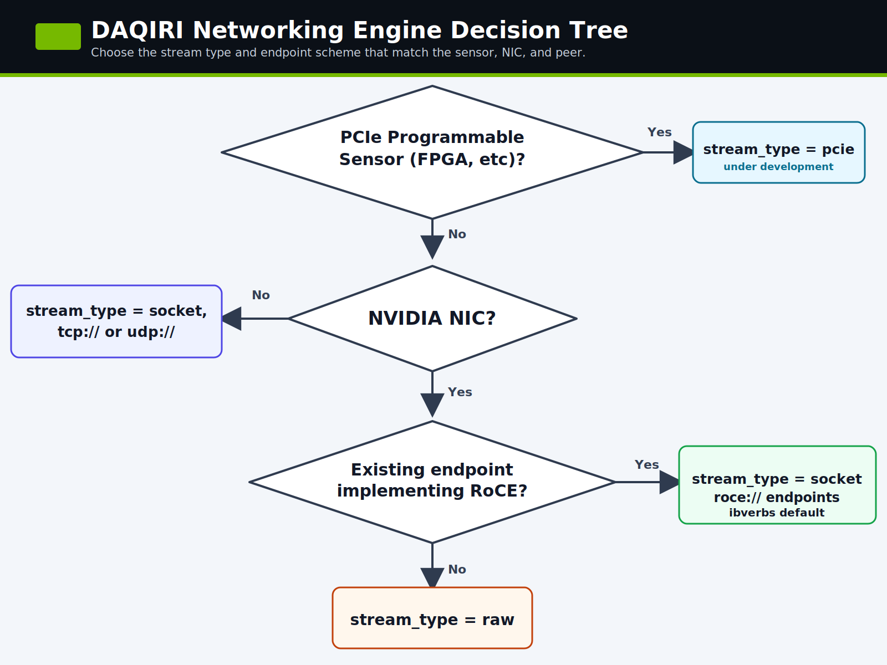

---
hide:
  - navigation
---

# Benchmarking

DAQIRI ships with several stream types to handle different types of incoming and outgoing streams. Choosing the stream type depends on the type of sensor being used and its capabilities. The `stream_type` is decided from the decision tree below:

<div class="img-visual-frame" markdown="1">
{ #dt-thumb }
</div>

<div id="dt-overlay" style="display:none;position:fixed;top:0;left:0;right:0;bottom:0;z-index:9999;background:rgba(0,0,0,.82);align-items:center;justify-content:center;padding:1.5rem;cursor:zoom-out;"></div>

## Choose a stream type

| Use case | DAQIRI config | Benchmark | Start here |
|---|---|---|---|
| Ingest from or egress to a programmable PCIe sensor, such as an FPGA on the PCIe bus. | `stream_type: "pcie"` | Coming soon | PCIe benchmarking docs are coming soon. |
| Compare against normal Linux networking, run on a non-NVIDIA NIC, or test a peer that speaks TCP/UDP sockets. | `stream_type: "socket"` with `tcp://` or `udp://` endpoints | `daqiri_bench_socket` | [Socket and RDMA Benchmarking](socket_benchmarking.md) |
| Test a peer that already implements RDMA verbs over RoCE. | `stream_type: "socket"` and `roce://` endpoints | `daqiri_bench_rdma` | [Socket and RDMA Benchmarking](socket_benchmarking.md#run-the-rdma-roce-benchmark) |
| Drive raw Ethernet packets directly from an NVIDIA NIC under DAQIRI control. | `stream_type: "raw"` | `daqiri_bench_raw_gpudirect` and the other `raw_*` benches | [Raw Ethernet Benchmarking](raw_benchmarking.md) |

!!! note "PCIe stream type status"

    The PCIe programmable-sensor path is under development. Once completed it will allow 3rd party PCIe devices
    to read from and write to the GPU's BAR1 memory.

!!! note "Why RDMA is listed under socket"

    The RoCE benchmark uses the connection-oriented socket/RDMA configuration model. The executable is named `daqiri_bench_rdma` to show the RDMA-specific API calls.

## Common benchmark workflow

1. Build the examples with the engines you plan to test. The default container build enables every stream type:

    ```bash
    BASE_TARGET=dpdk DAQIRI_ENGINE="dpdk ibverbs" scripts/build-container.sh
    ```

2. Pick the physical pair or host pair that should carry the traffic. For same-host Spark wire tests, prefer a client namespace and a server namespace so the route cannot silently fall back to loopback.

3. Prove the direction with hardware counters before trusting bandwidth numbers. For one-way client-to-server tests, the important counters are the client-side `tx_packets_phy` / `tx_bytes_phy` and the server-side `rx_packets_phy` / `rx_bytes_phy`.

4. Run the DAQIRI benchmark and a known baseline such as `iperf3` or `ib_send_bw` with the same namespace, interface, and message-size assumptions.

5. Monitor line rate with NIC counters or `mlnx_perf`; application-side byte counts are useful, but hardware counters answer whether packets actually reached the physical path.

## Page map

- [Socket and RDMA Benchmarking](socket_benchmarking.md) covers Linux TCP/UDP and RoCE/RDMA runs with matching client/server namespace setup.
- [Raw Ethernet Benchmarking](raw_benchmarking.md) covers the DPDK/raw Ethernet examples, hugepage sizing, physical loopback configuration, and raw benchmark troubleshooting.
- [Understanding the Configuration File](../tutorials/configuration-walkthrough.md) explains the YAML fields once you have selected the stream type and example config.

---
**Previous:** [System Configuration](../tutorials/system_configuration.md)<br>
**Next:** [Socket and RDMA Benchmarking](socket_benchmarking.md)
