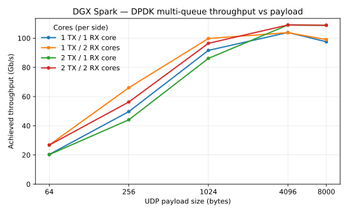

---
hide:
  - navigation
---

# Performance: DGX Spark

Measured C++-loopback throughput for each stream/protocol on a single DGX Spark
(GB10), driven over a physical cabled loopback on one ConnectX-7. Numbers are
from a Release build via `examples/run_spark_bench.sh` (30 s per cell).

For the loopback setup these numbers depend on and the per-transport
benchmarking procedure, see [Socket and RDMA Benchmarking](socket_benchmarking.md)
(the `dq_wire_*` network-namespace wire loopback used by RoCE and sockets) and
[Raw Ethernet Benchmarking](raw_benchmarking.md) (the two-physical-port DPDK
loopback). The exact commands are collected under [Reproduce](#reproduce) below.

## System under test

| Component | Detail |
| --------- | ------ |
| Platform | DGX Spark (GB10), 20 cores, isolcpus `16-19` |
| NIC | ConnectX-7, ports p0 ↔ p1 cross-cabled (single-host loopback), MTU 9000 |
| Build | Release (`-DCMAKE_BUILD_TYPE=Release`), `DAQIRI_MGR="dpdk socket rdma"` |
| Loopback | Raw/DPDK uses the two physical ports directly; socket/RoCE use the `dq_wire_*` network-namespace wire loopback |
| Core pinning | Each direction has a busy-spin queue poller and an app worker (PR #149). Single-queue pins them to **separate** isolated X925 cores (DPDK TX 17/16, RX 18/19); co-locating them livelocks at small batch sizes. Multi-queue co-locates per queue (4 queues, 4 cores) but only at the fixed large batch where it is safe. |

## Headline — native-shape peak (C++ loopback)

Each transport at its best-case operation size. Raw/RoCE are single-stream;
socket TCP/UDP scale with the number of client/server pairs, so the four-pair
aggregate is shown.

| Stream / Protocol | Best case | Throughput | Drops |
| ----------------- | --------- | ---------: | ----- |
| Raw Ethernet / GPUDirect | 4 KB packet | **105.5 Gb/s** (98.5 at 8 KB native) | 0 |
| Socket / RoCE (SEND) | 8 MB message | **102.2 Gb/s** | 0 |
| Socket / TCP | 8 KB × 4 pairs | **97.2 Gb/s** | ~0 (flow-controlled) |
| Socket / UDP | 8 KB × 4 pairs | **29.8 Gb/s** goodput | unpaced, ~51% app-loss |

Each transport is best read at its own native operation size (see the per-transport
tables below); a single cross-transport unit of work isn't meaningful here, since
RoCE at 8 KB is op-rate-bound well below its large-message peak and TCP has no
operation boundary.

## Raw Ethernet / GPUDirect (DPDK)

Physical port-to-port loopback, GPU-resident payloads. Native 8 KB packets run
at **98.5 Gb/s** drop-free across all batch sizes; the throughput peak is
**105.5 Gb/s** at a 4 KB payload. Packet handling is CPU-bound (see the CPU
utilization table below). With the poller/worker core split, throughput is now
flat across batch size and stable run-to-run (3 reps per cell, ≤1% spread).

Achieved Gb/s (mean of 3 reps), unpaced, 0 drops in every cell:

<table class="perf-matrix" markdown="0">
  <thead>
    <tr>
      <th rowspan="2">Payload</th>
      <th colspan="4">Batch size (packets per burst)</th>
    </tr>
    <tr>
      <th>256</th><th>1024</th><th>4096</th><th>10240</th>
    </tr>
  </thead>
  <tbody>
    <tr><th>8000 B</th><td>98.5</td><td>98.0</td><td>98.0</td><td>98.5</td></tr>
    <tr><th>4096 B</th><td>105.2</td><td>105.3</td><td>105.5</td><td>105.1</td></tr>
    <tr><th>1024 B</th><td>92.1</td><td>91.8</td><td>91.7</td><td>91.7</td></tr>
    <tr><th>256 B</th><td>50.0</td><td>49.8</td><td>49.8</td><td>49.8</td></tr>
    <tr><th>64 B</th><td>20.4</td><td>20.5</td><td>20.5</td><td>20.4</td></tr>
  </tbody>
</table>

At ≥4 KB the link saturates (~98–105 Gb/s) regardless of batch. Below that the
path is packet-rate-bound: 1 KB ~92 Gb/s (10.5 M pps), 256 B ~50 Gb/s (19.5 M pps),
64 B ~20 Gb/s (20 M pps) — a ~20 M pps ceiling. With the poller/worker core split
these small-payload cells are now flat across batch size and stable run-to-run; the
co-located config (poller and worker sharing a core) ran at roughly half the rate
and was ±20% noisy here, and livelocked outright at small batch. Every cell is
drop-free, so the achieved rate is also the no-drop rate — *pacing the sender below
it simply hits the target with zero drops*.

**CPU utilization** (headline cell, 8000 B / batch 10240, unpaced):

| Core                     | Busy% | Note                                  |
| ------------------------ | ----: | ------------------------------------- |
| Master (CPU 8)           |  3.7% | Orchestration only; mostly idle       |
| TX queue poller (CPU 17) |  ~92% | Poll-mode spin; rate-independent      |
| RX queue poller (CPU 18) |  ~92% | Poll-mode spin; rate-independent      |

Under the poller/worker split the benchmark app workers run on their own cores
(TX 16, RX 19) alongside these pollers; this run sampled only the poller cores.
The pollers stay near 92% across every drop-curve step from 1 Gb/s to line rate —
DPDK's poll-mode driver spins regardless of offered load. The GPU stays idle (SM
and memory-controller utilization both ~0%): it is a DMA target for the payload,
not a compute engine.

### Multi-queue core scaling

Each packet-handling core spins in poll-mode. At the native 8 KB shape a single
TX core caps throughput near ~98 Gb/s, while a single RX core already drains the
line — so adding a second TX core is the lever that scales (97.7 → 110 Gb/s),
and a second RX core adds little. The matrix sweeps (TX cores, RX cores) over
`(1,1) → (1,2) → (2,1) → (2,2)`; `(2,2)` beating `(1,1)` demonstrates the
scaling. Configs (TX cores 16,17 ; RX cores 18,19 ;
master core 8): derived from the single base
`daqiri_bench_raw_tx_rx_spark_mq.yaml` (the balanced 2,2 superset) by
`scripts/gen_spark_mq_config.py`. Generated by
`examples/run_spark_mq_bench.sh`, 30 s per cell, 0 drops.

| Cell | TX cores | RX cores | Achieved <span style="text-transform: none">Gb/s</span> |
| ---- | -------- | -------- | ------------: |
| (1,1) | 16    | 18    | 97.7  |
| (1,2) | 16    | 18,19 | 98.3  |
| (2,1) | 16,17 | 18    | **110.3** |
| (2,2) | 16,17 | 18,19 | **110.1** |

Which core is the bottleneck flips with payload size. Sweeping each cell from
64 B to 8 KB:



At small payloads the path is packet-rate-bound, so **RX cores** are the lever —
at 64 B a second RX core roughly doubles throughput (10.7 → 27.0 Gb/s at ~26 M
pps) while a second TX core does nothing. At large payloads it inverts to the
byte/line-rate-bound regime where **TX cores** are the lever (8 KB: 97.4 → 110.4
Gb/s, the native-shape result above). The curves cross around 1–4 KB, where the
link saturates and all four cells converge near ~105–110 Gb/s. Every cell is
drop-free. Generated by `examples/run_spark_mq_bench.sh` (30 s per point) and
`scripts/plot_mq_payload_sweep.py`.

## Socket / RoCE

RoCE SEND over the netns wire loopback, single queue-pair, batch 1. Large
messages up to 64 KB fully saturate the wire — the per-message flow-control
window sizes the queue depth to keep the in-flight window full — and the
smallest messages are bound by per-operation software overhead.

**Message-size sweep (single QP, batch 1, 0 drops)**

| Message size | <span style="text-transform: none">Gb/s</span> |
| ------------ | ---: |
| 8 MB  | **102.2** |
| 1 MB  | 101.3 |
| 64 KB | 101.6 |
| 8 KB  | 60.7 |
| 4 KB  | 38.0 |

Messages ≥64 KB hold ~101–102 Gb/s at the wire ceiling. Below that, throughput
is operation-rate-bound rather than wire-bound — per-operation software overhead,
not a stall — and every cell is drop-free. The small-message rates roughly tripled
under the poller/worker split (8 KB 19.5 → 60.7, 4 KB 10.1 → 38.0 Gb/s): putting the
bench worker on its own core, separate from the RoCE manager thread, frees up the
op-rate the same way it does for DPDK small packets. The path also depends on two
RC settings: `min_rnr_timer` set to 0.64 ms so a transient RECV-queue underrun does
not stall the sender, and the per-message flow-control window pre-posts `rx_depth`
receives before sending and bounds the transmit side by `tx_depth`, keeping enough
operations in flight to amortize per-op overhead.

**CPU utilization** (headline cell, 8 MB message, batch 1, unpaced):

| Core                | Busy% | Note                                            |
| ------------------- | ----: | ----------------------------------------------- |
| Master (CPU 8)      |  5.9% | Orchestration only                              |
| Client TX (CPU 17)  | 74.9% | Post-and-poll spin; rate-independent            |
| Server RX (CPU 18)  |  0.0% | HCA writes straight to memory; CPU uninvolved   |

The idle RX core is the expected RoCE RC signature — the HCA places incoming
data directly into registered memory with no CPU involvement. The GPU stays
idle here too (SM and memory-controller ~0%; DMA target, not a compute engine).

## Socket / TCP

Four one-way TCP client/server pairs over the netns wire loopback, each pair
pinned to one isolated core (16–19). TCP self-paces via flow control, so App TX
equals App RX with effectively no app-level loss. `message_size` is the per-send
byte count of a stream (no datagram boundary, no fragmentation).

Throughput in Gb/s (App TX = App RX):

<table class="perf-matrix" markdown="0">
  <thead>
    <tr>
      <th rowspan="2">Message size</th>
      <th colspan="3">Number of client/server pairs</th>
    </tr>
    <tr>
      <th>1</th><th>2</th><th>4</th>
    </tr>
  </thead>
  <tbody>
    <tr><th>1000 B</th><td>13.5</td><td>27.3</td><td>54.8</td></tr>
    <tr><th>8000 B</th><td>30.8</td><td>68.0</td><td>97.2</td></tr>
    <tr><th>1 MiB</th><td>31.6</td><td>58.7</td><td>93.7</td></tr>
  </tbody>
</table>

Throughput scales with the pair count; retransmits stay negligible over the run.

## Socket / UDP

Four one-way UDP client/server pairs, same one-core-per-pair pinning. UDP has no
flow control, so each sender runs flat-out and the receiver drops whatever it
cannot drain — the loss column is an inherent property of unpaced UDP, not a
fault. App RX is the delivered goodput; App-level loss is `(App TX − App RX) /
App TX`.

Each cell shows **receiver goodput in Gb/s** with the **app-level loss %** dimmed
beneath it:

<table class="perf-matrix" markdown="0">
  <thead>
    <tr>
      <th rowspan="2">Message size</th>
      <th colspan="3">Number of client/server pairs</th>
    </tr>
    <tr>
      <th>1</th><th>2</th><th>4</th>
    </tr>
  </thead>
  <tbody>
    <tr><th>1000 B</th><td>3.6<small>11% loss</small></td><td>7.7<small>16% loss</small></td><td>13.5<small>6% loss</small></td></tr>
    <tr><th>8000 B</th><td>9.6<small>56% loss</small></td><td>20.9<small>57% loss</small></td><td>29.8<small>51% loss</small></td></tr>
  </tbody>
</table>

The sweep stops at 8000 B (single Ethernet frame). Larger UDP datagrams
fragment above the ~8972 B MTU payload; reassembly is all-or-nothing out of a
shared per-namespace pool, so under multi-pair unpaced load delivery collapses
(≈100% loss at 65507 B / 4 pairs). The wire itself is loss-free here; the loss
is host-side socket-buffer and reassembly pressure.

## Reproduce

Run inside the project container (privileged, GPUs passed through, hugepages
mounted), as root. Build with `-DCMAKE_BUILD_TYPE=Release` and
`cmake --install build` so the bench loads the current `libdaqiri.so`.

```bash
export DAQIRI_BUILD_DIR=./build
export LD_LIBRARY_PATH=/opt/daqiri/lib:${LD_LIBRARY_PATH:-}
```

The base container does not ship the network tools the setup scripts and RoCE
baseline depend on; install them first, or
`scripts/setup_spark_wire_loopback_netns.sh` fails with `ip: command not found`:

```bash
apt-get update
apt-get install -y iproute2 iputils-ping ethtool iperf3 rdma-core ibverbs-utils perftest
```

These provide `ip`/`nstat` (`iproute2`), `ethtool`, and `ib_send_bw` (`perftest`).

**Raw Ethernet / GPUDirect (DPDK)** drives the two physical ports directly, so
the `dq_wire_*` namespaces must **not** be up — they capture the ports and
hide them from DPDK. Tear them down first (no-op if they were never created):

```bash
./scripts/setup_spark_wire_loopback_netns.sh down       # ensure netns is torn down
export ETH_DST_ADDR=$(cat /sys/class/net/<rx-iface>/address)
./examples/run_spark_bench.sh dpdk sweep
```

The **multi-queue core-scaling matrix and payload sweep** run on the same
physical loopback (netns down). The four cells are generated from
`examples/daqiri_bench_raw_tx_rx_spark_mq.yaml` at run time, so just export the
rx-iface MAC as `ETH_DST_ADDR` (the script fills it into each generated config),
then run the sweep and render the plot:

```bash
export ETH_DST_ADDR=$(cat /sys/class/net/<rx-iface>/address)
./examples/run_spark_mq_bench.sh                       # 4 cells x payload sweep, 30 s each
# render the line plot (needs matplotlib in a venv -- not a runtime dependency):
./scripts/plot_mq_payload_sweep.py bench-results/<ts>-dpdk-mq/runs.csv
```

**Socket / RoCE and sockets** cross the cable through the `dq_wire_client` →
`dq_wire_server` namespaces. Bring the loopback up and confirm PHY counters move
before running; tear it down when finished:

```bash
./scripts/setup_spark_wire_loopback_netns.sh up         # create the namespaces
./scripts/setup_spark_wire_loopback_netns.sh verify      # confirm wire traffic
./examples/run_spark_bench.sh rdma sweep
./examples/run_spark_bench.sh socket-tcp sweep
./examples/run_spark_bench.sh socket-udp sweep
./scripts/setup_spark_wire_loopback_netns.sh down        # tear down when done
```

Each run writes `bench-results/<timestamp>-<backend>-<mode>/runs.csv`. See
[Socket and RDMA Benchmarking](socket_benchmarking.md) and
[Raw Ethernet Benchmarking](raw_benchmarking.md) for the namespace setup and
per-transport details.

---
**Previous:** [Raw Ethernet Benchmarking](raw_benchmarking.md)
