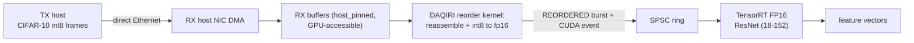

---
hide:
  - navigation
---

# Performance: DGX Spark

This report covers DAQIRI receive performance in two configurations.
[Cross-host measurements](#cross-host-benchmarks) include [I/O throughput](#raw-ethernet-gpudirect),
[I/O with GPU workloads](#gpu-workloads-in-the-receive-path), and
[I/O with ResNet inference](#end-to-end-inference-pipeline-resnet).
[Single-host wire-loopback diagnostics](#single-host-loopback-benchmarks) cover I/O only.

## Cross-host benchmarks

### Cross-host setup

| Component | Detail |
| --------- | ------ |
| Platform | NVIDIA DGX Spark (receiver) |
| Data source | Another DGX Spark for these measurements. The report is about receiver performance; another source may be used when it can sustain the required offered load. |
| CPU | NVIDIA GB10 Armv9: 10 Cortex-X925 performance cores + 10 Cortex-A725 efficiency cores |
| GPU and memory | NVIDIA GB10 GPU; 120 GiB unified memory per host |
| NIC | NVIDIA ConnectX-7; two 100 GbE Ethernet ports per host |
| NIC firmware | 28.45.4028 |
| NIC attachment | Two independently attached NIC connections are used for the two-link 200 GbE tests |
| Network | Direct one- and two-link 100 GbE cross-host tests; MTU 9000 |
| Host software | Ubuntu 24.04.4 LTS; Linux 6.17.0-1014-nvidia |
| GPU software | NVIDIA driver 580.142; CUDA Toolkit 13.1.0 in the benchmark container |
| DAQIRI build | Release; `DAQIRI_ENGINE="dpdk ibverbs"`; `DAQIRI_BUILD_APPLICATIONS=ON` when running the inference pipeline |
| CPU placement | Dedicated isolated CPU placement for raw/RDMA pollers and workers. Socket worker and I/O-thread placement is stated with each scaling result. |

Rates report received payload unless a table explicitly labels a wire rate.

### Results summary

**Loss-free two-link receive throughput.**

| Stream / Protocol | Message size | Receive setup | Delivered <span class="unit">Gbps</span> |
| ----------------- | -----------: | ------------- | -------------: |
| Raw Ethernet / GPUDirect (DPDK) | 8 KB | 1 queue/link | 197.17 |
| Socket / RoCE (RC SEND) | 8 MB | 1 RX queue/link | **195.55 ±0.03** |
| Socket / TCP | 1 MiB | 4 RX cores/link | 174.3 ±0.9 |
| Socket / UDP (paced) | 8 KB | 4 RX cores/link | 95.98 ±0.00 |

### Raw Ethernet / GPUDirect

**DPDK receive throughput vs payload size. Average of three 30 s samples;
loss-free two-link results.**

| Payload | Wire <span class="unit">Gbps</span> | App <span class="unit">Gbps</span> | Mpps |
| ------- | --------: | -------: | ---: |
| 8000 B | **201.70** | **197.17** | 3.056 |
| 4096 B | 201.29 | 197.19 | 5.925 |
| 1024 B | 198.62 | 194.68 | 22.367 |
| 256 B  | 73.71 | 72.80 | 28.436 |
| 64 B   | 30.35 | 29.43 | 28.740 |

### Socket / RoCE

**RoCE RC SEND receive throughput vs message size. Average of five 120 s samples;
`±` is the sample standard deviation.**

| Message size | Wire <span class="unit">Gbps</span> | App <span class="unit">Gbps</span> |
| ------------ | --------: | -------: |
| 8 MB | **198.72 ±0.03** | **195.55 ±0.03** |
| 1 MB | 198.16 ±0.06 | 194.92 ±0.06 |
| 8 KB | 172.77 ±1.04 | 169.85 ±1.02 |
| 4 KB | 72.96 ±5.03 | 71.47 ±4.93 |

### Socket / TCP

#### Single Rx core, one link

**TCP receive throughput vs message size with one RX worker on one link.
Loss-free results.**

| Message size | App <span class="unit">Gbps</span> |
| ------------ | -------: |
| 1 MiB  | **55.7** |
| 8000 B | 52.9 |
| 1000 B | 18.3 |

#### Multiple Rx cores, two links

**TCP receive throughput vs RX workers per link at 1 MiB. Average of three 30 s
samples; `±` is the sample standard deviation. Loss-free two-link results.**

| Rx workers | Rx workers per link | App <span class="unit">Gbps</span> |
| ---------: | ------------------: | -------: |
| 2 | 1 | 110.7 ±6.6 |
| 4 | 2 | 156.9 ±1.7 |
| 8 | 4 | **174.3 ±0.9** |

### Socket / UDP

#### Single Rx core, one link

**Loss-free UDP receive throughput vs message size with one RX worker on one link.
Average of three 30 s samples.**

| Message size | Loss-free app <span class="unit">Gbps</span> |
| ------------ | -----------------: |
| 8000 B  | **25.00** |
| 65507 B | 15.00 |
| 1000 B  | 4.00 |

#### Multiple Rx cores, two links

**Loss-free UDP receive throughput vs RX cores per link at 8 KB. Average of three
30 s samples.**

| Rx workers | Rx cores per link | Pace per flow (<span class="unit">Gbps</span>) | App <span class="unit">Gbps</span> |
| ---------: | ----------------: | ----------------------------------------------: | -------: |
| 2 | 1 | 25 | **50.00** |
| 4 | 2 | 20 | **79.99** |
| 8 | 4 | 12 | **95.98** |

For TCP and UDP scaling, use isolated Cortex-X925 performance cores. Pin the
socket I/O thread and application worker to separate cores in the same CPU cluster,
and distribute workers evenly across the two links.

### GPU workloads in the receive path

Each workload runs once per ~8 MB received-data window after DAQIRI assembles it
into a contiguous GPU buffer. Raw and RoCE receive buffers are GPU-accessible;
sockets are not included in this comparison.

- **FFT** — batched FP32, length-1024 complex-to-complex forward transforms.
- **GEMM** — FP32 1024×1024 matrix multiply (2.15 GFLOP; 4 MB input).

DPDK uses 8 KB packets and RoCE uses 8 MB messages, yielding the same approximate
working-set size per workload invocation.

!!! warning "Provisional loopback baseline; cross-host re-run pending"
    These are single-host 100 GbE loopback results, retained here pending a
    cross-host re-run. Do not compare their absolute rates with the cross-host
    results above.

**Single-host loopback throughput. Average of three 30 s samples.**

| Workload | DPDK <span class="unit">Gbps</span> | RoCE <span class="unit">Gbps</span> |
| -------- | ------------------------------------: | -----------------------------------: |
| none (baseline) | 98.7 ±0.0  | 96.6 ±0.3 |
| FFT             | 95.7 ±0.8  | 95.6 ±0.1 |
| GEMM (FP32)     | 96.6 ±0.2  | 90.2 ±1.1 |

### End-to-end inference pipeline (ResNet)

The [ResNet pipeline](../tutorials/daqiri-resnet-inference.md) receives CIFAR-10
images, reassembles and converts them on the GPU, then runs TensorRT FP16
inference. The results cover ResNet-18 through ResNet-152.


```mermaid
flowchart LR
  TX["TX host<br/>CIFAR-10 int8 frames"] -->|"direct Ethernet"| N["RX host NIC DMA"]
  N --> R["RX buffers (host_pinned,<br/>GPU-accessible)"]
  R --> K["DAQIRI reorder kernel:<br/>reassemble + int8 to fp16"]
  K -->|"REORDERED burst + CUDA event"| Q["SPSC ring"]
  Q --> T["TensorRT FP16<br/>ResNet (18-152)"]
  T --> F["feature vectors"]
```

Each image is 224×224×3 signed int8 (150,528 B), sent as 128 frames. The GPU
reorder kernel reassembles and converts the input to FP16 for TensorRT.

**ResNet inference throughput. Batch 32, TensorRT FP16; median of three 120 s samples.**

| Model | img/s | p50 / p99 ms per batch | TensorRT-only img/s | End-to-end vs TensorRT-only | Consumed payload <span class="unit">Gbps</span> |
| ----- | ----: | ---------------------: | ------------------: | --------------------------: | ---------------: |
| ResNet-18  | **12,162** | 2.56 / 2.84   | 13,200 | 92% | 14.65 Gbps |
| ResNet-34  | 7,278  | 4.32 / 4.79   | 7,727  | 94% | 8.76 Gbps |
| ResNet-50  | 3,701  | 8.50 / 9.49   | 3,834  | 97% | 4.46 Gbps |
| ResNet-101 | 2,453  | 12.80 / 13.78 | 2,502  | 98% | 2.95 Gbps |
| ResNet-152 | 1,746  | 18.12 / 19.38 | 1,794  | 97% | 2.10 Gbps |

Without inference, the input path reaches 74,091 img/s (89.2 Gbps payload).
Inference is therefore the bottleneck for every model in this table. The end-to-end
pipeline reaches 92–98% of the TensorRT-only rate.

## Single-host loopback benchmarks

### Single-host loopback benchmark setup

| Component | Detail |
| --------- | ------ |
| Platform | NVIDIA DGX Spark |
| Data source | The same DGX Spark acts as sender and receiver |
| CPU | NVIDIA GB10 Armv9: 10 Cortex-X925 performance cores + 10 Cortex-A725 efficiency cores |
| GPU and memory | NVIDIA GB10 GPU; 120 GiB unified memory |
| NIC | NVIDIA ConnectX-7; two 100 GbE Ethernet ports |
| NIC firmware | 28.45.4028 |
| NIC attachment | The two ports are joined by a 100 GbE cable |
| Network | Single-host wire loopback; MTU 9000 |
| Host software | Ubuntu 24.04.4 LTS; Linux 6.17.0-1014-nvidia |
| GPU software | NVIDIA driver 580.142; CUDA Toolkit 13.1.0 in the benchmark container |
| DAQIRI build | Release; `DAQIRI_ENGINE="dpdk ibverbs"` |
| CPU placement | Dedicated isolated CPU placement for raw/RDMA pollers and workers. Socket worker and I/O-thread placement is stated with each scaling result. |
| Transport setup | Raw/DPDK uses the physical ports directly; sockets and RoCE use a network-namespace wire loopback |

These I/O-only diagnostics isolate polling, batching, queue, and CPU-placement
effects. They are not cross-host performance claims.

### Results summary

**Single-host loopback I/O diagnostics.**

| Stream / Protocol | Message size | Receive setup | Delivered <span class="unit">Gbps</span> |
| ----------------- | -----------: | ------------- | -----------------------------------------: |
| Raw Ethernet / GPUDirect (DPDK) | 8 KB | 1 RX queue | 98.7–98.8 |
| Raw Ethernet / GPUDirect (DPDK) | 256 B | 2 RX pollers | 66.4 |
| Socket / TCP | 8 KB | 4 RX workers | 87.3 ±2.2 |
| Socket / RoCE | — | — | pending payload sweep |
| Socket / UDP | — | — | pending loss-free sweep |

RoCE and UDP need loopback throughput sweeps before they can be compared with the
cross-host results.

### Raw Ethernet / GPUDirect

**DPDK loopback throughput vs payload. Average of three 30 s samples; zero drops.**
Batch sizes from 256 to 10,240 packets differed by at most 0.4 Gbps, so the table
shows their observed range rather than every batch-size cell.

| Payload | App <span class="unit">Gbps</span> |
| ------- | -----------------------------------: |
| 8000 B | 98.7–98.8 |
| 4096 B | 98.6–98.8 |
| 1024 B | 97.1–97.2 |
| 256 B  | 49.5–49.7 |
| 64 B   | 20.2–20.4 |

**CPU utilization** (8000 B / batch 10240, unpaced):

| Core            | Busy% | Note                            |
| --------------- | ----: | ------------------------------- |
| Master          |  3.7% | Orchestration only, mostly idle |
| TX queue poller |  ~92% | Poll-mode busy-spin             |
| RX queue poller |  ~92% | Poll-mode busy-spin             |

The GPU is a DMA target in this test (SM and memory-controller utilization ~0%).

#### Multi-queue core scaling

**DPDK loopback throughput at 256 B. Average of three 30 s samples; zero drops.**

| Cell | TX pollers | RX pollers | Achieved <span style="text-transform: none">Gbps</span> |
| ---- | ---------- | ---------- | ------------: |
| (1,1) | 1 | 1 | 50.0 |
| (1,2) | 1 | 2 | **66.4** |
| (2,1) | 2 | 1 | 49.0 |
| (2,2) | 2 | 2 | 64.7 |

At 256 B, the second RX poller raises throughput to 66.4 Gbps; the second TX
poller does not improve the one-RX-poller result.

### Socket / RoCE

#### CPU utilization

No loopback throughput sweep is available yet. The CPU sample below is retained
as a diagnostic at 8 MB, batch 1, unpaced:

| Core      | Busy% | Note                                            |
| --------- | ----: | ----------------------------------------------- |
| Master    |  0.7% | Orchestration only                              |
| Client TX | 74.8% | Busy-spins posting sends and polling completions |
| Server RX |  1.1% | HCA DMAs straight to memory, worker only reaps completions |

### Socket / TCP

#### Single Rx core, one link

**TCP loopback receive throughput vs message size with one RX worker on one link.
Average of three 30 s samples.**

| Message size | App <span class="unit">Gbps</span> |
| ------------ | -----------------------------------: |
| 1 MiB | **32.1 ±2.2** |
| 8000 B | 28.9 ±2.9 |
| 1000 B | 14.2 ±0.4 |

#### Multiple Rx cores, one link

**TCP loopback receive throughput vs RX workers at 1 MiB. Average of three 30 s
samples.**

| Rx workers | App <span class="unit">Gbps</span> |
| ---------: | -----------------------------------: |
| 1 | 32.1 ±2.2 |
| 2 | 51.5 ±2.4 |
| 4 | **83.7 ±0.4** |

### Socket / UDP

No loopback loss-free throughput sweep is available yet. Add a message-size and
core-scaling sweep before using UDP as a loopback diagnostic.

## Reproduce

Run inside the project container (privileged, GPUs passed through, hugepages
mounted), as root. Build with `-DCMAKE_BUILD_TYPE=Release` and
`cmake --install build` so the bench loads the current `libdaqiri.so`.

The commands below drive the **single-host loopback** tables. The `_xhost` configs
provide the paired roles for a manual cross-host smoke test:
(`examples/daqiri_bench_raw_tx_spark_xhost.yaml`,
`examples/daqiri_bench_raw_rx_spark_xhost.yaml`,
`examples/daqiri_bench_rdma_tx_rx_spark_xhost.yaml`), one role per host, with wire
rates read from physical counters at both ends — see
[Cross-host two-DGX-Spark loopback](raw_benchmarking.md#cross-host-two-dgx-spark-loopback).

```bash
export DAQIRI_BUILD_DIR=./build
export LD_LIBRARY_PATH=/opt/daqiri/lib:${LD_LIBRARY_PATH:-}
```

The base container does not ship the network tools the setup scripts and RoCE
baseline depend on. Install them first, or
`scripts/setup_spark_wire_loopback_netns.sh` fails with `ip: command not found`:

```bash
apt-get update
apt-get install -y iproute2 iputils-ping ethtool iperf3 rdma-core ibverbs-utils perftest
```

These provide `ip`/`nstat` (`iproute2`), `ethtool`, and `ib_send_bw` (`perftest`).

Each `run_spark_bench.sh <backend> <mode>` invocation takes a **mode** that sets
which cells run: `sweep` runs the full payload × batch × pairs matrix (the
per-transport message-size tables above), while `smoke` runs just the single
summary-table cell, one payload/batch/pairs operating point. `REPEATS=N` repeats
every cell N times for error bars.

**Raw Ethernet / GPUDirect (DPDK)** drives the two physical ports directly, so
the socket/RoCE network namespaces must **not** be up, since they capture the
ports and hide them from DPDK. Tear them down first (no-op if they were never
created). `<rx-iface>` below is the receive physical port:

```bash
./scripts/setup_spark_wire_loopback_netns.sh down       # ensure netns is torn down
export ETH_DST_ADDR=$(cat /sys/class/net/<rx-iface>/address)
./examples/run_spark_bench.sh dpdk sweep
```

The **multi-queue core-scaling matrix and payload sweep** run on the same
physical loopback (netns down). The four cells are generated from
`examples/daqiri_bench_raw_tx_rx_spark_mq.yaml` at run time, so just export the
rx-iface MAC as `ETH_DST_ADDR` (the script fills it into each generated config),
then run the sweep and render the plot:

```bash
export ETH_DST_ADDR=$(cat /sys/class/net/<rx-iface>/address)
./examples/run_spark_mq_bench.sh                       # 4 cells x payload sweep, 30 s each
# render the line plot (needs matplotlib in a venv -- not a runtime dependency):
./scripts/plot_mq_payload_sweep.py bench-results/<timestamp>-dpdk-mq/runs.csv
```

**Socket / RoCE and sockets** cross the cable through the network namespaces.
Bring the loopback up and confirm PHY counters move before running, and tear it
down when finished:

```bash
./scripts/setup_spark_wire_loopback_netns.sh up         # create the namespaces
./scripts/setup_spark_wire_loopback_netns.sh verify      # confirm wire traffic
./examples/run_spark_bench.sh rdma sweep
./examples/run_spark_bench.sh socket-tcp sweep
./examples/run_spark_bench.sh socket-udp sweep
./scripts/setup_spark_wire_loopback_netns.sh down        # tear down when done
```

That produces the **pair-scaling** matrices. The single-stream socket rows in the
summary are cross-host instead: one client and one server on separate hosts, no
namespaces, using the `_spark_xhost` configs after cross-host L3 connectivity is
configured on both hosts.

Sockets need **one config file per role**, unlike the RoCE cross-host config that
carries both. `daqiri_init` binds every interface listed in the file, so a
combined config fails on each host at the address it does not own.

```bash
# on the server host, started first and outliving the client
./build/examples/daqiri_bench_socket \
  examples/daqiri_bench_socket_udp_server_spark_xhost.yaml --mode server --seconds 42

# on the client host, paced
./build/examples/daqiri_bench_socket \
  examples/daqiri_bench_socket_udp_client_spark_xhost.yaml --mode client --seconds 30 --target-gbps 23
```

Swap in the `tcp_server` / `tcp_client` pair for the retained single-pair TCP rows and drop
`--target-gbps`, since TCP self-paces. For UDP that flag drives a token-bucket
pacer; find the loss-free rate by walking it up until the server's `recv_bytes`
stops tracking the client's `sent_bytes`. The configs ship at 8000 B (UDP) and
1 MiB (TCP); for the other published message sizes change `message_size` in
**both** files of the pair, since the two must agree.

To separate wire loss from host loss, snapshot `ethtool -S <iface>` on both hosts
immediately before and after the measured window and subtract, reading
`tx_packets_phy` on the client and `rx_packets_phy` on the server. These are
whole-run totals for the entire port, not per queue or per stream, so keep other
traffic off the port while measuring. When the two deltas match and the app still
lost datagrams, the drops are above the NIC.

Whichever setup you use, pin each pair's send and receive to **separate** cores in
the same CPU cluster. Socket affinity in these examples applies to the benchmark
workers; queue `cpu_core` does not currently bind the socket engine's I/O threads.

Use the client's `active_seconds` to calculate both sent and received application
rates. The server deliberately outlives the client, so its whole-process
`seconds` includes an idle tail and is not a transfer-rate denominator.

**GPU workload (FFT / GEMM)** re-runs a backend with a representative GPU workload
in the receive path by exporting `WORKLOAD` (`none` | `fft` | `gemm` |
`gemm_fp16`), run once per received I/O unit on the real payload. Each call is a
fixed **1024³ GEMM** (override with `GEMM_DIM` / `--workload-gemm-dim`) or a batched
**length-1024 FFT** (override with `FFT_LEN` / `--workload-fft-len`). Both compute
sizes are held constant while the message size varies, so the FLOP count per call
is fixed. It composes with the same network-namespace setup as above (DPDK in the
default namespace). Use `smoke`, the single
summary-table cell that the fixed-n table reports, and run all three workloads
with error bars:

```bash
# RoCE (netns up); Raw is identical with `dpdk`, netns down, ETH_DST_ADDR exported.
for WL in none fft gemm; do
  WORKLOAD=$WL REPEATS=3 ./examples/run_spark_bench.sh rdma smoke
done
```

In the workload case the payload size is fixed per backend (8 KB for DPDK, 8 MB
message for RoCE), so a `sweep` only steps through batch size (DPDK) or
client/server pairs (sockets). The workload lands in the CSV `post_process` column
(with the GEMM dimension in `post_process_gemm_dim`); compare each `gbps` /
`gpu_sm_pct` against the `WORKLOAD=none` baseline from the same loop.

Each run writes `bench-results/<timestamp>-<backend>-<mode>/runs.csv`. The CSV
records the configured `batch`; for socket runs, `observed_max_rx_burst` reports
the largest burst returned to the application. Its CPU core columns identify the
actual sampled cores; socket runs with multiple pairs report pair 0 rather than
aggregate CPU utilization. See
[Socket and RDMA Benchmarking](socket_benchmarking.md) and
[Raw Ethernet Benchmarking](raw_benchmarking.md) for the namespace setup and
per-transport details.

**The ResNet pipeline** needs `-DDAQIRI_BUILD_APPLICATIONS=ON`, TensorRT (the
`BASE_IMAGE=torch` container), and the exported models plus packetized dataset.
The [tutorial](../tutorials/daqiri-resnet-inference.md) covers both. Given
passwordless `ssh` between the two hosts and a shared checkout,
`run_resnet_xhost.sh` starts the RX side, waits for `TrtRunner ready` (TensorRT
deserializes its plan *after* `daqiri_init`, so gating on the earlier reorder
line opens the run with an artificial drop burst), then launches TX:

```bash
# one cell; the table is the median of 3 such runs per model
applications/resnet50_inference/tools/run_resnet_xhost.sh --seconds 120
```

The wrapper runs whichever engine the RX config points at. The other four sizes
come from `--model resnet18|resnet34|resnet101|resnet152` on the RX binary, which
swaps the ONNX/engine paths and the feature dimension; the wrapper does not
forward that flag, so a model sweep drives the two sides directly.

The ingest ceiling is the same TX driving `daqiri_bench_raw_reorder_seq` on the RX
host instead of the app — identical wire format, sequence placement and batch
geometry, with only TensorRT removed. TX runs unthrottled in both arms, so the RX
NIC drop counter measures the offered-to-consumed ratio rather than loss in the
pipeline.

For a batch-size sweep, point the RX host at a config with a different
`images_per_batch` (and `packets_per_batch` scaled with it, 128 packets per
image) and re-run. Throughput comes from the RX process's own image counter;
wire rates come from `mlnx_perf` on both ports, since application run time over
packet counts is not accurate enough at these rates.

Rates are normalized on the TX window, because the RX process deliberately
outlives it by 15 s and counts that idle tail in its own `seconds=` field.
