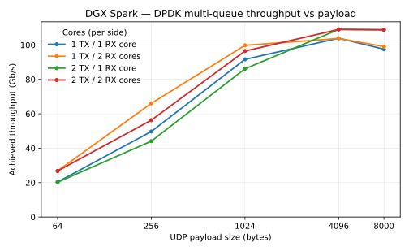
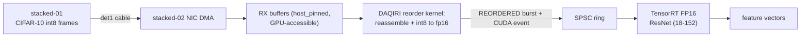

---
hide:
  - navigation
---

# Performance: DGX Spark

Measured C++ throughput for each stream/protocol on DGX Spark (GB10) hardware,
from Release builds. Numbers come from **two testbeds**, and every table says
which one it used:

- **Cross-host** — two DGX Sparks joined by direct links. The raw DPDK sweep uses
  two independent 100 GbE links; the other tables identify their link count.
  Each table states its own run duration and repetition count.
- **Single-host, 100 GbE loopback** — one DGX Spark with its two ConnectX-7 ports
  cross-cabled, driven by `examples/run_spark_bench.sh` (30 s per cell). The
  scaling studies come from here: socket pair-count scaling, the multi-queue
  core-scaling sweep and the CPU-utilization tables.

The cross-host link is the faster of the two, so a rate from one testbed should
not be compared against a rate from the other. Every table names its testbed.

All backends are measured **one-way** (unidirectional) by default: one side sends,
the other receives and computes. For a bidirectional test, set `send: true` on the
receiving role (and `receive: true` on the sending role) in the bench config.

For the per-transport benchmarking procedures, see
[Socket and RDMA Benchmarking](socket_benchmarking.md) (the
`dq_wire_*` network-namespace wire loopback used by the socket cells) and
[Raw Ethernet Benchmarking](raw_benchmarking.md) (the two-physical-port DPDK
loopback and the cross-host wire setup).

The [end-to-end inference pipeline](#end-to-end-inference-pipeline-resnet-cross-host)
measures a whole application rather than a transport, so its figure of merit is
images per second, not Gb/s.

## System under test

### Cross-host, 200 GbE (raw Ethernet, RoCE, single-stream sockets, inference pipeline)

| Component | Detail |
| --------- | ------ |
| Platform | Two DGX Sparks (GB10 Grace, 10x Cortex-X925 + 10x Cortex-A725, 120 GiB unified memory each) |
| NIC | ConnectX-7; raw DPDK uses two independent 100 GbE direct links |
| NIC host attach | Independent PCIe Gen5 x4 links, each with 126 Gb/s of lane bandwidth after 128b/130b |
| Build | Release, `DAQIRI_ENGINE="dpdk ibverbs"`, `DAQIRI_BUILD_APPLICATIONS=ON` |
| Method | Results state their run duration and repetition count. The cross-host DPDK cells use 3 repetitions x 30 s. Wire rate is cross-checked with physical counters at both endpoints; application rate is RX-delivered bytes over the sender transfer window. A cell is loss-free only when TX/RX application counts and physical counters agree and RX hardware-buffer discards remain zero. |
| Hugepages | 2048 x 2 MiB per host |

Wire rate sits above app rate by design: the wire figure includes Ethernet
framing the application never sees, plus any packet the RX path could not keep up
with. Both columns are reported because the gap is the interesting part.

### Single-host, 100 GbE loopback (socket pair scaling, multi-queue, CPU utilization)

| Component | Detail |
| --------- | ------ |
| Platform | DGX Spark (GB10), 20 cores, isolcpus `16-19` (the multi-queue sweep expands this, see [Multi-queue core scaling](#multi-queue-core-scaling)) |
| NIC | ConnectX-7, ports p0 ↔ p1 cross-cabled with a **100 GbE QSFP28** loopback cable, MTU 9000 |
| Build | Release (`-DCMAKE_BUILD_TYPE=Release`), `DAQIRI_ENGINE="dpdk ibverbs"` |
| Loopback | Raw/DPDK uses the two physical ports directly, while socket/RoCE use the `dq_wire_*` network-namespace wire loopback |
| Core pinning | Each direction has a busy-spin queue poller and an app worker on separate isolated X925 cores (PR #149). Single-queue: DPDK pollers 17/18, workers 16/19. Multi-queue: TX pollers 16/19, RX pollers 18/9, each with its own worker core, master 8. Sockets pin each pair's send and receive to separate cores in the same CPU cluster (all with `isolcpus=5-9,15-19`). |

## Results Summary

Each transport is shown at its best-case **operation size**. The DPDK row is a
two-link measurement; the remaining rows use one queue pair, QP, or
client/server socket pair as stated. Sockets also scale with the number of
concurrent pairs; that is a separate axis, measured in the
[TCP](#socket-tcp) and [UDP](#socket-udp) sections below.

On a single cross-host link, **the NIC's host attach is the ceiling, not the cable
and not the software.** A Gen5 x4 connection carries 126 Gb/s after 128b/130b
encoding and roughly 110–116 Gb/s once TLP overhead is counted, so one 200 GbE port
cannot move 200 Gb/s into host memory regardless of what drives it. The two-link
DPDK result has independent host attachments and therefore approaches 200 Gb/s at
large payloads. On the single-host loopback the
**100 GbE cable** is the ceiling instead: it tops out near ~98.8 Gb/s of payload.

| Stream / Protocol | Best case | Wire | App-delivered | Drops | Testbed |
| ----------------- | --------- | ---: | ------------: | ----- | ------- |
| Raw Ethernet / GPUDirect (dpdk) | 8 KB packet | **201.70 ±0.18 Gb/s** | 197.17 Gb/s | 0 | Cross-host two-link 200 GbE |
| Socket / RoCE (SEND) | 8 MB message | **112.5 ±0.2 Gb/s** | **109.0 Gb/s** | 0 | Cross-host 200 GbE |
| Socket / TCP | 1 MiB message | — | 55.7 Gb/s | 0 | Cross-host 200 GbE |
| Socket / UDP (paced) | 8 KB message | — | 23.0 Gb/s | 0 | Cross-host 200 GbE |

Each transport is best read at its own best-case operation size (see the per-transport
tables below); a single cross-transport unit of work isn't meaningful here, since
RoCE at 8 KB is bound by its in-flight buffer pool rather than the wire and TCP has
no operation boundary. The socket rows report app rates and per-port packet counts
rather than a wire byte rate, so their Wire cells are blank.

**Every row here is loss-free.** TCP gets that for free from flow control. UDP has
no flow control, so its row is **paced** at the highest rate that held zero loss
over three 30 s reps; offer more than that and the receiver's drain rate decides
what arrives. See [Socket / UDP](#socket-udp) for that curve.

**The kernel stack's cost is per core, not per link.** A single TCP stream
delivers 55.7 Gb/s against RoCE's 109.0 on the same cable, because one stream is
bound by per-byte copy and ACK processing on one core rather than by the wire. Add
a second concurrent stream and TCP reaches 105.2 Gb/s, and four put it at 108.5 —
level with the zero-copy transports at the PCIe ceiling. So the interesting
difference between sockets and RDMA on this platform is CPU cost per byte, not
attainable rate. UDP paced starts lower at 23.0 Gb/s for one stream, since a
datagram socket gives up TCP's segmentation offload and pays per datagram, and it
scales the same way: see [core scaling](#core-scaling-cross-host-200-gbe_1).

## Raw Ethernet / GPUDirect

GPU-resident payloads. Every row uses one process per host, two independent
links, and one queue per link. The table reports receive capability: the source
only supplies the offered load, while the application column is RX-delivered
throughput.

### Cross-host raw Ethernet receive sweep (two links)

Rows are medians of three 30-second unpaced runs. Wire rate is aggregate
physical TX/RX traffic; RX-delivered rate is measured over the sender transfer
window. Each cell is loss-free: application counts and physical
counters agree, and the receiver reports no hardware-buffer discards.

| Payload | Wire Gb/s | RX-delivered Gb/s | Mpps |
| ------- | --------: | ----------------: | ---: |
| 8000 B | **201.70 ±0.18** | **197.17** | 3.056 |
| 4096 B | 201.29 ±0.32 | 197.19 | 5.925 |
| 1024 B | 198.62 ±0.15 | 194.68 | 22.367 |

At 1 KB and above, both links carry about 100 Gb/s, so the aggregate approaches
200 Gb/s on the wire. This sweep records the loss-free large-payload DPDK result.

### Single-host loopback, payload x batch (100 GbE)

On the 100 GbE loopback the cable is the ceiling instead, and throughput saturates
at **~98.8 Gb/s** for 4–8 KB payloads, drop-free across all batch sizes. Packet
handling is CPU-bound (see the CPU utilization table below). Throughput is flat
across batch size and stable run-to-run (3 reps per cell, ≤1% spread).

Achieved Gb/s measured at App RX (equal to App TX, since every cell is
drop-free), unpaced, mean of 3 reps. Run-to-run spread ≤0.5 Gb/s (<1%):

<table class="perf-matrix" markdown="0">
  <thead>
    <tr>
      <th rowspan="2">Payload</th>
      <th colspan="4">Batch size (packets per burst)</th>
    </tr>
    <tr>
      <th>256</th><th>1024</th><th>4096</th><th>10240</th>
    </tr>
  </thead>
  <tbody>
    <tr><th>8000 B</th><td>98.8</td><td>98.8</td><td>98.8</td><td>98.7</td></tr>
    <tr><th>4096 B</th><td>98.6</td><td>98.8</td><td>98.7</td><td>98.6</td></tr>
    <tr><th>1024 B</th><td>97.1</td><td>97.2</td><td>97.2</td><td>97.1</td></tr>
    <tr><th>256 B</th><td>49.7</td><td>49.6</td><td>49.6</td><td>49.5</td></tr>
    <tr><th>64 B</th><td>20.2</td><td>20.2</td><td>20.4</td><td>20.2</td></tr>
  </tbody>
</table>

At ≥1 KB the link saturates near line rate (~97–99 Gb/s) regardless of batch.
Below that the path is packet-rate-bound: 256 B ~50 Gb/s (19.5 M pps), 64 B
~20 Gb/s (20 M pps), a ~20 M pps single-queue ceiling (the multi-queue
section lifts it). Gb/s here is the L2 frame rate including the 64 B header, so
pps ≈ Gb/s ÷ ((payload + 64) × 8). These small-payload cells are flat across batch
size and stable run-to-run. Because every cell is drop-free, the achieved rate is
also the no-drop rate: pacing the sender below it hits the target with zero drops.

**CPU utilization** (single-host loopback, 8000 B / batch 10240, unpaced):

| Core                     | Busy% | Note                                  |
| ------------------------ | ----: | ------------------------------------- |
| Master (CPU 8)           |  3.7% | Orchestration only, mostly idle       |
| TX queue poller (CPU 17) |  ~92% | Poll-mode busy-spin |
| RX queue poller (CPU 18) |  ~92% | Poll-mode busy-spin |

The benchmark app workers run on their own cores (TX 16, RX 19) alongside these
pollers. This run sampled only the poller cores.
The pollers stay near 92% across every drop-curve step from 1 Gb/s to line rate,
because DPDK's poll-mode driver spins regardless of offered load. The GPU stays idle (SM
and memory-controller utilization both ~0%): it is a DMA target for the payload,
not a compute engine.

### Multi-queue core scaling

Each packet-handling core spins in poll-mode. At large payloads (≥1 KB) a single
queue already saturates the 100 GbE line (~97–99 Gb/s), so extra cores add
nothing there. The multi-queue win is confined to the small,
packet-rate-bound payloads, where **RX cores** are the lever. The matrix sweeps
(TX cores, RX cores) over `(1,1)`, `(1,2)`, `(2,1)`, `(2,2)`.

Each queue is served by a poll-mode driver core plus a separate bench-worker
core, paired within one CPU cluster where possible so the poller→worker handoff
stays local. The four-queue matrix uses the expanded isolated-core budget
(`isolcpus=5-9,15-19`): TX pollers on 16/19, RX pollers on 18/9, each with its
own worker core, and the master on core 8. Configs are derived from the single
base `daqiri_bench_raw_tx_rx_spark_mq.yaml` (the balanced 2,2 superset) by
`scripts/gen_spark_mq_config.py`; generated by `examples/run_spark_mq_bench.sh`,
30 s per cell, 0 drops.

Achieved Gb/s at a **256 B payload** (the packet-rate-bound regime where core
count matters); at ≥1 KB every cell converges at the wire ceiling regardless:

| Cell | TX pollers | RX pollers | Achieved <span style="text-transform: none">Gb/s</span> |
| ---- | ---------- | ---------- | ------------: |
| (1,1) | 16    | 18   | 50.0  |
| (1,2) | 16    | 18,9 | **66.4** |
| (2,1) | 16,19 | 18   | 49.0  |
| (2,2) | 16,19 | 18,9 | 64.7  |

A second **RX** core lifts 256 B from 50.0 to 66.4 Gb/s, while a second **TX** core does
nothing (49.0 ≈ 50.0). The full payload sweep shows why, since the bottleneck depends
on payload size:



At small payloads the path is packet-rate-bound, so **RX cores** are the lever:
a second RX core lifts 64 B from 20.3 to 26.9 Gb/s (~20 M → ~27 M pps) and 256 B
from 50.0 to 66.4 Gb/s, while a second TX core does nothing. At large payloads a
single queue already saturates the wire, so all four cells converge near
~97–99 Gb/s at ≥1 KB and neither extra core helps. Every cell is drop-free.
Generated by
`examples/run_spark_mq_bench.sh` (30 s per point) and
`scripts/plot_mq_payload_sweep.py`.

## Socket / RoCE

RoCE RC SEND, cross-host on the 200 GbE pair, single queue-pair, batch 1, 0 drops.
Large messages make RoCE the fastest transport on this hardware; small ones are
bound by how many messages the configuration keeps in flight, not by the wire.

**Message-size sweep (single QP, batch 1, 0 drops).** Medians over 3 reps, `±`
half the observed range.

| Message size | Wire <span style="text-transform: none">Gb/s</span> | App <span style="text-transform: none">Gb/s</span> | In-flight buffers |
| ------------ | ---: | ---: | --- |
| 8 MB  | **112.5 ±0.2** | **109.0** | 20 |
| 1 MB  | 112.1 ±0.3 | 108.4 | 20 |
| 8 KB  | 1.07 ±0.01 | 1.02 | 20 (shipped config) |
| 8 KB  | **88.7 ±1.5** | 85.5 | 512 |
| 4 KB  | 0.62 | 0.58 | 20 (shipped config) |
| 4 KB  | 40.1 ±9.5 | 38.5 | 512 |

At 1 MB and above RoCE is the fastest transport here (112.5 against raw Ethernet's
109.6 Gb/s) and
comes within 11% of the 126 Gb/s PCIe budget: hardware segmentation emits MTU-sized
packets from one posted message, so the host pays its per-packet costs less often
than the raw path does at an 8 KB frame.

**Below 1 MB, size the memory region to keep enough messages in flight.** The pair of
8 KB rows above is the same transport, the same code and the same wire: the only
difference is `num_bufs`. The RDMA bench's send loop stops when either `tx_depth`
or the memory region's buffer pool runs dry, and
`daqiri_bench_rdma_tx_rx_spark_xhost.yaml` ships with **20** buffers. Twenty 8 KB
messages is too little in flight to keep the send loop from stalling on
completions, so the shipped config measures pipeline depth rather than RoCE — a
**83x** difference at 8 KB and 65x at 4 KB. Raise `num_bufs` to 512 and the
transport shows its real rate, 88.7 Gb/s at an 8 KB message. The 4 KB deep row
stays noisy (±9.5) because at that size the per-message cost really is close to the
limit.

!!! note "The 64 KB row is pending a re-measurement"
    The cross-host 64 KB cell also ran with the shipped 20-buffer pool, so its
    result measures pool depth like the small-message rows and is omitted rather
    than published. It is being re-run with a 512-buffer pool.

**CPU utilization** (single-host loopback, 8 MB message, batch 1, unpaced):

| Core                 | Busy% | Note                                            |
| -------------------- | ----: | ----------------------------------------------- |
| Master (CPU 8)       |  0.7% | Orchestration only                              |
| Client TX (CPU 17)   | 74.8% | Busy-spins posting sends and polling completions |
| Server RX (CPU 19)   |  1.1% | HCA DMAs straight to memory, worker only reaps completions |

The TX core busy-spins in a post-and-poll loop, so its ~75% busy time is set by
that spin, not by the throughput: it stays near this level whether the link runs
at 10 or 100 Gb/s (the same reason the DPDK pollers sit near 92% regardless of
offered load). The near-idle RX core is the expected RoCE RC signature. The HCA
places incoming data directly into registered memory, so the receive worker only
reaps completions and reposts (~1% at this message rate). The GPU stays idle here
too (SM and memory-controller ~0%; DMA target, not a compute engine).

## Socket / TCP

One-way TCP client/server pairs. Each pair's send (client) and receive (server)
sides pin to **separate** isolated cores in one CPU cluster. A shared send/receive
core ping-pongs a single stream and can wedge it at half rate for a whole run, so
splitting the two sides keeps single-stream throughput stable — it is worth roughly
4x, and results measured before that fix are not comparable to these.
TCP self-paces via flow control, so App TX equals App RX with effectively no
app-level loss. `message_size` is the per-send byte count of a stream (no datagram
boundary, no fragmentation).

### Single pair, cross-host (200 GbE)

Medians of 3 × 30 s, one client/server pair, unthrottled. App TX equals App RX in
every cell, and the client's `tx_packets_phy` equals the server's `rx_packets_phy`
in every rep:

| Message size | App-delivered | Loss | Frames on the wire |
| ------------ | ------------: | ---: | -----------------: |
| 1 MiB  | **55.7 Gb/s** | 0% | 23,439,344 |
| 8000 B | 52.9 Gb/s | 0% | 22,460,342 |
| 1000 B | 18.3 Gb/s | 0% | 7,994,650 |

Throughput is message-size-bound in the small-message regime: at 1000 B a single
stream reaches only 18.3 Gb/s, since the cost is per `send()` rather than per byte.
By 8 KB it is 2.9x that, and 1 MiB adds only another 5% — the per-call overhead is
amortized out by then and the remaining limit is per-byte work on one core.

Segmentation offload is why: at every message size the wire carries MTU-sized
frames (8.6–8.9 KB, from bytes ÷ frames above), so `message_size` changes how many
`send()` calls the application makes, not what the NIC transmits. The 1000 B cell
spends 68.7 M calls to move 68.7 GB where the 8000 B cell moves 2.9x the bytes in
2.8x fewer calls — the cost being amortized is the call, not the framing.

### Core scaling, cross-host (200 GbE)

Concurrent client/server pairs at an 8000 B message, unpaced, medians of 3 × 30 s.
Each pair uses one queue-poller core and one app-worker core per host, so the
core count is twice the pair count. Clients run on one Spark and servers on the
other, giving each side its own core budget. App TX equals App RX in every cell
and the client's `tx_packets_phy` equals the server's `rx_packets_phy`:

| Pairs | Cores per host | Delivered | Spread | Loss |
| ----: | -------------: | --------: | -----: | ---: |
| 1 | 2  | 52.0 Gb/s | ±0.10 | 0% |
| 2 | 4  | **105.2 Gb/s** | ±0.30 | 0% |
| 4 | 8  | **108.5 Gb/s** | ±0.03 | 0% |
| 8 | 16 | **109.3 Gb/s** | ±0.42 | 0% |

**Four cores per host is all TCP needs to reach the PCIe ceiling.** One pair is
core-bound at 52.0 Gb/s, but a second doubles it to 105.2, and from four pairs on
the curve is flat at 108.5–109.3 — the same 126 Gb/s PCIe budget that bounds raw
Ethernet (109.6) and RoCE (112.5). At that point TCP is within a few percent of
the zero-copy transports, and the remaining difference is what the transports buy
in CPU cost per byte rather than in achievable rate. Pairs 5–8 add nothing because
they land on the A725 efficiency cores once the ten X925 cores are spoken for.

### Pair scaling, single-host loopback (100 GbE)

The same sweep on the netns loopback testbed, kept for the message-size axis
(pairs 1–2 pinned in cluster 15–19, pairs 3–4 in 5–9). These rates are held down
by both sides sharing one host's cores, so read them against each other rather
than as platform numbers. Throughput in Gb/s (App TX = App RX), mean ± std over
3 reps:

<table class="perf-matrix" markdown="0">
  <thead>
    <tr>
      <th rowspan="2">Message size</th>
      <th colspan="3">Number of client/server pairs</th>
    </tr>
    <tr>
      <th>1</th><th>2</th><th>4</th>
    </tr>
  </thead>
  <tbody>
    <tr><th>1000 B</th><td>14.2<small>±0.4</small></td><td>27.6<small>±0.4</small></td><td>45.2<small>±0.1</small></td></tr>
    <tr><th>8000 B</th><td>28.9<small>±2.9</small></td><td>42.4<small>±2.7</small></td><td>87.3<small>±2.2</small></td></tr>
    <tr><th>1 MiB</th><td>32.1<small>±2.2</small></td><td>51.5<small>±2.4</small></td><td>83.7<small>±0.4</small></td></tr>
  </tbody>
</table>

Throughput scales with the pair count here too, and retransmits stay negligible.
The message-size axis is the part worth reading: at every pair count, going from
1000 B to 1 MiB moves throughput far less than adding pairs does, so
**concurrency, not message size, is what fills the link with TCP**. The absolute
rates are lower than the cross-host table above because both endpoints share one
host's ten performance cores.

## Socket / UDP

One-way UDP client/server pairs, same per-side pinning (send and receive on
separate cores). UDP has no flow control, so an unthrottled sender overruns the
receiver and the receiver drops what it cannot drain. App RX is the delivered
goodput; app-level loss is `(App TX - App RX) / App TX`. The headline figure is
therefore the **paced loss-free rate**, with the unpaced behavior shown after it.

### Single pair, cross-host: the loss-free rate (200 GbE)

Paced at the highest rate that held zero loss over 3 × 30 s reps. App TX is that
rate, and the client's `tx_packets_phy` matches the server's `rx_packets_phy` in
every rep:

| Message size | Paced rate | Delivered | Loss | Frames on the wire |
| ------------ | ---------: | --------: | ---: | -----------------: |
| 8000 B  | 23 Gb/s | **23.00 Gb/s** | 0% | 10,781,563 |
| 65507 B | 15 Gb/s | 15.00 Gb/s | 0% | 6,889,553 |
| 1000 B  | 4 Gb/s  | 4.00 Gb/s  | 0% | 15,045,910 |

Zero here means a **teardown tail of at most 30 datagrams** out of 6.9–15 million,
still in flight when the receiver stopped. The residual does not grow with run
length, so it is not a loss rate.

### Beyond the loss-free rate

The receiving core's drain rate sets the ceiling here, not the wire. Unpaced, the
same 8000 B cell offers 50.1 Gb/s and delivers 26.5, and the phy counters still
match exactly: every datagram crossed the cable, and the ones the receive path
could not keep up with were dropped in the host.

| Offered | Delivered | Loss |
| ------: | --------: | ---: |
| 23 Gb/s | 23.00 Gb/s | 0% |
| 25 Gb/s | 24.3–25.0 Gb/s | 0–2.8% (loss in 2 of 3 reps) |
| 26 Gb/s | 24.4 Gb/s | 6.0% |
| 27 Gb/s | 24.8 Gb/s | 8.1% |
| 31 Gb/s | 25.7 Gb/s | 17.1% |
| 50.1 Gb/s (unpaced) | 26.5 Gb/s | 47.1% |

**Delivered throughput is flat near 25 Gb/s across that whole range**: offering
27 Gb/s beyond the loss-free rate returns 3.5 Gb/s more goodput, so most of the
extra load is spent rather than delivered. UDP has no backpressure, so the sender
cannot be told to slow down and the receiver sheds what it cannot drain. 25 Gb/s
sits close enough to the drain rate that it held zero loss in only one rep of
three, which is why the published rate is 23.

Give the receiver GPU work per datagram and the drain rate falls further, because
the socket path has to stage each payload host-to-device before the GPU can touch
it — a copy the raw and RoCE paths avoid on this integrated part. See
[GPU workloads in the receive path](#gpu-workloads-in-the-receive-path), where the
raw path holds 96.6 Gb/s of a 98.7 Gb/s baseline with an FP32 GEMM inline.

The 65507 B row fragments (8 frames per datagram at MTU 9000) and reassembly is
all-or-nothing, so it collapses rather than degrading: 59–61% loss at 20 Gb/s over
two reps, and 99.5–99.8% unpaced, where it delivers 0.1–0.3 Gb/s.

### Core scaling, cross-host (200 GbE)

Concurrent pairs at an 8000 B datagram, each paced at the highest per-pair rate
that held zero loss across 3 × 30 s reps. One queue-poller core and one app-worker
core per pair per host, clients on one Spark and servers on the other:

| Pairs | Cores per host | Paced per pair | Delivered | Loss |
| ----: | -------------: | -------------: | --------: | ---: |
| 1 | 2  | 23 Gb/s | 23.0 Gb/s | 0% |
| 2 | 4  | 22 Gb/s | **44.0 Gb/s** | 0% |
| 4 | 8  | 18 Gb/s | **72.0 Gb/s** | 0% |
| 8 | 16 | 9 Gb/s  | 72.0 Gb/s | 0% |

**Loss-free UDP scales with receiving cores, at a falling rate per pair.** One
pair drains 23 Gb/s, two drain 22 each, and four drain 18 each, for 72 Gb/s
aggregate; the per-pair rate drops as the pairs contend for the same NIC and
memory. Eight pairs deliver the same 72 Gb/s as four, because pairs 5–8 land on
the A725 efficiency cores after the ten X925 cores are taken, so they add
scheduling pressure rather than drain capacity.

Run unpaced instead and four pairs offer 96.8 Gb/s and deliver 91.9 at 5.0% loss,
so the delivered peak is higher than the loss-free rate but no longer clean. The
choice between 72 Gb/s at zero loss and ~92 Gb/s at a few percent is an
application decision, and the wire is loss-free either way —
`tx_packets_phy` matches `rx_packets_phy` in every cell, so every drop is host-side.

The sweep stops at 8000 B, one Ethernet frame. Larger datagrams fragment above the
~8972 B MTU payload and reassembly is all-or-nothing, which is why the 65507 B
single-pair row above collapses rather than degrading.

## GPU workloads in the receive path

A common question for a GPU-attached receiver is how much line rate it holds while
the GPU also crunches the incoming data. The benchmarks accept
`--workload none|fft|gemm|gemm_fp16`, exposed by `run_spark_bench.sh` as the
`WORKLOAD` env var (recorded in the CSV `post_process` column); more workload kinds
can be added to the same reusable component over time. The workload runs on the
received packet data. Every backend first assembles the burst's
payloads into one contiguous GPU buffer (a sequence-number **reorder** on the
out-of-order transports, an arrival-order **gather** on the in-order ones) and the
compute consumes that buffer.

**What the two workloads compute**, both in **FP32** (single precision), from the
reusable component `examples/bench_workload.{h,cu}`:

- **FFT**: a batched 1-D **complex-to-complex forward FFT** via cuFFT
  (`cufftExecC2C`). The reordered buffer is treated as an array of single-precision
  complex samples and transformed as many independent length-1024 FFTs, batched so
  the transforms cover the whole reorder window. This models a streaming
  signal-processing receiver, such as channelization or spectral analysis that FFTs every
  frame as it arrives.
- **GEMM**: a dense **matrix multiply** `C = A·B` via cuBLAS on square *n×n*
  matrices, with the reordered buffer supplying the *A* operand. The side length is
  **pinned at n=1024** (`--workload-gemm-dim`, env `GEMM_DIM`), so every call is an
  identical **2.15 GFLOP** matmul reading the first **4 MB** (n²·4 B, FP32) of each
  received unit. The compute is fixed regardless of message size, which is what
  makes it comparable across transports. The matmul is FP32 (`cublasSgemm`). This models a
  receiver feeding incoming data into a dense linear-algebra or neural-network
  stage (beamforming, correlation, an inference layer).

**The reorder/gather step is per-backend** (`examples/bench_pipeline.{h,cu}`),
chosen to be representative for each transport:

| Backend | Payload source | Pre-workload step |
| ------- | -------------- | ----------------- |
| Raw / GPUDirect (DPDK) | GPU-accessible RX buffers | **seq reorder** kernel → contiguous device buffer (out-of-order capable) |
| RoCE (RC) | GPU-accessible recv MR | **gather** (in-order); one large message is a zero-copy pass-through |
| UDP sockets | host RX buffers | **host→device stage**, then **seq reorder** |
| TCP sockets | host RX buffers | **host→device stage**, then **gather** (in-order stream) |

Each compute runs **once per reorder window** on a dedicated CUDA stream, shared
with the reorder/gather kernel so the two serialize without an extra sync and
compute overlaps ingest. The reorder window is sized so the contiguous buffer is
~8 MB on every backend, giving a comparable GPU working set across transports.

!!! note "Where the data lives, per backend"
    On the integrated GB10 the GPU shares memory with the CPU, so the raw and RoCE
    receive buffers (`host_pinned`) are GPU-accessible with **no copy**, and the
    reorder/gather kernel reads them in place. Sockets are different: the kernel
    hands received bytes to the application in pageable host memory, so the socket
    path must **stage each payload host→device** before the GPU can touch it, a
    copy on the measured path that the raw/RoCE paths avoid. Lost packets (raw/UDP)
    leave their reorder slots zero-filled, and the FLOP/copy volume is unchanged.

Fixed **n=1024**, one GEMM (or a length-1024 batched FFT) per received unit. DPDK runs
at an **8 KB payload** (~8 MB reorder window, 1024 packets × 8000 B), matched to RoCE's
**8 MB message** so the GPU working set and per-unit compute are the same on both.
3 reps, 30 s each, GPU SM% from `nvidia-smi dmon`; 0 drops on every cell.

!!! note "Measured on the single-host 100 GbE loopback"
    These cells predate the cross-host raw and RoCE numbers above, so read the
    baselines against the 100 GbE ceiling, not against 109–112 Gb/s. They are
    being re-run cross-host; what should carry over is the *relative* cost of each
    workload, not the absolute rate.

| Workload | DPDK (Raw / GPUDirect) | RoCE (RC) |
| -------- | ---------------------: | --------: |
| none (baseline) | 98.7 ±0.0  | 96.6 ±0.3 |
| FFT             | 95.7 ±0.8  | 95.6 ±0.1 |
| GEMM (FP32)     | 96.6 ±0.2  | 90.2 ±1.1 |

Throughput in Gb/s. Both `none` baselines sit at that loopback's ~97–99 Gb/s wire
ceiling (DPDK 98.7, RoCE 96.6), as expected for two line-rate transports.

**GPU compute costs a few percent of line rate here, and the path stays
wire-limited rather than compute-limited** (SM well under 100% throughout). FFT
runs 1.0 Gb/s off baseline on RoCE and 3.0 on DPDK at SM ~6–17%; the largest cost
in the table is RoCE with the FP32 GEMM, 6.4 Gb/s or 6.6%.

Sockets are absent from this table because a single stream tops out near 56 Gb/s
(TCP) well before the GPU becomes the question, and the socket path pays a
host-to-device stage per payload that raw and RoCE do not.

## End-to-end inference pipeline (ResNet, cross-host)

Everything above measures transports in isolation. This section measures a
complete application built on them: the
[ResNet pipeline](../tutorials/daqiri-resnet-inference.md), which takes
CIFAR-10 images off the wire and runs TensorRT inference on them without the
payload ever being touched by the CPU. Five model sizes are measured, ResNet-18
through ResNet-152.

It runs **cross-host** on a stacked Spark pair (`spark-stacked-01` TX →
`spark-stacked-02` RX) over one direct `det1` cable — the same class of link as the
raw and RoCE tables above, and not the 100 GbE chassis loopback used for the socket
tables.


```mermaid
flowchart LR
  TX["stacked-01<br/>CIFAR-10 int8 frames"] -->|"det1 cable"| N["stacked-02 NIC DMA"]
  N --> R["RX buffers (host_pinned,<br/>GPU-accessible)"]
  R --> K["DAQIRI reorder kernel:<br/>reassemble + int8 to fp16"]
  K -->|"REORDERED burst + CUDA event"| Q["SPSC ring"]
  Q --> T["TensorRT FP16<br/>ResNet (18-152)"]
  T --> F["feature vectors"]
```

Each image is 224×224×3 **signed int8** on the wire, 150,528 B, split across 128
frames of 1240 B (64 B header + 1176 B payload). The reorder kernel reassembles
the frames and converts to fp16 in the same pass, so fp16 exists only in GPU
memory and the network carries one byte per pixel. TensorRT reads the reorder
output directly; there is no staging copy.

Batch of 32 images, TensorRT FP16, medians of 3 × 120 s per model. Throughput
comes from the RX process's own image counter over its active window, not wall
clock, which would fold in the pre-traffic wait. Consumed payload counts the
150,528 image bytes, not the frame overhead.

**The GPU is the limit, not the network.** The ingest path with inference removed
sustains **94.4 Gb/s** of wire (9.48 Mpkt/s, 89.2 Gb/s of image payload), which is
**74,091 img/s** of supply — 6x what the fastest model consumes:

| Model | img/s | p50 / p99 ms per batch | TensorRT-only img/s | End-to-end vs TensorRT-only | Consumed payload |
| ----- | ----: | ---------------------: | ------------------: | --------------------------: | ---------------: |
| ResNet-18  | **12,162** | 2.56 / 2.84   | 13,200 | 92% | 14.65 Gb/s |
| ResNet-34  | 7,278  | 4.32 / 4.79   | 7,727  | 94% | 8.76 Gb/s |
| ResNet-50  | 3,701  | 8.50 / 9.49   | 3,834  | 97% | 4.46 Gb/s |
| ResNet-101 | 2,453  | 12.80 / 13.78 | 2,502  | 98% | 2.95 Gb/s |
| ResNet-152 | 1,746  | 18.12 / 19.38 | 1,794  | 97% | 2.10 Gb/s |
**Putting a network in front of TensorRT costs 2–8%.** The `TensorRT-only` column is
the same engine driven by `trtexec` with no network at all, and end-to-end reaches
92% of it at ResNet-18, rising to 97–98% at the larger models. In absolute terms
DAQIRI adds **0.21–0.49 ms per batch of 32** — unpacking the reorder output and
copying features out — and that stays under half a millisecond while the compute
per batch grows from 2.4 to 17.8 ms, which is why the percentage improves with
model size rather than degrading.

**Ingest is decoupled from the model.** Wire rate holds at ~94 Gb/s across all five
models while consumed payload falls from 14.65 to 2.10 Gb/s, so swapping models
changes inference throughput and nothing else. The remainder is dropped at the NIC
by design: the sender is unthrottled, and inference is the bottleneck.

For reference, the raw GPUDirect bench measured in the same campaign reaches
~109 Gb/s at its native 8 KB frames, matching the transport table above. This
pipeline's 94.4 Gb/s ceiling reflects its own RX loop and the smaller 1240 B
frames the image format implies.

## Reproduce

Run inside the project container (privileged, GPUs passed through, hugepages
mounted), as root. Build with `-DCMAKE_BUILD_TYPE=Release` and
`cmake --install build` so the bench loads the current `libdaqiri.so`.

The commands below drive the **single-host loopback** tables. The `_xhost` configs
provide the paired roles for a manual cross-host smoke test:
(`examples/daqiri_bench_raw_tx_spark_xhost.yaml`,
`examples/daqiri_bench_raw_rx_spark_xhost.yaml`,
`examples/daqiri_bench_rdma_tx_rx_spark_xhost.yaml`), one role per host, with wire
rates read from physical counters at both ends — see
[Cross-host two-DGX-Spark loopback](raw_benchmarking.md#cross-host-two-dgx-spark-loopback).
Remember that the shipped RDMA config provisions 20 in-flight buffers, which is
what the small-message rows above measure.

```bash
export DAQIRI_BUILD_DIR=./build
export LD_LIBRARY_PATH=/opt/daqiri/lib:${LD_LIBRARY_PATH:-}
```

The base container does not ship the network tools the setup scripts and RoCE
baseline depend on. Install them first, or
`scripts/setup_spark_wire_loopback_netns.sh` fails with `ip: command not found`:

```bash
apt-get update
apt-get install -y iproute2 iputils-ping ethtool iperf3 rdma-core ibverbs-utils perftest
```

These provide `ip`/`nstat` (`iproute2`), `ethtool`, and `ib_send_bw` (`perftest`).

Each `run_spark_bench.sh <backend> <mode>` invocation takes a **mode** that sets
which cells run: `sweep` runs the full payload × batch × pairs matrix (the
per-transport message-size tables above), while `smoke` runs just the single
summary-table cell, one payload/batch/pairs operating point. `REPEATS=N` repeats
every cell N times for error bars.

**Raw Ethernet / GPUDirect (DPDK)** drives the two physical ports directly, so
the `dq_wire_*` namespaces must **not** be up, since they capture the ports and
hide them from DPDK. Tear them down first (no-op if they were never created).
`<rx-iface>` below is the RX physical port (p1 in the p0→p1 loopback):

```bash
./scripts/setup_spark_wire_loopback_netns.sh down       # ensure netns is torn down
export ETH_DST_ADDR=$(cat /sys/class/net/<rx-iface>/address)
./examples/run_spark_bench.sh dpdk sweep
```

The **multi-queue core-scaling matrix and payload sweep** run on the same
physical loopback (netns down). The four cells are generated from
`examples/daqiri_bench_raw_tx_rx_spark_mq.yaml` at run time, so just export the
rx-iface MAC as `ETH_DST_ADDR` (the script fills it into each generated config),
then run the sweep and render the plot:

```bash
export ETH_DST_ADDR=$(cat /sys/class/net/<rx-iface>/address)
./examples/run_spark_mq_bench.sh                       # 4 cells x payload sweep, 30 s each
# render the line plot (needs matplotlib in a venv -- not a runtime dependency):
./scripts/plot_mq_payload_sweep.py bench-results/<timestamp>-dpdk-mq/runs.csv
```

**Socket / RoCE and sockets** cross the cable through the `dq_wire_client` →
`dq_wire_server` namespaces. Bring the loopback up and confirm PHY counters move
before running, and tear it down when finished:

```bash
./scripts/setup_spark_wire_loopback_netns.sh up         # create the namespaces
./scripts/setup_spark_wire_loopback_netns.sh verify      # confirm wire traffic
./examples/run_spark_bench.sh rdma sweep
./examples/run_spark_bench.sh socket-tcp sweep
./examples/run_spark_bench.sh socket-udp sweep
./scripts/setup_spark_wire_loopback_netns.sh down        # tear down when done
```

That produces the **pair-scaling** matrices. The single-stream socket rows in the
summary are cross-host instead: one client and one server on separate hosts, no
namespaces, using the `_spark_xhost` configs after
`scripts/setup_spark_xhost_net.sh` has put 1.1.1.1 on the client host and
2.2.2.2 on the server host.

Sockets need **one config file per role**, unlike the RoCE cross-host config that
carries both. `daqiri_init` binds every interface listed in the file, so a
combined config fails on each host at the address it does not own.

```bash
# on the server host, started first and outliving the client
./build/examples/daqiri_bench_socket \
  examples/daqiri_bench_socket_udp_server_spark_xhost.yaml --mode server --seconds 42

# on the client host, paced
./build/examples/daqiri_bench_socket \
  examples/daqiri_bench_socket_udp_client_spark_xhost.yaml --mode client --seconds 30 --target-gbps 23
```

Swap in the `tcp_server` / `tcp_client` pair for the TCP rows and drop
`--target-gbps`, since TCP self-paces. For UDP that flag drives a token-bucket
pacer; find the loss-free rate by walking it up until the server's `recv_bytes`
stops tracking the client's `sent_bytes`. The configs ship at 8000 B (UDP) and
1 MiB (TCP); for the other published message sizes change `message_size` in
**both** files of the pair, since the two must agree.

To separate wire loss from host loss, snapshot `ethtool -S <iface>` on both hosts
immediately before and after the measured window and subtract, reading
`tx_packets_phy` on the client and `rx_packets_phy` on the server. These are
whole-run totals for the entire port, not per queue or per stream, so keep other
traffic off the port while measuring. When the two deltas match and the app still
lost datagrams, the drops are above the NIC.

Whichever setup you use, pin each pair's send and receive to **separate** cores in
the same CPU cluster — sharing a core costs roughly 4x on TCP, and results
gathered that way cannot be compared against these.

**GPU workload (FFT / GEMM)** re-runs a backend with a representative GPU workload
in the receive path by exporting `WORKLOAD` (`none` | `fft` | `gemm` |
`gemm_fp16`), run once per received I/O unit on the real payload. Each call is a
fixed **1024³ GEMM** (override with `GEMM_DIM` / `--workload-gemm-dim`) or a batched
**length-1024 FFT** (override with `FFT_LEN` / `--workload-fft-len`). Both compute
sizes are held constant while the message size varies, so the FLOP count per call
is fixed. It composes with the same netns setup as above (dpdk in the default
namespace, rdma in the `dq_wire_*` namespaces). Use `smoke`, the single
summary-table cell that the fixed-n table reports, and run all three workloads
with error bars:

```bash
# RoCE (netns up); Raw is identical with `dpdk`, netns down, ETH_DST_ADDR exported.
for WL in none fft gemm; do
  WORKLOAD=$WL REPEATS=3 ./examples/run_spark_bench.sh rdma smoke
done
```

In the workload case the payload size is fixed per backend (8 KB for DPDK, 8 MB
message for RoCE), so a `sweep` only steps through batch size (DPDK) or
client/server pairs (sockets). The workload lands in the CSV `post_process` column
(with the GEMM dimension in `post_process_gemm_dim`); compare each `gbps` /
`gpu_sm_pct` against the `WORKLOAD=none` baseline from the same loop.

Each run writes `bench-results/<timestamp>-<backend>-<mode>/runs.csv`. See
[Socket and RDMA Benchmarking](socket_benchmarking.md) and
[Raw Ethernet Benchmarking](raw_benchmarking.md) for the namespace setup and
per-transport details.

**The ResNet pipeline** needs `-DDAQIRI_BUILD_APPLICATIONS=ON`, TensorRT (the
`BASE_IMAGE=torch` container), and the exported models plus packetized dataset.
The [tutorial](../tutorials/daqiri-resnet-inference.md) covers both. Given
passwordless `ssh` between the two hosts and a shared checkout,
`run_resnet_xhost.sh` starts the RX side, waits for `TrtRunner ready` (TensorRT
deserializes its plan *after* `daqiri_init`, so gating on the earlier reorder
line opens the run with an artificial drop burst), then launches TX:

```bash
# one cell; the table is the median of 3 such runs per model
applications/resnet50_inference/tools/run_resnet_xhost.sh --seconds 120
```

The wrapper runs whichever engine the RX config points at. The other four sizes
come from `--model resnet18|resnet34|resnet101|resnet152` on the RX binary, which
swaps the ONNX/engine paths and the feature dimension; the wrapper does not
forward that flag, so a model sweep drives the two sides directly.

The ingest ceiling is the same TX driving `daqiri_bench_raw_reorder_seq` on the RX
host instead of the app — identical wire format, sequence placement and batch
geometry, with only TensorRT removed. TX runs unthrottled in both arms, so the RX
NIC drop counter measures the offered-to-consumed ratio rather than loss in the
pipeline; per-queue `pacing_mbps` is not usable here because the mlx5 PMD then
requests `tx_pp` and this NIC's firmware rejects it.

For a batch-size sweep, point the RX host at a config with a different
`images_per_batch` (and `packets_per_batch` scaled with it, 128 packets per
image) and re-run. Throughput comes from the RX process's own image counter;
wire rates come from `mlnx_perf` on both ports, since application run time over
packet counts is not accurate enough at these rates.

Rates are normalized on the TX window, because the RX process deliberately
outlives it by 15 s and counts that idle tail in its own `seconds=` field.
