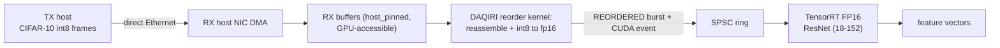

---
hide:
  - navigation
---

# Performance: DGX Spark

This report covers DAQIRI receive performance in two configurations.
[Cross-host measurements](#cross-host-benchmarks) include [I/O throughput](#raw-ethernet-gpudirect-throughput-by-payload-size),
[I/O with GPU workloads](#two-link-receive-throughput-with-gpu-workloads), and
[I/O with ResNet inference](#end-to-end-resnet-inference-throughput).
[Single-host wire-loopback diagnostics](#single-host-loopback-benchmarks) cover I/O only.
The transport setup and validation checks are described in
[Raw Ethernet Benchmarking](raw_benchmarking.md) and
[Socket and RDMA Benchmarking](socket_benchmarking.md).

## Cross-host benchmarks

### Cross-host setup

| Component | Detail |
| --------- | ------ |
| Platform | NVIDIA DGX Spark (receiver) |
| Data source | Another DGX Spark for these measurements. The report is about receiver performance; another source may be used when it can sustain the required offered load. |
| CPU | NVIDIA GB10 Armv9: 10 Cortex-X925 performance cores + 10 Cortex-A725 efficiency cores |
| GPU and memory | NVIDIA GB10 GPU; 120 GiB unified memory per host |
| NIC | NVIDIA ConnectX-7; two 100 GbE Ethernet ports per host |
| NIC firmware | 28.45.4028 |
| NIC attachment | Two independently attached NIC connections are used for the two-link 200 GbE tests |
| Network | Direct one- and two-link 100 GbE cross-host tests; MTU 9000 |
| Host software | Ubuntu 24.04.4 LTS; Linux 6.17.0-1014-nvidia |
| GPU software | NVIDIA driver 580.142; CUDA Toolkit 13.1.0 in the benchmark container |
| DAQIRI build | Release; `DAQIRI_ENGINE="dpdk ibverbs"`; `DAQIRI_BUILD_APPLICATIONS=ON` when running the inference pipeline |
| CPU placement | Dedicated isolated CPU placement for raw/RDMA pollers and workers. Socket worker and I/O-thread placement is stated with each scaling result. |

Rates report received payload unless a table explicitly labels a wire rate.
For each accepted cross-host repetition, the receiver was ready before the
30-second sender window, stable `mlnx_perf` samples were retained, and matching
directional PHY deltas confirmed the physical path. Application delivery and
the relevant UDP/kernel, NIC, raw-queue, or RDMA completion errors were checked
for loss. All reported results are loss-free. Each result is the average of
three independent samples except the two-link GPU-workload results marked `†`.

### Results summary for two-link receive throughput

| Stream / Protocol | Message size | Receive setup | Delivered Gbps |
| ----------------- | -----------: | ------------- | -------------: |
| Raw Ethernet / GPUDirect (DPDK) | 8 KB | 1 queue/link | 197.2 |
| Socket / RoCE (RC SEND) | 8 MB | 1 RX queue/link | **194.5 ±0.1** |
| Socket / TCP | 1 MiB | 4 RX cores/link | 174 ±1 |
| Socket / UDP (paced) | 8 KB | 4 pairs/link; 8 pinned CPUs/link | 96 |

### Raw Ethernet / GPUDirect throughput by payload size

| Payload | Wire Gbps | App Gbps | Mpps |
| ------- | --------: | -------: | ---: |
| 8000 B | **201.7** | **197.2** | 3.1 |
| 4096 B | 201.3 | 197.2 | 5.9 |
| 1024 B | 198.6 | 194.7 | 22.4 |
| 256 B  | 73.7 | 72.8 | 28.4 |
| 64 B   | 30.4 | 29.4 | 28.7 |

### RoCE RC SEND throughput by message size

| Message size | App Gbps |
| ------------ | -------: |
| 8 MB | **194.5 ±0.1** |
| 1 MB | 194.2 ±0.5 |
| 8 KB | 171.1 ±0.5 |
| 4 KB | 67 ±6 |

### TCP receive throughput

#### Single-core, one-link throughput by message size

| Message size | App Gbps |
| ------------ | -------: |
| 1 MiB  | **56** |
| 8000 B | 53 |
| 1000 B | 18 |

#### Multi-core, two-link throughput by worker count at 1 MiB

| Rx workers | Rx workers per link | App Gbps |
| ---------: | ------------------: | -------: |
| 2 | 1 | 111 ±7 |
| 4 | 2 | 157 ±2 |
| 8 | 4 | **174 ±1** |

### UDP receive throughput

#### Single-core, one-link throughput by message size

| Message size | App Gbps |
| ------------ | -------: |
| 8000 B  | **25** |
| 65507 B | 15 |
| 1000 B  | 4 |

#### Multi-core, two-link throughput by pair count at 8 KB

| Pairs | Pinned CPUs / host (I/O + worker) | Pairs / link | Pacer target / flow (Gbps) | App Gbps |
| ----: | ----------------------------------: | -----------: | ------------------------------------------------------: | -------: |
| 2 | 4 (2 + 2) | 1 | 25 | **50** |
| 4 | 8 (4 + 4) | 2 | 20 | **80** |
| 8 | 16 (8 + 8) | 4 | 12 | **96** |

For UDP scaling, every pair has a receive-I/O thread and an application worker;
the table counts both. Keep each pair on separate CPUs in one cluster and
distribute pairs evenly across the two links.

### Two-link receive throughput with GPU workloads

Each workload runs once per ~8 MB received-data window after DAQIRI assembles it
into a contiguous GPU buffer. This table reports only the raw/DPDK results;
socket and RoCE/RDMA measurements are not included.

- **FFT** — batched FP32, length-1024 complex-to-complex forward transforms.
- **GEMM** — FP32 1024×1024 matrix multiply (2.15 GFLOP; 4 MB input).

DPDK uses 8 KB packets and an approximately 8 MB working set per workload
invocation.

| Workload | DPDK Gbps |
| -------- | ------------------------------------: |
| none (baseline) | 197.2† |
| FFT             | 197.2† |
| GEMM (FP32)     | 197.1† |

`†` Preliminary: one accepted 30 s sample per cell; two further repetitions are
required for a mean.

### End-to-end ResNet inference throughput

The [ResNet pipeline](../tutorials/daqiri-resnet-inference.md) receives CIFAR-10
images, reassembles and converts them on the GPU, then runs TensorRT FP16
inference. The results cover ResNet-18 through ResNet-152.

```mermaid
flowchart LR
  TX["TX host<br/>CIFAR-10 int8 frames"] -->|"direct Ethernet"| N["RX host NIC DMA"]
  N --> R["RX buffers (host_pinned,<br/>GPU-accessible)"]
  R --> K["DAQIRI reorder kernel:<br/>reassemble + int8 to fp16"]
  K -->|"REORDERED burst + CUDA event"| Q["SPSC ring"]
  Q --> T["TensorRT FP16<br/>ResNet (18-152)"]
  T --> F["feature vectors"]
```

Each image is 224×224×3 signed int8 (150,528 B), sent as 128 frames. The GPU
reorder kernel reassembles and converts the input to FP16 for TensorRT.

Batch size is 32 and TensorRT uses FP16. Each row reports the highest accepted
offered rate for that model.

| Model | img/s | p50 / p99 ms per batch | Delivered payload Gbps |
| ----- | ----: | ---------------------: | -----------------------------------------------: |
| ResNet-18  | **11,833** | 2.6 / 3.1 | 14.3 |
| ResNet-34  | 7,174  | 4.4 / 4.9 | 8.6 |
| ResNet-50  | 3,550  | 8.6 / 9.5 | 4.3 |
| ResNet-101 | 2,367  | 13.3 / 14.2 | 2.9 |
| ResNet-152 | 1,590  | 18.4 / 19.5 | 1.9 |

## Single-host loopback benchmarks

### Single-host loopback benchmark setup

| Component | Detail |
| --------- | ------ |
| Platform | NVIDIA DGX Spark |
| Data source | The same DGX Spark acts as sender and receiver |
| CPU | NVIDIA GB10 Armv9: 10 Cortex-X925 performance cores + 10 Cortex-A725 efficiency cores |
| GPU and memory | NVIDIA GB10 GPU; 120 GiB unified memory |
| NIC | NVIDIA ConnectX-7; two 100 GbE Ethernet ports |
| NIC firmware | 28.45.4028 |
| NIC attachment | The two ports are joined by a 100 GbE cable |
| Network | Single-host wire loopback; MTU 9000 |
| Host software | Ubuntu 24.04.4 LTS; Linux 6.17.0-1014-nvidia |
| GPU software | NVIDIA driver 580.142; CUDA Toolkit 13.1.0 in the benchmark container |
| DAQIRI build | Release; `DAQIRI_ENGINE="dpdk ibverbs"` |
| CPU placement | Dedicated isolated CPU placement for raw/RDMA pollers and workers. Socket worker and I/O-thread placement is stated with each scaling result. |
| Transport setup | Raw/DPDK uses the physical ports directly; sockets and RoCE use a network-namespace wire loopback |

These I/O-only diagnostics isolate polling, batching, queue, and CPU-placement
effects. They are not cross-host performance claims.

### Results summary for single-host loopback throughput

| Stream / Protocol | Message size | Receive setup | Delivered Gbps |
| ----------------- | -----------: | ------------- | -----------------------------------------: |
| Raw Ethernet / GPUDirect (DPDK) | 8 KB | 1 RX queue | **98.7** |
| Socket / RoCE | 8 KB | one receive queue, TX depth 512 | **96.4 ±0.1** |
| Socket / TCP | 1 MiB | 4 RX workers | **97.7 ±0.2** |
| Socket / UDP | 8 KiB | 4 RX workers | **64.7 ±0.7** |

### Raw Ethernet / GPUDirect throughput by payload size

| Payload | App Gbps |
| ------- | -----------------------------------: |
| 8000 B | **98.7** |
| 4096 B | 98.5 |
| 1024 B | 97.1 |

#### Paced small-packet throughput

| Payload | Offered rate | App Gbps |
| ------- | -----------: | -----------------------------------: |
| 256 B | 50 Gbps | **46.1 ±0.1** |
| 64 B  | 24.5 Gbps | **20.1 ±0.1** |

Unpaced 256 B and 64 B transmission overruns the receive buffer. The paced rows
are the highest offered rates with no reported DPDK hardware-buffer discards.

#### CPU utilization at 8 KB

Batch size is 10,240 and transmission is unpaced.

| Core            | Busy% | Note                            |
| --------------- | ----: | ------------------------------- |
| Master          |  3.7% | Orchestration only, mostly idle |
| TX queue poller |  ~92% | Poll-mode busy-spin             |
| RX queue poller |  ~92% | Poll-mode busy-spin             |

The GPU is a DMA target in this test (SM and memory-controller utilization ~0%).

### RoCE RC SEND throughput by message size

| Message size | TX depth | App Gbps |
| -----------: | -------: | -----------------------------------: |
| 8 MiB | 128 | 96.8 ±0.1 |
| 1 MiB | 128 | 96.5 ±0.1 |
| 64 KiB | 128 | **97.7 ±0.1** |
| 8 KiB | 512 | 96.4 ±0.1 |
| 4 KiB | 512 | 57 ±1 |

### TCP receive throughput

#### Single-core throughput by message size

| Message size | App Gbps |
| ------------ | -----------------------------------: |
| 1 MiB | **53 ±4** |
| 8000 B | 49.1 ±0.3 |
| 1000 B | 13.2 ±0.1 |

#### Multi-core throughput by worker count at 1 MiB

| Rx workers | App Gbps |
| ---------: | -----------------------------------: |
| 1 | 49.7 ±0.5 |
| 2 | 79 ±2 |
| 4 | **97.7 ±0.2** |

### UDP throughput by message size

| Message size | Pacer target | App Gbps |
| -----------: | -----------: | -----------------------------------: |
| 8000 B  | 22 Gbps | **20.6 ±0.2** |
| 1000 B  | 6 Gbps  | 5.0 ±0.1 |
| 65507 B | 15 Gbps | 15 |

#### UDP throughput by worker count at 8 KB

| RX workers | Pacer target / worker | App Gbps |
| ---------: | ---------------------: | -----------------------------------: |
| 1 | 22 Gbps | 20.6 ±0.2 |
| 2 | 24 Gbps | 39.3 ±0.5 |
| 4 | 18 Gbps | **64.7 ±0.7** |
