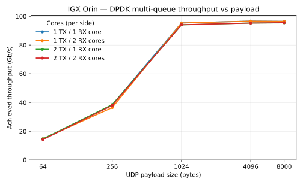

---
hide:
  - navigation
---

# Performance: IGX Orin

Measured C++-loopback throughput for each stream/protocol on a single IGX Orin
devkit (discrete RTX 6000 Ada GPU), driven over a physical cabled loopback on one
ConnectX-7. Numbers are from a Release build via `BENCH_PLATFORM=igx
examples/run_spark_bench.sh`, 30 s per cell, mean of 3 reps.

This page is the IGX-Orin counterpart to [Performance: DGX Spark](performance-dgx-spark.md);
the two run the *same* sweep scripts, selected by `BENCH_PLATFORM`. The
interesting differences are platform topology, not methodology: the IGX Orin
pairs a discrete RTX 6000 Ada (so `kind: device` gives real GPUDirect, with the
NIC DMAing straight into 49 GB of VRAM) with a weaker CPU — 12 uniform
Cortex-A78AE cores at 1.97 GHz, only three isolated (`isolcpus=9-11`) — and a
PCIe switch capped at a 128-byte Max Payload Size. The CPU is the headline: DGX
Spark pins its benchmark cores onto a 3.9 GHz Cortex-X925 performance cluster, so
each Spark bench core has roughly twice the clock and a much higher-IPC
microarchitecture. The result: the offload-heavy bulk-transfer paths (DPDK raw,
large RoCE messages) hit the same ~96–98 Gb/s NIC/PCIe ceiling as Spark — the NIC
does that work, not the CPU — while the CPU-bound paths (kernel sockets,
small-operation RoCE, small-packet DPDK) top out well below Spark in proportion
to the per-core gap. A clean check: single-pair 1 MiB TCP runs 31.6 Gb/s on Spark
versus 17.2 Gb/s here — a ~1.8× ratio that tracks the 3.9/1.97 GHz clock ratio
almost exactly.

For the loopback setup these numbers depend on and the per-transport
benchmarking procedure, see [Socket and RDMA Benchmarking](socket_benchmarking.md)
(the `dq_wire_*` network-namespace wire loopback used by RoCE and sockets) and
[Raw Ethernet Benchmarking](raw_benchmarking.md) (the two-physical-port DPDK
loopback). The exact commands are collected under [Reproduce](#reproduce) below.

!!! note "Methodology"
    Each cell is the mean of 3 independent 30 s reps (`REPEATS=3`). Run-to-run
    spread is tiny on this platform — ≤0.4 Gb/s on the DPDK and RoCE sweeps,
    ≤0.3 Gb/s on the sockets — so the tables show means without per-cell error
    bars and call out the spread in prose instead. Every DPDK and RoCE cell was
    drop-free; the per-core CPU-utilization figures are approximate (see the note
    under the DPDK table).

## System under test

| Component | Detail |
| --------- | ------ |
| Platform | IGX Orin devkit, 12 cores (0–11), isolcpus `9-11` (only three isolated cores; `irqaffinity=0-8`, `nohz_full`/`rcu_nocbs` on 9–11) |
| CPU | 12× Arm Cortex-A78AE @ 1.97 GHz (uniform, 3 clusters of 4). For contrast, DGX Spark pins bench cores on a 3.9 GHz Cortex-X925 cluster — ~2× clock and higher IPC, which is why the CPU-bound paths below trail Spark |
| GPU | Discrete NVIDIA RTX 6000 Ada (49 GB), real GPUDirect via dmabuf → `kind: device` |
| NIC | ConnectX-7, ports `eth0` ↔ `eth1` (`0005:03:00.0`/`.1`) cross-cabled (single-host loopback), MTU 9000 |
| Build | Release (`-DCMAKE_BUILD_TYPE=Release`), `DAQIRI_ENGINE="dpdk ibverbs"` |
| Loopback | Raw/DPDK uses the two physical ports directly; socket/RoCE use the `dq_wire_*` network-namespace wire loopback |
| Core pinning | DPDK/RoCE (poll-mode) use the isolated cores: DPDK single-queue pollers 9/10, workers 0/1, master 8; multi-queue TX pollers 9/7, RX pollers 10/11 (the fourth poller borrows non-isolated core 7, since only three are isolated). Kernel sockets instead pin to **non-isolated** cores 1–4 (in the `irqaffinity=0-8` pool, normal tick/RCU, and off core 0 — the single NIC RX-softirq sink); isolated cores hurt syscall-heavy kernel networking. |
| PCIe | Switch Max Payload Size capped at 128 B (devkit limitation), bounding bulk throughput near ~96–98 Gb/s |

## Results Summary — native-shape peak (C++ loopback)

Each transport at its best-case operation size. Raw/RoCE are single-stream;
socket TCP/UDP scale (or don't) with the number of client/server pairs, so the
four-pair aggregate is shown.

| Stream / Protocol | Best case | Throughput | Drops | Notes |
| ----------------- | --------- | ---------: | ----- | ----- |
| Raw Ethernet / GPUDirect | 4 KB packet | **97.0 Gb/s** | 0 | 96.4 Gb/s at the 8 KB native shape; flat across batch size |
| Socket / RoCE (SEND) | 8 MB message | **97.7 Gb/s** | 0 | Single QP, batch 1; collapses below 64 KB (see below) |
| Socket / TCP | 8 KB × 4 pairs | **15.3 Gb/s** | ~0 | Large-message scaling capped by single-core RX softirq; kernel-TCP CPU-bound |
| Socket / UDP | 8 KB × 4 pairs | **10.5 Gb/s** | ~0% loss | Receiver goodput; unpaced sender |

Each transport is best read at its own native operation size (see the per-transport
tables below). The headline story is the split between the two NIC-saturating
paths (DPDK raw, large RoCE) at ~96–98 Gb/s and the CPU-bound paths (sockets,
small-message RoCE) that the IGX Orin's smaller core complement holds far lower
than Spark.

## Raw Ethernet / GPUDirect (DPDK)

Physical port-to-port loopback, GPU-resident payloads in RTX 6000 Ada VRAM
(`kind: device` — the NIC DMAs straight into VRAM over the GPU↔NIC PCIe switch
leg). Native 8 KB packets run at **96.4 Gb/s** drop-free across all batch sizes;
the throughput peak is **97.0 Gb/s** at a 4 KB payload. Packet handling is
CPU-bound on the poller cores. Throughput is flat across batch size.

Achieved Gb/s measured at App RX (equal to App TX, since every cell is
drop-free), unpaced, mean of 3 reps (run-to-run spread ≤0.4 Gb/s):

<table class="perf-matrix" markdown="0">
  <thead>
    <tr>
      <th rowspan="2">Payload</th>
      <th colspan="4">Batch size (packets per burst)</th>
    </tr>
    <tr>
      <th>256</th><th>1024</th><th>4096</th><th>10240</th>
    </tr>
  </thead>
  <tbody>
    <tr><th>8000 B</th><td>96.5</td><td>96.5</td><td>96.5</td><td>96.4</td></tr>
    <tr><th>4096 B</th><td>96.7</td><td>97.0</td><td>97.0</td><td>96.6</td></tr>
    <tr><th>1024 B</th><td>95.4</td><td>95.9</td><td>95.7</td><td>95.3</td></tr>
    <tr><th>256 B</th><td>36.9</td><td>37.2</td><td>37.6</td><td>38.2</td></tr>
    <tr><th>64 B</th><td>14.1</td><td>14.1</td><td>14.3</td><td>14.5</td></tr>
  </tbody>
</table>

At ≥1 KB the link saturates (~95–97 Gb/s) regardless of batch. Below that the
path is packet-rate-bound: 256 B ~37.8 Gb/s (14.8 M pps), 64 B ~14.5 Gb/s
(14.2 M pps) — a ~14–15 M pps single-queue ceiling. (Gb/s here is the L2 frame
rate including the 64 B header, so pps ≈ Gb/s ÷ ((payload + 64) × 8).) These
cells are flat across batch size. Because every cell is drop-free, the achieved
rate is also the no-drop rate.

Compared with DGX Spark (~98–105 Gb/s, ~20 M pps single-queue), the IGX Orin
caps lower on both axes — the 128 B PCIe MPS limit holds the byte rate near
~96–97 Gb/s, and the smaller cores hold the single-queue packet rate near
~15 M pps.

**CPU utilization.** Per-core busy% is unreliable to report on this platform: the
poller cores (9–11) run with `nohz_full`/`rcu_nocbs`, whose tickless accounting
under-counts busy time in `/proc/stat`, and the figure shifts run-to-run even at
identical throughput. So we don't publish a precise per-core table here — the real
evidence that the path is CPU-bound is the throughput itself: it stays flat across
batch size (the poll-mode driver spins regardless of offered load) and the
small-payload packet rate caps below Spark in proportion to the per-core clock
gap. The GPU stays compute-idle (SM ~0%) — it is a DMA target for the payload, not
a compute engine — while its memory controller shows light activity as the NIC
writes into VRAM.

### Multi-queue core scaling

Unlike DGX Spark — where a second TX core lifts the native 8 KB shape from ~98 to
~109 Gb/s — the IGX Orin shows **no multi-queue lift**: a single queue already
saturates the ~96 Gb/s link, and the small-payload packet rate is not lifted by
adding RX cores either. The matrix sweeps (TX cores, RX cores) over `(1,1)`,
`(1,2)`, `(2,1)`, `(2,2)`.

| Cell | TX pollers | RX pollers | Achieved <span style="text-transform: none">Gb/s</span> (8 KB) |
| ---- | ---------- | ---------- | ------------: |
| (1,1) | 9    | 10    | 96.4 |
| (1,2) | 9    | 10,11 | 96.4 |
| (2,1) | 9,7  | 10    | 95.4 |
| (2,2) | 9,7  | 10,11 | 95.4 |

The slight regression in the two-TX cells is the isolated-core budget: the IGX
Orin has only three isolated cores (`isolcpus=9-11`), so the second TX poller
borrows non-isolated core 7, where it contends with kernel/IRQ work. Sweeping
each cell from 64 B to 8 KB confirms the cells stay clustered at every payload —
the lines overlap rather than fanning out as they do on Spark:



At small payloads (~14.5 Gb/s / ~14 M pps at 64 B) the path is packet-rate-bound
but a second RX core does not raise the ceiling here, because the extra poller
lands on the shared core 7/IRQ-contended budget rather than a clean isolated
core. At large payloads the link is already saturated by one queue. Every cell is
drop-free. Generated by `BENCH_PLATFORM=igx examples/run_spark_mq_bench.sh`
(30 s per point) and `scripts/plot_mq_payload_sweep.py`.

## Socket / RoCE

RoCE SEND over the netns wire loopback, single queue-pair, batch 1, payloads in
VRAM (`kind: device`). Throughput is App RX goodput, equal to App TX with 0
drops. Large messages saturate the wire; small messages are bound by
per-operation software overhead — and the IGX Orin's shallower flow-control
window makes that overhead bite much earlier than on Spark.

**Message-size sweep (single QP, batch 1, 0 drops), mean of 3 reps (spread ≤0.1 Gb/s):**

| Message size | <span style="text-transform: none">Gb/s</span> |
| ------------ | ---: |
| 8 MB  | **97.7** |
| 1 MB  | 97.6 |
| 64 KB | 95.6 |
| 8 KB  | 12.6 |
| 4 KB  | 5.4  |

Messages ≥64 KB hold ~96–98 Gb/s at the wire ceiling — matching Spark. Below
that the path is operation-rate-bound (per-operation software overhead, not a
stall). Here the IGX Orin diverges sharply from Spark: at 8 KB it reaches only
12.6 Gb/s (Spark: 60.7) and at 4 KB only 5.4 Gb/s (Spark: 38.0). Two platform
factors compound — the RoCE flow-control window is capped shallower on this HCA
(`RDMA_RX_DEPTH_CAP=128` vs Spark's 512, so fewer operations stay in flight to
amortize the per-op cost), and the smaller cores post/poll operations more
slowly. The window is still drop-free; it is simply op-rate-bound far below the
wire at small messages.

**CPU utilization** (headline cell, 8 MB message, batch 1, unpaced, mean of 3 reps):

| Core               | Busy% | Note                                          |
| ------------------ | ----: | --------------------------------------------- |
| Master (CPU 8)     |  ~2%  | Orchestration only                            |
| Client TX (CPU 10) | ~76%  | Post-and-poll spin; rate-independent          |
| Server RX (CPU 0)  |  ~4%  | HCA writes straight to memory; CPU uninvolved |

The idle RX core is the expected RoCE RC signature — the HCA places incoming data
directly into registered memory with no CPU involvement, exactly as on Spark. The
GPU memory controller shows light activity (~6%) as the HCA DMAs message payloads
into VRAM, while the GPU SM stays idle — the `kind: device` GPUDirect signature.

## Socket / TCP

Four one-way TCP client/server pairs over the netns wire loopback, each pair
pinned to one non-isolated core (1–4). TCP self-paces via flow control, so App TX
equals App RX with effectively no app-level loss. `message_size` is the per-send
byte count of a stream (no datagram boundary, no fragmentation).

Throughput in Gb/s (App TX = App RX), mean of 3 reps (spread ≤0.3 Gb/s):

<table class="perf-matrix" markdown="0">
  <thead>
    <tr>
      <th rowspan="2">Message size</th>
      <th colspan="3">Number of client/server pairs</th>
    </tr>
    <tr>
      <th>1</th><th>2</th><th>4</th>
    </tr>
  </thead>
  <tbody>
    <tr><th>1000 B</th><td>4.2</td><td>8.5</td><td>16.7</td></tr>
    <tr><th>8000 B</th><td>15.9</td><td>16.8</td><td>15.3</td></tr>
    <tr><th>1 MiB</th><td>17.2</td><td>15.6</td><td>14.6</td></tr>
  </tbody>
</table>

A single TCP stream tops out near **~17 Gb/s** — the per-core ceiling, far below
Spark's ~97 Gb/s four-pair aggregate. That is host-side kernel-TCP CPU cost: a
single 1 MiB pair runs 17.2 Gb/s here versus 31.6 Gb/s on Spark, a ~1.8× gap that
matches the 1.97-vs-3.9 GHz per-core clock ratio almost exactly. The wire is
identical; the cores are not.

Two different scaling regimes appear as you add pairs:

- **Small (1000 B) messages scale well** — 4.2 → 8.5 → 16.7 Gb/s over 1/2/4 pairs
  (~linear). These are operation-rate-bound, so spreading them across more cores
  helps. Pinning matters here: kernel sockets run on non-isolated cores 1–4 — the
  isolated `nohz_full`/`rcu_nocbs` cores 9–11 used for DPDK/RoCE *halve* this
  small-message scaling, because deferred timers/RCU starve the syscall path.
- **Large (8 KB, 1 MiB) messages do not scale** — a single pair already nears the
  ~17 Gb/s per-core ceiling, and adding pairs does not raise the aggregate (1 MiB
  even drifts to 14.6 at 4 pairs). The cause is **receive-side, not the app
  cores**: all NIC RX softirq processing serializes on a single core — measured,
  every `NET_RX` softirq lands on cpu0, which runs ~70% in softirq while every
  other core sees none. RSS/RPS is not spreading receive work, so the four flows'
  copy-heavy receive paths share one softirq core. Lifting this would need
  RX-softirq spreading (RPS / multi-queue RSS steered to distinct cores), not more
  app cores — which is why moving the app threads around leaves the large-message
  numbers essentially unchanged.

## Socket / UDP

Four one-way UDP client/server pairs, same one-core-per-pair pinning on the
non-isolated cores 1–4. UDP has no
flow control, so each sender runs flat-out and the receiver drops whatever it
cannot drain — the loss column is an inherent property of unpaced UDP, not a
fault. App RX is the delivered goodput; App-level loss is `(App TX − App RX) /
App TX`.

Each cell shows **receiver goodput in Gb/s** with the **app-level loss %** dimmed
beneath it (mean of 3 reps):

<table class="perf-matrix" markdown="0">
  <thead>
    <tr>
      <th rowspan="2">Message size</th>
      <th colspan="3">Number of client/server pairs</th>
    </tr>
    <tr>
      <th>1</th><th>2</th><th>4</th>
    </tr>
  </thead>
  <tbody>
    <tr><th>1000 B</th><td>1.6<small>1% loss</small></td><td>0.00<small>~100% loss</small></td><td>0.00<small>~100% loss</small></td></tr>
    <tr><th>8000 B</th><td>5.8<small>31% loss</small></td><td>8.9<small>20% loss</small></td><td>10.5<small>~0% loss</small></td></tr>
  </tbody>
</table>

The sweep stops at 8000 B (single Ethernet frame). At 1000 B the multi-pair
receiver collapses to near-total loss — the small-datagram receive rate on the
IGX Orin's cores cannot keep up with multiple unpaced senders, so almost nothing
is delivered. At 8000 B delivered goodput climbs with pair count to ~10.5 Gb/s
(loss falling to ~0% at 4 pairs as the per-pair send rate drops below what the
receiver drains). As on Spark, the wire itself is loss-free; the loss is
host-side socket-buffer and receive-rate pressure, sharper here on the smaller
cores.

## Reproduce

Run inside the project container (privileged, GPUs passed through, hugepages
mounted), as root. Build with `-DCMAKE_BUILD_TYPE=Release` and
`cmake --install build` so the bench loads the current `libdaqiri.so`. Select the
IGX Orin profile with `BENCH_PLATFORM=igx` (the scripts default to `spark`); the
profile (`examples/bench_platform_igx.env`) selects `kind: device`, the IGX core
map, the `0005:03:00.x` PCIe addresses, and the shallower RoCE depth cap. See the
"Platform profiles" note in `AGENTS.md`.

```bash
export BENCH_PLATFORM=igx
export REPEATS=3                                    # mean of 3 reps, as published here
export DAQIRI_BUILD_DIR=./build
export LD_LIBRARY_PATH=/opt/daqiri/lib:${LD_LIBRARY_PATH:-}
```

The base container does not ship the network tools the setup scripts and RoCE
baseline depend on; install them first, or
`scripts/setup_spark_wire_loopback_netns.sh` fails with `ip: command not found`:

```bash
apt-get update
apt-get install -y iproute2 iputils-ping ethtool iperf3 rdma-core ibverbs-utils perftest
```

These provide `ip`/`nstat` (`iproute2`), `ethtool`, and `ib_send_bw` (`perftest`).

**Raw Ethernet / GPUDirect (DPDK)** drives the two physical ports directly, so
the `dq_wire_*` namespaces must **not** be up — they capture the ports and
hide them from DPDK. Tear them down first (no-op if they were never created).
The RX physical port on the IGX Orin is `eth1` (p1 in the p0→p1 loopback):

```bash
./scripts/setup_spark_wire_loopback_netns.sh down       # ensure netns is torn down
export ETH_DST_ADDR=$(cat /sys/class/net/eth1/address)
./examples/run_spark_bench.sh dpdk sweep
```

The **multi-queue core-scaling matrix and payload sweep** run on the same
physical loopback (netns down). The four cells are generated from
`examples/daqiri_bench_raw_tx_rx_spark_mq.yaml` at run time, so just export the
rx-iface MAC as `ETH_DST_ADDR` (the script fills it into each generated config),
then run the sweep and render the plot:

```bash
export ETH_DST_ADDR=$(cat /sys/class/net/eth1/address)
./examples/run_spark_mq_bench.sh                      # 4 cells x payload sweep, 30 s each
# render the line plot (needs matplotlib in a venv -- not a runtime dependency):
./scripts/plot_mq_payload_sweep.py bench-results/<timestamp>-dpdk-mq/runs.csv \
    docs/images/igx-mq-payload-sweep.svg \
    "IGX Orin — DPDK multi-queue throughput vs payload"
```

**Socket / RoCE and sockets** cross the cable through the `dq_wire_client` →
`dq_wire_server` namespaces. Bring the loopback up and confirm PHY counters move
before running; tear it down when finished:

```bash
./scripts/setup_spark_wire_loopback_netns.sh up         # create the namespaces
./scripts/setup_spark_wire_loopback_netns.sh verify      # confirm wire traffic
./examples/run_spark_bench.sh rdma sweep
./examples/run_spark_bench.sh socket-tcp sweep
./examples/run_spark_bench.sh socket-udp sweep
./scripts/setup_spark_wire_loopback_netns.sh down        # tear down when done
```

Each run writes `bench-results/<timestamp>-<backend>-<mode>/runs.csv`. See
[Socket and RDMA Benchmarking](socket_benchmarking.md) and
[Raw Ethernet Benchmarking](raw_benchmarking.md) for the namespace setup and
per-transport details.

---
**Previous:** [Performance: DGX Spark](performance-dgx-spark.md)
