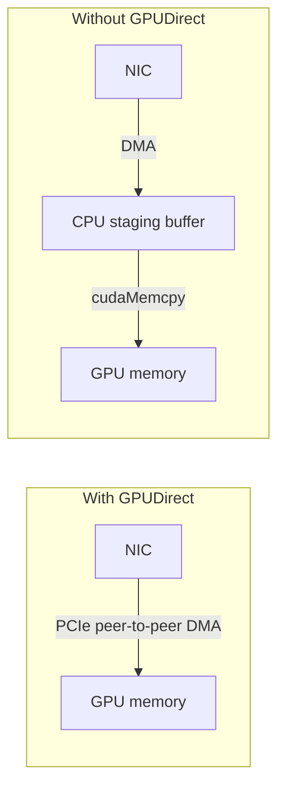
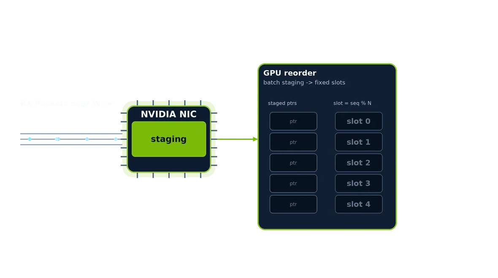

---
hide:
  - navigation
---

# Concepts

This page is the DAQIRI glossary. It defines the terms used across the
[API Guide](api-reference/index.md),
[Configuration Reference](api-reference/configuration.md), and
[tutorials](tutorials/system_configuration.md): **stream types and
endpoint URI schemes**, **GPUDirect**, **packet / burst / segment**,
**flow / queue**, **memory region**, **zero-copy ownership**,
**queue polling modes**, and **RX reorder**.

## Stream Types

DAQIRI exposes a single C++ API on top of several packet-I/O stacks. The
choice is configured per-application in YAML with:

- `stream_type`: the I/O stack family.
- endpoint URI schemes: `tcp://`, `udp://`, or `roce://` in
  `socket_config.local_addr` and `socket_config.remote_addr`.

The shipped Ethernet stream types use NICs as their hardware endpoint.
The planned PCIe programmable-sensor path uses the same DAQIRI model for
devices that sit directly on the PCIe bus, such as FPGAs, frame grabbers,
or custom acquisition cards.

#### Engines

An **engine** is the library that *implements* a stream type. It is a
separate concept from `stream_type`: the stream type says *what* kind of
stream you want, the engine is the *implementation* behind it.

You normally never set an engine, since DAQIRI picks a sensible default from
the `stream_type` and the endpoint URI scheme:

| Stream | Default engine | Notes |
|---|---|---|
| `stream_type: "raw"` | **`dpdk`** | kernel-bypass raw Ethernet |
| `stream_type: "raw"` with `engine: "ibverbs"` | **`ibverbs`** (opt-in) | MPRQ raw Ethernet via libibverbs/DevX (Mellanox/mlx5) |
| `stream_type: "socket"` with `udp://`/`tcp://` endpoints | **built-in Linux sockets** | always available, nothing to build |
| `stream_type: "socket"` with `roce://` endpoints | **`ibverbs`** | RDMA/RoCE via libibverbs |

The engine concept exists so the implementation can be swapped without
changing the stream type. For example, raw Ethernet is served by the
`dpdk` engine by default but can instead use the `ibverbs` engine (a
Multi-Packet/striding Receive Queue implementation) by setting
`engine: "ibverbs"` on the stream. RoCE is served by the `ibverbs` engine,
and a future release could add a DOCA RDMA engine as an alternative for the
same `roce://` stream.

At build time, `DAQIRI_ENGINE` selects which optional engines are
compiled in (`dpdk`, `ibverbs`); Linux sockets are always available. See
[Getting Started](getting-started.md) for the build options.

### Raw Ethernet

*YAML:* `stream_type: "raw"`.

Kernel-bypass raw Ethernet. The application talks directly to NIC ring
buffers in user space, skipping the Linux network stack entirely. This
is the highest-performance path and the only one with hardware flow
steering (see [Flows](#flow) below). Implemented on top of
[DPDK](https://www.dpdk.org/) by default. The DPDK dependency is an
implementation detail, not a user-facing concept. Setting `engine: "ibverbs"`
on the stream instead uses a pure-libibverbs/DevX Multi-Packet (striding)
Receive Queue engine on Mellanox/mlx5 NICs, which packs many packets into one
pre-posted buffer to avoid per-packet allocation.

Requires an NVIDIA SmartNIC (ConnectX-6 Dx or later).

### Socket

*YAML:* `stream_type: "socket"`. The specific transport is chosen by endpoint
URI schemes:

- **`udp://`** / **`tcp://`**: Linux kernel UDP and TCP sockets. No NIC
  privileges required, no special hardware. Useful
  as a comparison baseline against the kernel-bypass paths and as a way
  to get first results on a system without an NVIDIA NIC.
- **`roce://` endpoints**: RDMA over Converged Ethernet, using the
  open-source [`rdma-core`](https://github.com/linux-rdma/rdma-core)
  library. A server/client connection model, NIC-level reliable
  transport (RC), and in-order delivery. Primarily intended for
  workloads where **one** endpoint is a third-party device (an FPGA, an
  instrument, or another customer-supplied black box) that already
  speaks RoCE. When both peers run DAQIRI, prefer an upper-layer
  library such as MPI, NCCL, or UCX rather than wiring RoCE directly.

### PCIe (future)

*YAML:* `stream_type: "pcie"`.

Planned path for sensors that appear directly on the PCIe bus, such
as FPGAs, frame grabbers, or custom acquisition cards. The goal is to
move data into or out of CPU or NVIDIA GPU memory through the same
DAQIRI C++/Python API while avoiding unnecessary copies. This stream
type does not currently ship with a runnable benchmark or example YAML.

### Choosing a stream type

The right choice depends on packet size, batch size, latency target,
whether you need ordering or hardware reliability, and what the other
end of the link looks like. DAQIRI's job is to make swapping among them
a configuration change rather than a code change.

For a use-case-driven decision tree (baseline throughput, GPU reorder,
header-data split, multi-queue flow steering, packet recording, RDMA,
sockets), see
[Choosing an example config](tutorials/configuration-walkthrough.md#choosing-an-example-config)
in the configuration walkthrough.

??? example "Support and testing"

    The DAQIRI library integration testing infrastructure is under active
    development. As such:

    - **Raw Ethernet** (`stream_type: "raw"`) is supported, distributed
      with the DAQIRI library, and is the only stream type actively
      tested at this time.
    - **Socket: UDP / TCP** (`stream_type: "socket"` with `udp://` /
      `tcp://` endpoints) is supported and distributed. Integration testing is
      under development.
    - **Socket: RoCE** (`stream_type: "socket"` and
      `roce://` endpoints) is supported and distributed. Integration
      testing is under development.
    - The **PCIe programmable-sensor** path is under development.

## GPUDirect

**GPUDirect** allows the NIC to read and write data from/to a GPU
without staging it through system memory first. That decreases CPU
overhead and significantly reduces latency. An implementation of
GPUDirect is supported by every DAQIRI stream type.

The two paths look like this:

The GPUDirect path skips the CPU-side staging buffer and the
`cudaMemcpy` that goes with it.

!!! warning

    GPUDirect is only supported on RTX GPUs and Data Center GPUs. It is
    not supported on GeForce cards.

??? info "How does that relate to peermem or dma-buf?"

    There are two kernel interfaces to enable GPUDirect:

    - The [`nvidia-peermem`](https://docs.nvidia.com/cuda/gpudirect-rdma/)
      kernel module, distributed with the NVIDIA DKMS GPU drivers.
        - Supported on Ubuntu kernels 5.4+, deprecated starting with kernel
          6.8.
        - Supported on NVIDIA-optimized Linux kernels, including IGX OS and
          DGX OS.
        - Supported by all MOFED drivers (requires rebuilding `nvidia-dkms`
          drivers afterwards).
    - [`DMA Buf`](https://docs.kernel.org/driver-api/dma-buf.html),
      supported on Linux kernels 5.12+ with NVIDIA open-source drivers
      515+ and CUDA toolkit 11.7+.

    The DPDK that ships in the DAQIRI container is patched with dma-buf
    support, so the `nvidia-peermem` kernel module is **not required**
    inside the container.

For step-by-step system setup, see the
[System Configuration tutorial](tutorials/system_configuration.md#enable-gpudirect).

## Packets, Bursts, and Segments

DAQIRI is a batch processing library. Packets are received from DAQIRI
and sent to DAQIRI in batches called **bursts**. Larger bursts can
increase throughput at the expense of latency, while smaller bursts decrease
latency but cap total throughput because of the per-burst processing
overhead. The terms below appear throughout the API, configuration, and
code paths.

### Packet

A **packet** is a single, contiguous block of memory representing
either received data or data to transmit. Packets can be far larger
than an Ethernet MTU in some cases (for example with `roce://`, `tcp://`, or
`udp://` endpoints); the underlying stack fragments and
reassembles them on the wire transparently.

### Burst (`BurstParams`)

A **burst** is the metadata container DAQIRI uses to describe a batch
of packets being transmitted or received. The C++ type for a burst is
`BurstParams`. It is intentionally opaque, so applications use helper
functions (`get_packet_ptr`, `get_packet_length`, `get_num_packets`,
...) to inspect or modify it rather than touching its fields directly.

### Segment

A **segment** is one contiguous memory region inside a packet. A packet
can have one segment or multiple segments:

- **Single segment**: the whole packet fills one contiguous region.
- **Multiple segments**: each segment is assigned to a different memory
  region. The memory regions can be of any kind (CPU or GPU) in any
  order. A common use case is *header-data split* (HDS) below.

### Header-Data Split (HDS)

**Header-data split** is the canonical multi-segment configuration:
headers go to CPU memory (segment 0), payload goes to GPU memory
(segment 1). This keeps the GPU payload path zero-copy for downstream
GPU workloads while still letting the CPU parse and steer on the
headers.

Use HDS when the application needs to inspect headers (UDP
source/destination ports, application-layer sequence numbers, etc.) but
the bulk of the data is meant for the GPU.

## Flows and Queues

These two terms describe how packets are routed from the wire into the
right application buffer.

### Queue

A **queue** is a NIC-side buffer that an application reads from (RX) or
writes to (TX). By default, each queue is assigned a CPU core in the YAML
for DAQIRI to service. Queues and cores are not strictly one-to-one: one
core can service multiple queues.

A queue points at one or more *memory regions*, which hold its packet
buffers (CPU hugepages, GPU device memory, or pinned host memory).

### Queue Polling Modes (`poll_mode`)

With packet processing there is an inverse relationship with bandwidth and latency. This is mainly for two reasons:

1) Batching packets allows more optimizations, but takes longer to wait
2) Larger packet sizes are more efficient for higher bandwidth, but take longer to transmit and receive

DAQIRI allows users to select whether to prefer higher bandwidth or lower latency on a per-queue basis. A typical 
use case for this would be high bandwidth for data plane, and low latency for control plane. Note that these are extreme definitions of high bandwidth and low latency. DAQIRI already provides extremely low latency and high bandwidth by bypassing the Linux kernel, regardless of the setting. Choosing low latency may save low single digit microseconds per packet.

The `poll_mode` setting is used by choosing either indirect for high bandwidth, or direct for low latency by choosing which thread polls the NIC. `indirect` mode is chosen by default to favor high bandwidth and batching.

| Mode | Who services the queue? | Best suited for |
|---|---|---|
| `indirect` | A DAQIRI worker running on the queue's configured `cpu_core` | General use, batching, highest bandwidth |
| `direct` | The application thread calling the RX or TX API | The lowest single-packet latency when the application can dedicate one thread to each queue |

In **indirect mode**, the application and DAQIRI worker exchange bursts. The
queue requires `cpu_core` and `batch_size`; RX queues may also use `timeout_us`
to return a partial batch. `indirect` mode also allows more processing jitter in the application threads by using a zero-copy ring in between DAQIRI and the user. This is the existing behavior and is supported by
all applicable engines.

In **direct mode**, there is no worker between the application and the queue.
The application thread performs the queue work as part of its normal API calls:

- Direct RX returns all packets currently ready, up to 256, without waiting.
  An empty poll returns `Status::NOT_READY`.
- Direct TX accepts exactly one packet per `BurstParams`. A successful
  `send_tx_burst()` means the packet was submitted; the application must not
  access that burst afterward.
- Exactly one application thread must own each direct queue. A direct TX queue
  may have only one acquired-but-unsubmitted packet at a time.

Direct mode is available only for the raw `ibverbs` engine. A direct queue must
omit `cpu_core`, `batch_size`, and, for RX, `timeout_us`. Direct RX does not
support reorder configurations. Direct and indirect queues may be mixed on the
same interface.

Direct mode removes the cross-thread handoff that can add latency, but it also
makes application scheduling part of packet I/O. If the application thread is
descheduled, blocked, or busy doing other work, packet processing for that queue
stops until it calls DAQIRI again. Use indirect mode when steady progress or
batch throughput matters more than minimum latency.

See the [RX queue](api-reference/configuration.md#queues) and
[TX queue](api-reference/configuration.md#queues_1) configuration references
for the complete field rules.

### Flow

A **flow** is a match pattern paired with one or more actions. The
common RX action is to steer matching packets into one queue or a list of
queues. For
example, all UDP-destination-port-4096 packets can be routed into a
queue backed by GPU memory. Matching and the resulting actions both run
entirely in NIC hardware.

Flow rules are only available in Raw Ethernet (`stream_type: "raw"`).

A flow's match can combine fields such as `udp_src`, `udp_dst`, and
`ipv4_len`; multiple flows can target the same queue, and the matching
flow's ID is available at runtime so the application can distinguish them.

Flows can be static or dynamic. Static flows are configured under
`rx.flows` in the YAML and keep their configured IDs for the process lifetime.
Dynamic RX flows are added after `daqiri_init()` with `add_rx_flow_async()` or
`add_rx_flows_async()`; their non-zero `FlowId`s are allocated by DAQIRI,
returned in the add completion, and used as the packet marks returned by
`get_packet_flow_id()`. Batch adds complete with a single operation result whose
flow IDs are in input order. Only dynamic flows can be deleted dynamically. TX
dynamic flows are not part of v1.

Raw DPDK and raw ibverbs flows can also use ordered `actions:` for hardware VLAN
pop/push and VXLAN, GRE, or NVGRE decap/encap. RX decap/pop actions deliver
post-decap packets to application buffers, while TX encap/push actions leave
application buffers as pre-encap packets and change only the wire frame.
Dynamic RX flows use the same ordered action model for runtime decap/pop rules,
while TX transform flows remain static startup configuration.

A queue action with two or more queue IDs enables **receive-side scaling
(RSS)**. The NIC computes a Toeplitz hash from the IPv4/UDP five tuple and uses
it to select one requested queue. This is flow-affine: every packet in an
unchanged flow stays on one queue, preserving per-flow ordering. RSS is not
packet striping, so roughly even queue packet counts require enough distinct
tuples with reasonably balanced traffic. Tunnel-decap rules hash the inner
tuple; flex-item rules still hash the IPv4/UDP tuple rather than the flex value.
eCPRI flows do not support multi-queue RSS.

### Flow Steering

**Flow steering** is the NIC-level mechanism that classifies an
incoming packet against the configured flows and writes it into a selected
queue's buffer, entirely in hardware. Multi-queue RX can use separate scalar
rules or one RSS rule for parallel processing.

For Raw Ethernet, flow steering is implemented on top of RTE Flow in the
DPDK engine and mlx5 Direct Rules in the ibverbs engine. Flow rules are
programmed during `daqiri_init()`; initialization fails if the NIC
rejects a rule. The YAML options are documented in
[Configuration YAML Reference → Flows](api-reference/configuration.md#flows).

## Memory Regions

A **memory region** is a named pool of buffers where packet data lives.
Memory regions are declared at the top of the YAML and referenced by
name from each queue.

The kind of a memory region determines whether packet data ends up on
the CPU or the GPU:

- `huge`: CPU hugepages (recommended for CPU buffers).
- `device`: GPU VRAM (discrete GPUs, requires GPUDirect via peermem or
  DMA-BUF).
- `host_pinned`: pinned CPU pages allocated via `cudaHostAlloc`.
  Recommended on integrated GPUs (NVIDIA GB10 / DGX Spark), where the
  NIC cannot peer-DMA into device memory.
- `host`: regular CPU memory (not recommended for hot paths).

The size of the memory region (`buf_size`) dictates the largest
contiguous chunk that can be stored in a single *segment*. For example,
with a 60-byte region the first 60 bytes of each packet land in that
segment before the remainder spills into the next region in the
queue's list. Region buffers can be much larger than a single Ethernet
frame for fragmented transports (for example, `roce://`).

Combining memory regions on a single queue is how *header-data split*
is expressed in the YAML: queue 0's first memory region is a `huge` CPU
pool (for headers, segment 0); its second region is a `device` GPU pool
(for payload, segment 1).

## Zero-Copy Ownership

DAQIRI is designed around zero-copy packet delivery. When a receive API
returns packet data, the application is reading the buffers the NIC
DMA'd into. The API passes pointers and metadata, not copies.

That zero-copy model makes **buffer release part of the API contract**.
Applications must free RX bursts after processing and free or send TX
bursts after allocation. Holding bursts indefinitely drains DAQIRI's
buffer pools and can lead to `NO_FREE_BURST_BUFFERS`,
`NO_FREE_PACKET_BUFFERS`, queue drops, or stalled TX.

When to call each `free_*` function is documented in the
[C++ API Usage page](api-reference/cpp.md#rx-step-3-free-buffers).

## RX Packet Aggregation and Reorder

DAQIRI can perform GPU- or CPU-side packet aggregation and reordering
on RX through `rx.reorder_configs`:

- **GPU reorder configs** copy selected packet payloads into a configured
  output memory region and deliver the result as one *reordered
  aggregate burst*.
- **CPU reorder configs** provide the same aggregate-burst model for
  CPU-addressable packet and output memory.

This is the path to use when packets arrive out of order (e.g. across
multiple NIC queues) and need to be reassembled into a single, contiguous
GPU buffer before downstream processing.

Each reorder config currently operates on a single memory domain, either
GPU-only or CPU-only. Reordering packets whose segments span two memory
regions (for example, an HDS pair with CPU-side headers and GPU-side
payloads) is not yet supported but is planned.

See [Configuration YAML Reference → RX Reorder Configs](api-reference/configuration.md#rx-reorder-configs)
for the configuration constraints and
[C++ API Usage → Reordered RX bursts](api-reference/cpp.md#reordered-rx-bursts)
for how to consume them from C++.

## See also

- [API Guide](api-reference/index.md): the 6-step DAQIRI application
  lifecycle, with links into the language API.
- [Configuration YAML Reference](api-reference/configuration.md): every
  YAML key, its type, and its valid values.
- [C++ API Usage](api-reference/cpp.md): initialization, RX/TX, file
  writes, utilities, and the C++ function reference.
- [System Configuration tutorial](tutorials/system_configuration.md):
  the hardware and OS setup the concepts above depend on.
