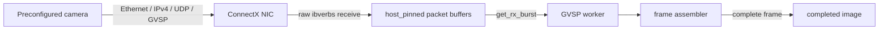

# Receive preconfigured GVSP image streams

This tutorial uses DAQIRI's raw `ibverbs` engine to receive a preconfigured
GigE Vision® Stream Protocol (GVSP) image stream. The example parses GVSP image
leader, data, and trailer packets and copies complete images into one preallocated
pinned frame buffer. The shipped configuration is pre-filled for DGX Spark, but
the application is not Spark-specific.

The example is intentionally a data-plane proof, not a camera SDK. Configure and
start the camera first with its vendor tool, Aravis tooling, or another GenICam/GVCP
utility.

!!! note "Scope and terminology"

    This example is not a complete or certified GigE Vision implementation. It
    does not perform discovery, GVCP control, packet resend, or GenICam XML access.
    GigE Vision® is a registered trademark administered by the Association for
    Advancing Automation (A3).

## Data path



The example deliberately uses:

- `stream_type: raw` and `engine: ibverbs`;
- an indirect RX queue, with a dedicated receive core;
- one `host_pinned` memory region, which preserves the high-throughput receive
  path and matches GB10 unified memory;
- one application worker on a separate CPU core;
- NIC filtering for the camera's destination MAC, IP addresses, and UDP port.

It does not use header-data split, DAQIRI's built-in packet reordering, or direct
polling. Mixed-size leader, data, trailer, and final-data packets are assembled
by the example instead.

## Supported packet profile

The parser accepts:

- Ethernet II with no VLAN or one 802.1Q/802.1ad tag;
- IPv4 with a valid variable header length;
- unfragmented UDP;
- conventional GVSP image leader, payload, and trailer packets;
- a single image payload and one active frame.

It rejects IP fragments, stacked VLANs, multipart images, compressed images,
chunk-only payloads, and other advanced GVSP payload types. The assembler
drops packets received before their leader and late packets belonging to another
block.

## Build

Build inside the project container as described in
[Getting Started](../getting-started.md).
Only the ibverbs optional engine is needed; Linux sockets remain built automatically.

```bash
cmake -S . -B build \
  -DCMAKE_BUILD_TYPE=Release \
  -DBUILD_SHARED_LIBS=ON \
  -DDAQIRI_ENGINE="ibverbs" \
  -DDAQIRI_BUILD_EXAMPLES=ON \
  -DDAQIRI_BUILD_TESTS=ON \
  -DDAQIRI_BUILD_PYTHON=OFF
cmake --build build -j
ctest --test-dir build --output-on-failure
```

The executable and configuration template are:

```text
build/examples/daqiri_example_gvsp_receiver
build/examples/daqiri_example_gvsp_receiver.yaml
```

## Configure the camera and receiver NIC

Use the camera control tool to set at least:

- receiver/destination IPv4 address;
- receiver UDP port;
- image width and height;
- pixel format;
- stream packet size;
- acquisition mode and start command.

Configure the camera-facing netdev with the receiver IP and a sufficiently
large MTU. The [DGX Spark system profile](system_configuration.md#dgx-spark-profile)
shows the persistent NetworkManager setup and explains why Spark uses
`host_pinned` buffers.

Identify the NIC BDF and MAC:

```bash
ethtool -i <camera-facing-netdev> | grep bus-info
cat /sys/class/net/<camera-facing-netdev>/address
ip -4 address show dev <camera-facing-netdev>
```

The camera must send to that MAC, IP, and UDP port. Keep camera control traffic on
the kernel interface; `flow_isolation: true` sends unmatched traffic back to the
kernel while the configured stream enters the DAQIRI queue.

## Set packet and frame sizes correctly

These values describe different layers:

| Value | Meaning |
|---|---|
| NIC MTU | Maximum IP packet accepted by the Linux/NIC path. |
| Camera stream packet size | Camera-side stream-channel setting; its precise accounting is camera-dependent. |
| `buf_size` | Maximum complete Ethernet frame DAQIRI may receive, starting at the destination MAC. |
| `data_payload_bytes` | Image bytes following the GVSP header in each full data packet. |
| `frame_bytes` | Exact reconstructed image byte count. Do not infer this from a free-form format name. |

Measure `data_payload_bytes` from a full GVSP data packet capture or the camera's
documented stream geometry. It excludes Ethernet, IPv4, UDP, and GVSP headers. The
final data packet may be shorter. `buf_size` must cover the complete Ethernet frame and
should include headroom for a VLAN tag if one is present.

For `Mono8` with no line padding, `frame_bytes = width * height`. Packed formats,
multi-component formats, and line padding require their actual delivered byte count.

## Customize the configuration

The generic-named template is pre-filled for DGX Spark. Copy it and replace every
angle-bracket placeholder:

```bash
cp examples/daqiri_example_gvsp_receiver.yaml /tmp/gvsp.yaml
```

Customize the template in three groups:

| Group | Settings | Guidance |
|---|---|---|
| Camera and stream | `ethernet.dst`, `ipv4_src`, `ipv4_dst`, `udp_dst`, `width`, `height`, `pixel_format_code`, `frame_bytes`, `data_payload_bytes`, `buf_size` | These must match the configured camera stream. `match.udp_dst` is the single source of truth for the destination port. The numeric GenICam PFNC pixel-format code is authoritative; image bytes are copied without pixel decoding. |
| Host and NIC | Interface PCI BDF, NIC MTU, `master_core`, queue `cpu_core`, application `cpu_core`, memory `affinity`, `kind`, `num_bufs`, `batch_size`, `timeout_us` | The shipped core IDs, `host_pinned` memory, and queue sizing are Spark starting values. Re-select them for the NIC NUMA node and isolated cores on another system. Keep one CPU-readable memory region to preserve the high-throughput receive path. |
| Policy and diagnostics | `frame_timeout_ms`, `incomplete_frame_policy`, `report_interval_seconds` | Tune the frame timeout above the expected frame transmission time. Choose `drop` to suppress individual incomplete-frame messages or `log` to print them. |

Settings normally left unchanged for this example are raw `ibverbs`, indirect
polling, one RX queue, `flow_isolation: true`, and no header splitting or built-in
packet reordering. The NIC MTU is set outside this YAML and must accommodate the
camera packet size.

The important sections are:

```yaml
memory_regions:
- name: "GVSP_RX"
  kind: "host_pinned"
  affinity: 0
  num_bufs: 51200
  buf_size: <maximum-ethernet-frame-bytes>

interfaces:
- name: "gvsp_port"
  address: "<camera-facing-nic-pci-bdf>"
  rx:
    flow_isolation: true
    queues:
    - name: "gvsp_rx_q0"
      id: 0
      poll_mode: "indirect"
      cpu_core: 18
      batch_size: 10240
      timeout_us: 100
      memory_regions: ["GVSP_RX"]
    flows:
    - name: "gvsp_stream"
      id: 0
      action: {type: queue, id: 0}
      match:
        ethernet: {dst: "<receiver-nic-mac>"}
        ipv4_src: "<camera-ip>"
        ipv4_dst: "<receiver-ip>"
        udp_dst: <gvsp-destination-port>

gvsp_receiver:
  interface_name: "gvsp_port"
  queue_id: 0
  cpu_core: 19
  width: 1920
  height: 1080
  pixel_format_code: "0x01080001"
  frame_bytes: 2073600
  data_payload_bytes: <gvsp-image-data-bytes-per-packet>
  frame_timeout_ms: 100
  incomplete_frame_policy: "log"
  report_interval_seconds: 2
```

The shipped Spark core placement mirrors the existing cross-host raw RX config:
core 18 runs DAQIRI's RX poller and core 19 runs the application. Adjust them if
those cores are not isolated on your system.

## Run

DAQIRI raw networking requires root privileges. Start the receiver before starting
camera acquisition:

```bash
sudo ./build/examples/daqiri_example_gvsp_receiver /tmp/gvsp.yaml
```

Useful bounded runs:

```bash
sudo ./build/examples/daqiri_example_gvsp_receiver /tmp/gvsp.yaml --seconds 10
sudo ./build/examples/daqiri_example_gvsp_receiver /tmp/gvsp.yaml --max-frames 100
sudo ./build/examples/daqiri_example_gvsp_receiver /tmp/gvsp.yaml \
  --max-frames 1 --dump-first-frame /tmp/frame.raw --log-every-frame
```

Periodic reports aggregate completed/incomplete frames, FPS, reconstructed image
throughput, received Ethernet-frame throughput, malformed packets, unsupported
GVSP packets, and duplicates. `raw_l2_gbps` counts received frame bytes but does not
include the
Ethernet preamble, inter-packet gap, or FCS and therefore is not a physical wire-rate
measurement. Use `mlnx_perf` as described in the benchmark guide for authoritative
NIC throughput.

Camera timestamps are reported as raw camera clock ticks. They are not nanoseconds
without the camera's timestamp frequency. The raw `ibverbs` engine captures the
NIC receive timestamp automatically and exposes it through `get_packet_rx_timestamp()`.
The timestamp is converted to nanoseconds using the NIC clock information. To
compare it with another clock, synchronize the NIC clock first.

## Validate without a camera

The CTest target constructs complete synthetic Ethernet/IPv4/UDP/GVSP frames and
checks VLANs, IPv4 options, malformed lengths, fragment rejection, legacy packet
parsing, out-of-order data, duplicates, early trailers, missing packets, timeouts,
and replacement by a new leader.

For an end-to-end NIC test, use a cabled peer. The installed
`daqiri_send_gvsp_test_stream.py` fixture uses only the Python standard library to
send constructed Ethernet frames:

```bash
sudo python3 examples/gvsp/send_test_stream.py \
  --interface <peer-netdev> \
  --source-mac <peer-mac> \
  --destination-mac <receiver-nic-mac> \
  --source-ip <camera-ip-from-yaml> \
  --destination-ip <receiver-ip-from-yaml> \
  --destination-port <gvsp-port> \
  --data-payload-bytes <same-value-as-yaml> \
  --frames 10
```

Use `--drop-data-packet N`, `--duplicate-data-packet N`, or `--shuffle-data` to
exercise incomplete, duplicate, and out-of-order handling. An ordinary localhost
UDP sender does not validate the physical NIC receive path because locally routed
traffic may never enter that NIC.

## Use completed frames in your application

When a complete image is ready, the receiver invokes a callback with a `FrameView`.
It contains:

- block ID and raw camera timestamp ticks;
- optional first/last NIC RX timestamps;
- width, height, and authoritative numeric GenICam PFNC pixel-format code;
- a pointer and byte count for the pinned frame buffer;
- expected, received, and duplicate data-packet counts.

The image-data pointer is valid only while the callback is running. An application
that needs asynchronous retention should copy it or introduce a bounded pool of frame
buffers rather than holding it.

The completed image uses pinned host memory. On Spark, a later optional Holoscan operator can wrap it as host-accessible tensor or video memory, or copy it
into a Holoscan-owned allocation. Holoscan is intentionally not linked by this example.

## Limitations and next steps

This example has one stream, one active frame, and no resend. A new leader drops and
reports an older incomplete frame. Follow-up work can add:

1. Optional Aravis/GVCP discovery and camera control without changing this data path.
2. A separate Holoscan adapter with explicit frame ownership.
3. Multiple frame slots and cameras after measuring real overlap behavior.
4. GPU assembly or DAQIRI's built-in reordering only after confirming that the
   camera's packet layout is compatible.
