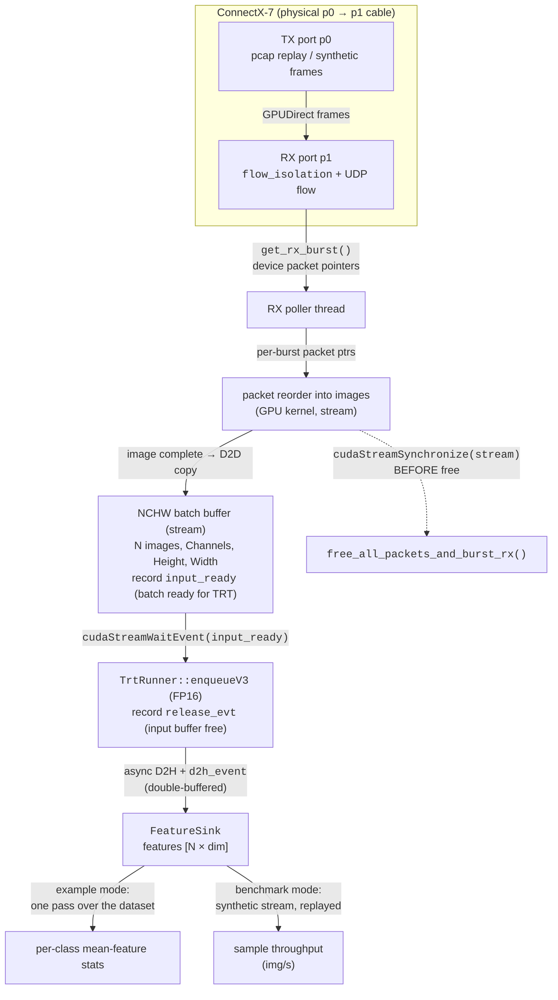

---
hide:
  - navigation
---

# DAQIRI → TensorRT ResNet Inference

This tutorial connects DAQIRI packet ingestion to a GPU inference pipeline:
received packets are reassembled into image tensors on the GPU, run through a
ResNet feature extractor with TensorRT, and summarized in latent space — with no
host bounce on the data path. The full source lives in
`applications/resnet50_inference/`.

```
received packets (raw / DPDK GPUDirect)
  → GPU sequence-number reorder (image reassembly)
  → ResNet feature extraction (TensorRT, FP16)
  → per-class mean-feature stats
```

It runs over a physical NIC loopback (the DGX Spark p0→p1 cabled loopback used in
[Performance: DGX Spark](../benchmarks/performance-dgx-spark.md)), so it exercises
the real RX path; the build is platform-agnostic and also targets IGX and RTX Pro
servers.

## Summary

One host sends preprocessed images out one NIC port and receives them on another
over a cabled loopback. Each image is streamed as ~84 UDP frames, DMA'd straight
into GPU memory (GPUDirect), reassembled and reordered on the GPU, and run through
a ResNet feature extractor — the CPU never touches the pixel data.

| | |
|---|---|
| **Dataset** | CIFAR-10 — 10 classes, 32×32 color images, upsampled to 224×224 for ResNet input |
| **Model** | ResNet-50 **feature extractor** via TensorRT (FP16) — the 1000-way ImageNet classifier head is replaced with `Identity`, so it emits a 2048-dim pooled feature per image (≈23.5 M params without the head; ≈25.6 M for full ResNet-50). `resnet18/34/101/152` also selectable |
| **Platform** | DGX Spark, ConnectX-7 with a p0→p1 loopback cable (build is platform-agnostic; also targets IGX and RTX Pro) |
| **Data path** | Raw Ethernet / DPDK GPUDirect RX → GPU reorder → TensorRT → per-class mean-feature stats, no host bounce |

## The pipeline

A single CUDA stream serializes every GPU stage — reorder → device-to-device batch
copy → inference — so no explicit syncs are needed *between* stages. The only
barrier is a `cudaStreamSynchronize` before each burst is freed, because the
reorder kernel reads the burst's device pointers.



## How it works

The receive path is one loop on a single CUDA stream. The walkthrough below follows
that loop in order (`applications/resnet50_inference/inference_pipeline.cu`,
`trt_runner.cu`).

Under the hood the app is multi-threaded: a DAQIRI RX poller thread pulls packets off
the NIC into the burst ring, and a separate **RX worker thread** dequeues those bursts
and runs the reorder kernel *and* TensorRT inference — both on the one CUDA stream.
A TX worker feeds the loopback. The cores are set in the config (values below are the
DGX Spark example):

| Thread | Core | Role |
| ------ | ---: | ---- |
| DPDK EAL master + stats | 3 | `cfg.master_core` |
| DPDK RX queue poller | 9 | `rx.queues[].cpu_core` — NIC → burst ring |
| App RX worker | 8 | `bench_rx.cpu_core` — `get_rx_burst` → reorder → inference |
| DPDK TX queue poller | 11 | `tx.queues[].cpu_core` — ring → NIC |
| App TX worker | 10 | `bench_tx.cpu_core` — replay/synthesize frames → enqueue |

The key point the "single stream" framing hides: reorder and inference share **one
thread and one stream** (the RX worker), while a *different* core (the DPDK poller)
fills the burst ring — a producer/consumer split. If the receive path can't keep up,
this core map is what you tune.

### 1 — One stream, three events

Everything runs on one non-blocking CUDA stream, so the GPU stages stay ordered
without per-stage synchronization. Three events coordinate the cross-stage and
back-edge signals:

```cpp
cudaStream_t stream = nullptr;
cudaStreamCreateWithFlags(&stream, cudaStreamNonBlocking);

cudaEvent_t input_ready = nullptr;   // a full NCHW batch is assembled and ready to infer
cudaEvent_t release_evt = nullptr;   // the input batch is consumed → buffer safe to reuse
cudaEventCreateWithFlags(&input_ready, cudaEventDisableTiming);
cudaEventCreateWithFlags(&release_evt, cudaEventDisableTiming);
```

A third event, `d2h_event`, lives inside the TRT runner: feature vectors are copied
device→host asynchronously and delivered **one batch late** (double-buffered), so the
host never stalls the current batch.

### 2 — Receive a burst, zero-copy

DAQIRI delivers packets in **bursts** of DAQIRI-owned buffers. The device pointers in
a burst are valid only until the burst is freed (the
[zero-copy ownership](../concepts.md) rule):

```cpp
daqiri::BurstParams* burst = nullptr;
if (daqiri::get_rx_burst(&burst, port_id, queue_id) != daqiri::Status::SUCCESS ||
    burst == nullptr) {
  // no packets this poll — back off and retry
}

const int num_pkts = static_cast<int>(daqiri::get_num_packets(burst));
for (int i = 0; i < num_pkts; ++i) {
  void* dev_ptr = daqiri::get_segment_packet_ptr(burst, /*seg=*/0, /*pkt=*/i);  // GPU pointer
  // ...
}
```

### 3 — Reassemble images across bursts

A single CIFAR image spans ~84 packets, and an image can straddle a burst boundary.
The pipeline keeps a **persistent, application-owned reorder buffer**
(`daqiri::bench::ReorderPipeline`) and runs the sequence-number reorder kernel **per
burst**, scattering each packet's pixel chunk into `slot = seq % packets_per_image`
*before* the burst is freed. Across bursts the slots accumulate, so a split image
still reassembles correctly. The per-image sequence number occupies the first 4
payload bytes; the reorder kernel copies pixels starting *after* it, so the sequence
number never overwrites image data.

This is DAQIRI's own sequence-number GPU reorder kernel
(`packet_reorder_copy_payload_by_sequence`, `src/kernels.cu`) — the same primitive the
`raw_reorder_*` benchmarks use — reused here through `ReorderPipeline`. It is
**application-driven**: DAQIRI does not reorder inside `get_rx_burst()`; the pipeline
invokes the kernel per burst. The config
([`resnet50_wire_loopback.yaml`](https://github.com/NVIDIA/daqiri/blob/main/applications/resnet50_inference/configs/resnet50_wire_loopback.yaml))
supplies only the packet geometry — `packets_per_image` is *derived* as
`image_bytes / out_payload_len`:

```yaml
reorder:
  out_payload_len: 7168   # pixel-bytes per packet, after the 4-byte sequence prefix
  images_per_batch: 32    # images assembled per inference batch
```

84 packets × 7168 B = 602,112 B = 3 × 224 × 224 × 4 (FP32 NCHW), so images reassemble
with no padding.

When an image completes, it is copied into its slot in the contiguous NCHW batch
buffer; once `images_per_batch` images are ready, one inference fires:

```cpp
pipe.reset_batch();
for (int i = 0; i < num_pkts; ++i) {
  pipe.add_device_packet(daqiri::get_segment_packet_ptr(burst, 0, i));
  if (++img_filled == cfg.packets_per_image) {
    const void* ordered = pipe.finish_batch();        // run reorder kernel on stream
    cudaMemcpyAsync(d_nchw_batch + img_in_batch * img_bytes, ordered,
                    img_bytes, cudaMemcpyDeviceToDevice, stream);
    ++img_in_batch;
    img_filled = 0;
    pipe.reset_batch();

    if (img_in_batch == batch) {                       // batch full → infer
      cudaEventRecord(input_ready, stream);
      trt.infer(reinterpret_cast<float*>(d_nchw_batch), batch, input_ready, release_evt,
                host_prev, n_prev);
      if (host_prev != nullptr) sink.consume(host_prev, n_prev);
      img_in_batch = 0;
    }
  }
}

// End of burst: flush the CURRENT image's this-burst packets into the persistent
// reorder buffer before the burst is freed — its device pointers die at free.
pipe.finish_batch();
pipe.reset_batch();
```

This trailing `finish_batch()` runs on **every** burst, not just when an image
completes. `add_device_packet()` only records each packet's GPU pointer; the reorder
kernel that copies pixels out of those buffers runs at `finish_batch()`. So when an
image straddles a burst boundary, its partial set of packets must be scattered into
the persistent buffer *before* the burst is freed and those pointers go dead — which
is exactly what lets a split image reassemble across bursts.

### 4 — Hand off to TensorRT

The runner gates inference on `input_ready`, binds the NCHW batch and output buffers,
enqueues on the same stream, then records `d2h_event` (output copied to host) and
`release_evt` (input buffer reusable):

```cpp
cudaStreamWaitEvent(inf_stream_, input_ready, 0);          // wait for the assembled batch

context_->setInputShape(cfg_.input_name.c_str(), dims);    // dynamic batch dim
context_->setTensorAddress(cfg_.input_name.c_str(), dev_input);
context_->setTensorAddress(cfg_.output_name.c_str(), trt_out_dev_[parity_]);
context_->enqueueV3(inf_stream_);

cudaMemcpyAsync(host_buf_[parity_], trt_out_dev_[parity_], out_bytes,
                cudaMemcpyDeviceToHost, inf_stream_);
cudaEventRecord(d2h_event_[parity_], inf_stream_);         // results ready (one batch late)
cudaEventRecord(release_evt, inf_stream_);                 // back-edge: input buffer free
```

The engine is **built and cached on the first run**, then loaded from cache. The
build requests a mixed FP16 engine from the FP32 ONNX and a dynamic batch dimension:

```cpp
if (cfg_.enable_fp16) {
  config->setFlag(nvinfer1::BuilderFlag::kFP16);
}
// ... build, then cache to cfg_.engine_path ...
std::ofstream out(cfg_.engine_path, std::ios::binary);
out.write(plan_data.data(), plan_data.size());
```

### 5 — Free the burst (the one load-bearing barrier)

The reorder kernel reads the burst's device pointers, so the burst must not be freed
until the stream drains. This is the only blocking sync in the loop:

```cpp
cudaStreamSynchronize(stream);                  // reorder kernel done reading burst ptrs
daqiri::free_all_packets_and_burst_rx(burst);   // return buffers to the pool
```

Missing the free drains the RX buffer pool, producing `NO_FREE_BURST_BUFFERS` /
`NO_FREE_PACKET_BUFFERS` errors and NIC-level drops. Free every burst, even on error
paths.

### 6 — Drain the last batch at shutdown

Because features are delivered **one batch late** (§1), the most recent batch is still
in flight when the loop exits. At shutdown the pipeline first flushes any trailing
partial batch (the dataset size need not be a multiple of `images_per_batch`), then
calls `trt.drain_final()` to synchronize and recover the final batch's features. Skip
this and the last batch is silently lost:

```cpp
cudaStreamSynchronize(stream);
float* host_final = nullptr;
uint32_t n_final = 0;
trt.drain_final(host_final, n_final);        // recover the one-batch-late tail
if (host_final != nullptr) sink.consume(host_final, n_final);
```

## Build & run

Build the container with the `torch` base image (it ships TensorRT plus
torch / torchvision for the offline data prep), then enable the applications tree
(off by default — it requires TensorRT):

```bash
BASE_IMAGE=torch BASE_TARGET=dpdk DAQIRI_ENGINE="dpdk ibverbs" scripts/build-container.sh

cmake -S . -B build -DCMAKE_BUILD_TYPE=Release -DBUILD_SHARED_LIBS=ON \
  -DDAQIRI_ENGINE="dpdk ibverbs" -DDAQIRI_BUILD_APPLICATIONS=ON
cmake --build build -j
cmake --install build --prefix /opt/daqiri
```

Prepare the model and dataset once, offline, so the runtime pipeline stays pure
*reorder → infer*:

```bash
# ResNet feature extractor (final FC stripped) → ONNX, dynamic batch axis.
python3 applications/resnet50_inference/tools/export_resnet_onnx.py \
  --model resnet50 --output models/resnet50_features.onnx --check

# CIFAR-10 → preprocessed framed pcap (+ a "<pcap>.labels" sidecar).
python3 applications/resnet50_inference/tools/prepare_cifar10_pcap.py \
  --num-images 256 --out data/cifar10_resnet.pcap
```

Bring the `dq_wire_*` namespaces down (they hide the ports from DPDK), export the RX
port MAC, fill the PCIe placeholders in `configs/resnet50_wire_loopback.yaml`
(TX = p0, RX = p1), then run:

```bash
./scripts/setup_spark_wire_loopback_netns.sh down
export ETH_DST_ADDR=$(cat /sys/class/net/<rx-iface>/address)   # RX port (p1)

./build/applications/resnet50_inference/daqiri_resnet50_inference \
  ./build/applications/resnet50_inference/configs/resnet50_wire_loopback.yaml \
  --dataset data/cifar10_resnet.pcap --seconds 10
```

Example mode replays the dataset **once** by default (use `--loop` to repeat): ResNet
inference is slower than line rate, so replaying once lets the whole dataset buffer in
the RX ring and drain through inference with zero drops, keeping the in-order image
reassembly correct. Confirm nonzero RX with `mlnx_perf`.

## Example output

On a successful run the engine loads from cache, a couple of raw feature vectors
print, and at shutdown a per-class mean-feature summary prints:

```text
Loaded cached engine from models/resnet50_features.fp16.engine (94164328 bytes)
  feature[image 0, class 6] = [0.1842, 0.0000, 0.4521, 0.0931, ...] (dim=2048)
  feature[image 1, class 9] = [0.0000, 0.2310, 0.1102, 0.3377, ...] (dim=2048)

=== ResNet inference summary ===
images=256 batches=8 seconds=10.00 => 25.60 img/s

Per-class mean-feature stats (first 8 dims + L2 norm of the mean vector):
  class  0 (n=    25): mean=[0.2014, 0.0331, 0.3895, ...]  |mean|=3.8421
  class  1 (n=    26): mean=[0.1577, 0.0902, 0.2233, ...]  |mean|=3.5108
  ...
  class  9 (n=    27): mean=[0.2588, 0.0117, 0.4410, ...]  |mean|=4.0072
(Distinct per-class mean vectors indicate ResNet separates the classes in latent space.)
```

The distinct per-class mean vectors (and their differing L2 norms) are a cheap,
dependency-free readout — a quick post-run check that the latent space separates by
class without pulling in a clustering or plotting dependency.

## Benchmark mode

Without `--dataset`, the TX synthesizes frames and the sink only counts, so the run
measures the full reorder + inference receive-path throughput. The sweep script builds
the ONNX for each model size as needed and writes `resnet-bench.csv` with img/s for
ResNet-18/34/50/101/152:

```bash
export ETH_DST_ADDR=$(cat /sys/class/net/<rx-iface>/address)
BUILD_DIR=./build ./applications/resnet50_inference/tools/run_resnet_bench.sh
```

### Results (DGX Spark)

Measured on a DGX Spark over the ConnectX-7 p0→p1 cable, FP16 engine, batch 32,
30 s × 3 reps (median reported). Params are the feature-extractor counts (the
1000-way ImageNet FC head is stripped). Payload rate is the application data rate
(`img/s × 3×224×224×4 B × 8`); the wire rate is a few percent higher (headers).

Latency is per **inference batch** (32 images), measured batch-ready → features on
the host with CUDA events.

| Model | Params (M) | Feature dim | Throughput (img/s) | Payload rate (Gb/s) | Latency p50 / p99 (ms) | RX drops |
| --------- | ---------: | ----------: | -----------------: | ------------------: | :--------------------: | :------: |
| ResNet-18 | 11.2 | 512 | 2109 | 10.2 | 3.0 / 5.1 | 0 |
| ResNet-34 | 21.3 | 512 | 1944 | 9.4 | 5.3 / 7.8 | 0 |
| ResNet-50 | 23.5 | 2048 | 1692 | 8.1 | 8.9 / 11.6 | 0 |
| ResNet-101 | 42.5 | 2048 | 1390 | 6.7 | 15.1 / 19.9 | 0 |
| ResNet-152 | 58.1 | 2048 | 1143 | 5.5 | 21.8 / 26.9 | ~19% |

Throughput falls monotonically with model depth (2109 → 1143 img/s, ~1.85× from
ResNet-18 to ResNet-152) and per-batch latency rises in step (p50 3.0 → 21.8 ms) —
both tracking model FLOPs. The **RX-drop column marks the receive-bound →
compute-bound transition**: everything up through ResNet-101 keeps up **drop-free**
(the receive path sustains ~1390 img/s), and only ResNet-152's inference is slow
enough to back-pressure the RX ring — it drops ~19% of arriving packets
(~698 K of ~3.6 M). Even the top payload rate (~10 Gb/s at ResNet-18) is well under
the ~95 Gb/s this link sustains on the raw DPDK bench, so the pipeline is
**GPU-compute bound**, not wire-bound: the single-stream reorder + FP16 inference on
the integrated GB10 is the limiter throughout.
