---
hide:
  - navigation
---

# DAQIRI → TensorRT ResNet Inference

This tutorial connects DAQIRI packet ingestion to a GPU inference pipeline:
received packets are reassembled into image tensors on the GPU, run through a
ResNet feature extractor with TensorRT, and summarized in latent space — with no
host bounce on the data path. It is the worked example for
[issue #73](https://github.com/NVIDIA/daqiri/issues/73). The full source lives in
`applications/resnet50_inference/`.

```
received packets (raw / DPDK GPUDirect)
  → GPU sequence-number reorder (image reassembly)
  → ResNet feature extraction (TensorRT, FP16)
  → per-class mean-feature stats
```

The example runs over the **DGX Spark physical p0→p1 cabled loopback** — the
same two-physical-port DPDK loopback used in
[Performance: DGX Spark](../benchmarks/performance-dgx-spark.md) — so it
exercises the real NIC receive path. The build is platform-agnostic (TensorRT is
discovered for both x86_64 and aarch64), so it also builds for IGX and RTX Pro
servers.

## Prerequisites

Build the container with the `torch` base image, which ships TensorRT plus
torch / torchvision for the offline data prep:

```bash
BASE_IMAGE=torch BASE_TARGET=dpdk DAQIRI_ENGINE="dpdk ibverbs" scripts/build-container.sh
```

Then enable the applications tree (off by default — it requires TensorRT):

```bash
cmake -S . -B build -DCMAKE_BUILD_TYPE=Release -DBUILD_SHARED_LIBS=ON \
  -DDAQIRI_ENGINE="dpdk ibverbs" -DDAQIRI_BUILD_APPLICATIONS=ON
cmake --build build -j
cmake --install build --prefix /opt/daqiri
```

## Step 1 — Export the model and packetize the dataset (offline)

The packetization is done once, offline, so the runtime pipeline stays pure
*reorder → infer*. Each CIFAR-10 image is resized to 224×224, ImageNet-normalized,
serialized as FP32 NCHW (3·224·224·4 = 602 112 bytes), split into fixed-size
chunks, and framed into UDP packets carrying a per-image sequence number.

```bash
# ResNet feature extractor (final FC stripped) → ONNX, dynamic batch axis.
python3 applications/resnet50_inference/tools/export_resnet_onnx.py \
  --model resnet50 --output models/resnet50_features.onnx --check

# CIFAR-10 → preprocessed framed pcap (+ a "<pcap>.labels" sidecar).
python3 applications/resnet50_inference/tools/prepare_cifar10_pcap.py \
  --num-images 256 --out data/cifar10_resnet.pcap
```

The TensorRT engine is **built and cached on the first run**, then loaded from
cache afterwards (the `engine_path` in the YAML).

## Step 2 — Run over the wire loopback

Bring the `dq_wire_*` namespaces down (they capture the ports and hide them from
DPDK) and export the RX port MAC, exactly as for the raw/DPDK bench. Fill the
PCIe placeholders in `configs/resnet50_wire_loopback.yaml` (TX = p0, RX = p1):

```bash
./scripts/setup_spark_wire_loopback_netns.sh down
export ETH_DST_ADDR=$(cat /sys/class/net/<rx-iface>/address)

./build/applications/resnet50_inference/daqiri_resnet50_inference \
  ./build/applications/resnet50_inference/configs/resnet50_wire_loopback.yaml \
  --dataset data/cifar10_resnet.pcap --seconds 10
```

You should see the engine build + cache on the first run (and load from cache on
the next), a couple of sample feature vectors, and at shutdown a per-class
mean-feature summary — distinct per-class mean vectors show ResNet separating the
CIFAR classes in latent space. Confirm nonzero RX with `mlnx_perf`.

!!! note "Why example mode replays the dataset once"
    ResNet inference is slower than line rate, so a continuously-looping sender
    would overflow the RX ring and drop packets — which would break the
    drop-free, in-order image reassembly. Example mode therefore replays the
    dataset a single time (override with `--loop`): the whole dataset fits in the
    RX ring (`num_images * packets_per_image < num_bufs`, e.g. 256 × 84 = 21 504
    < 51 200), so every packet is buffered and the receiver drains it through
    inference at its own pace with zero drops. The benchmark below loops instead,
    since it only needs throughput and tolerates drops.

## How it works — image reassembly across bursts

DAQIRI delivers packets in **bursts**; the device pointers in a burst are only
valid until the burst is freed. A single CIFAR image spans ~84 packets, and an
image can straddle a burst boundary. The pipeline therefore keeps a persistent,
application-owned reorder buffer and runs the sequence-number reorder kernel
**per burst**, scattering each packet's pixel chunk into `slot = seq %
packets_per_image` *before* the burst is freed. Across bursts the slots
accumulate, so an image that arrives split over two bursts still reassembles
correctly. Completed images are copied into a contiguous NCHW batch buffer; once
`images_per_batch` are ready, one TensorRT inference runs on the whole batch.

The per-image sequence number occupies the first 4 payload bytes (a prefix), and
the reorder kernel copies pixels starting *after* it — so the sequence number
never overwrites image data.

## How it works — CUDA-event buffer logic

The pipeline never blocks the RX poller on the GPU and never frees a burst while
the GPU is still reading it. Everything runs on a **single shared CUDA stream**
`s`, which serializes the stages with no explicit syncs between them:

1. **`input_ready`** — recorded on `s` after a full inference batch is assembled
   (all reorder kernels + per-image device-to-device copies enqueued). The TRT
   runner waits on it before `enqueueV3`, so inference cannot start before the
   NCHW batch exists.
2. **`release_evt`** — recorded on `s` after `enqueueV3`; marks the input batch
   as consumed (the back-edge signal a producer reusing the buffer waits on).
3. **`d2h_event` + double buffering** — feature vectors are copied device→host
   asynchronously; results are delivered one batch late, so the host never stalls
   the current batch.
4. **`cudaStreamSynchronize(s)` before `free_all_packets_and_burst_rx`** — the
   one load-bearing barrier. The reorder kernel reads the burst's device
   pointers, so the burst must not be freed until the stream drains. This is the
   DAQIRI [zero-copy ownership](../concepts.md) rule applied to a GPU consumer.

```mermaid
flowchart LR
  subgraph NIC["ConnectX-7 (physical p0 -> p1 cable)"]
    TX["TX port p0<br/>pcap replay / synthetic"] -->|GPUDirect frames| RX["RX port p1<br/>flow_isolation + UDP flow"]
  end
  RX -->|get_rx_burst<br/>device pkt ptrs| POLL["RX poller"]
  POLL -->|per-burst packet ptrs| REO["reorder-scatter kernel<br/>into image buffer (stream s)"]
  REO -->|image complete -> D2D| BATCH["NCHW batch buffer<br/>(stream s); record input_ready"]
  BATCH -->|cudaStreamWaitEvent input_ready| TRT["TrtRunner enqueueV3 FP16<br/>(stream s); record release_evt"]
  TRT -->|async D2H + d2h_event<br/>double-buffered| SINK["FeatureSink: features [N x dim]"]
  SINK -->|example mode| STATS["per-class mean-feature stats"]
  SINK -->|benchmark mode| CNT["count -> img/s"]
  REO -.->|cudaStreamSynchronize s<br/>BEFORE free| FREE["free_all_packets_and_burst_rx"]
```



## Benchmark mode

Without `--dataset`, the TX synthesizes frames and the sink only counts, so the
run measures the full reorder + inference receive-path throughput. The sweep
script builds the ONNX for each model size as needed:

```bash
export ETH_DST_ADDR=$(cat /sys/class/net/<rx-iface>/address)
BUILD_DIR=./build ./applications/resnet50_inference/tools/run_resnet_bench.sh
```

It writes `resnet-bench.csv` with img/s for ResNet-18/34/50/101/152. Published
numbers for the DGX Spark are in
[Performance: DGX Spark](../benchmarks/performance-dgx-spark.md).
