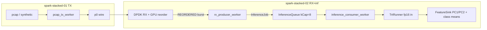

---
hide:
  - navigation
---

# DAQIRI → TensorRT ResNet Inference

This tutorial connects DAQIRI packet ingestion to a GPU inference pipeline:
config-based GPU reorder converts wire **int8** samples to a contiguous **fp16**
NCHW batch, an SPSC ring decouples RX from TensorRT, and ResNet features are
summarized per CIFAR-10 class, with no host bounce on the data path. FeatureSink
also prints headless `pc1=`/`pc2=` lines to stdout every
`inference.pca_every_n_batches` batches. Source: `applications/resnet50_inference/`.

```
wire int8 packets (raw / DPDK GPUDirect)
  → config-based GPU reorder + int8→fp16 (one burst = one inference batch)
  → SPSC handoff (RX producer | inference consumer)
  → ResNet feature extraction (TensorRT, FP16 tensor cores)
  → FeatureSink (PC1/PC2 + per-class mean-feature stats)
```

**How to use this page**

| Goal | Path |
|------|------|
| First build / no NIC | [Smoke first (software loopback)](#smoke-first-software-loopback) |
| Published numbers (customer-like RX+inference) | [Spark↔Spark, one cable](#run-xhost) |

**Reported topology:** two DGX Sparks, **one cable** p0↔p0 (not dual-cable):

| Role | Host | Config |
|------|------|--------|
| TX | `spark-stacked-01` (ncg-spark-0177) | `resnet50_tx_spark_xhost.yaml` |
| RX+inference | `spark-stacked-02` (ncg-spark-7013) | `resnet50_rx_spark_xhost.yaml` |

Single-host p0→p1 wire loopback remains an optional NIC smoke; it is not the
reported benchmark.

## Summary

| | |
|---|---|
| **Dataset** | CIFAR-10 → 224×224, signed int8 = pixel-128 (lossless); ImageNet norm folded into ONNX |
| **Model** | ResNet-50 feature extractor via TensorRT (FP16 input binding + tensor cores); 2048-dim features |
| **Platform** | Dual DGX Spark xhost (also builds for IGX / RTX Pro) |
| **Data path** | GPUDirect → reorder MR → TRT zero-copy read of reorder output → FeatureSink |

## Geometry (int8 → fp16)

Images travel as **signed int8**, one byte per pixel, and become fp16 only in GPU
memory. The reorder kernel reassembles the packets and converts in the same pass,
so the network never carries fp16 and the CPU never touches a pixel. fp16 is
required by the TensorRT engine, which is built for tensor cores; ResNet-50
itself is indifferent to the dtype.

| Field | Value |
|-------|-------|
| elems/image | 150528 (3×224×224) |
| packets_per_image | 128 |
| wire payload | 1176 B int8 |
| output_slot_stride | 2352 B fp16 |
| packets_per_batch | 4096 (= 128×32) |
| seq | header bit_offset 128, width 12 |
| aggregate output | 9,633,792 B = `[32,3,224,224]` fp16 |

Signed rather than `uint8` because the convert path is int8→fp16, so the prep
tool subtracts 128 from every pixel. That is lossless over 0..255, costs no extra
bytes, and the ONNX front-end adds the offset back as part of normalization.

`packets_per_image` and `images_per_batch` must both be powers of two.
`--images-per-batch` must stay a power-of-two divisor of `packets_per_batch / packets_per_image`.

### Queue sizing

The DPDK reorder path groups **the first `packets_per_batch` packets that
arrive** into one batch (each packet lands at `seq % packets_per_batch`), and a
separate timeout poll flushes a part-filled batch once
`now - first_packet_cycles >= timeout_us`. A partial flush is truncated to whole
images, so the image straddling the boundary is dropped.

| Setting | xhost value | Requirement |
|---------|------------:|-------------|
| `rx.queues[].timeout_us` | 0 | Disables partial flushes |
| `rx.queues[].batch_size` | 8192 | Multiple of `packets_per_batch` |
| `tx.queues[].batch_size`, `bench_tx.batch_size` | 4096 | Aligned to `packets_per_batch` |

`timeout_us: 0` is deliberate. The dataset is padded to whole batches, so a
partial flush can only ever lose data, and **any** finite timeout loses the race
whenever the RX poller stalls mid-batch because of inference backpressure, a cold
first run, or CPU contention. Measured on the xhost pair (256 images):

| `timeout_us` | Result |
|---|---|
| 0 | 256/256, three runs, `partial=0`. Also `partial=0` across 14,190 reorder batches in prior 30 s sustained runs |
| 20000 | 256/256 twice on an idle host; 255/256 twice while `app-detector` competed for CPU on the TX host |
| 200000 | 255/256 on a cold first run, idle host |

The 255/256 cells are the point: a finite timeout only helps if the flush boundary
never lands mid-batch, and CPU contention is enough to make it land there.

The trade-off: with flushing off, a batch missing even one packet is never
delivered, costing all 32 of its images instead of 31. A streaming deployment
that tolerates loss wants a finite timeout; a fixed dataset replay does not.

Misalignment is silent: the run completes but reports partial bursts and fewer
images than sent (`pushed 255 images (... partial=2 dropped=1)`).

## The pipeline


```mermaid
flowchart LR
  subgraph txHost ["spark-stacked-01 TX"]
    Pcap["pcap / synthetic"]
    TxW["pcap_tx_worker"]
    Pcap --> TxW --> Wire["p0 wire"]
  end
  subgraph rxHost ["spark-stacked-02 RX+inf"]
    Wire --> NicRx["DPDK RX + GPU reorder"]
    NicRx -->|"REORDERED burst"| Prod["rx_producer_worker"]
    Prod -->|"InferenceJob"| SPSC["InferenceQueue kCap=8"]
    SPSC --> Cons["inference_consumer_worker"]
    Cons --> TRT["TrtRunner fp16 in"]
    TRT --> Sink["FeatureSink PC1/PC2 + class means"]
  end
```

### Threads (RX host, xhost cores)

| Thread | Core | Role |
|--------|-----:|------|
| DPDK EAL master | 8 | `master_core` |
| DPDK RX poller | 18 | `rx.queues[].cpu_core` |
| App RX producer | 19 | `bench_rx.cpu_core`: `get_rx_burst` → SPSC push |
| Inference consumer | 15 | `inference.cpu_core`: TRT + FeatureSink |
| reorder CUDA stream | n/a | `set_reorder_cuda_stream` (bound once after init) |
| inference CUDA stream | n/a | owned by consumer |

TX host uses cores 8 / 16 / 17 (master / app TX / TX queue).

### Producer / consumer contract

- Producer requires `DAQIRI_BURST_FLAG_REORDERED`. On `REORDER_TIMEOUT`,
  `n_img = source_packet_count / packets_per_image` (skip if 0).
- `get_reorder_burst_info` on a timeout-flushed burst can return `NOT_READY`
  while its reorder event is still in flight; the producer retries (~100 ms)
  instead of discarding the batch.
- Example mode: backpressure on a full SPSC queue. Bench mode: drop the burst.
- Consumer calls `TrtRunner::infer` (returns **bool**). Rotate `prev_burst` only
  on success; free the current burst on failure. Freeing `prev_burst` is safe
  because a successful `infer` synchronizes the previous batch’s D2H event.
- Teardown: join producer → drain consumer → `daqiri::shutdown()` →
  `cudaStreamDestroy(reorder_stream)`.

### Type conversion

The reorder kernel does register-only int8→fp16 (load int8, convert, store half).
No fp32 buffer is materialized. ONNX prepends Mul/Add so
`y_c = x_fp16 * a_c + b_c` with `a_c = 1/(255*std_c)`,
`b_c = (128/255 - mean_c)/std_c` (R,G,B = channel 0,1,2). Shared constants live
in both `export_resnet_onnx.py` and `prepare_cifar10_pcap.py`.

## Build

```bash
BASE_IMAGE=torch BASE_TARGET=dpdk DAQIRI_ENGINE="dpdk ibverbs" scripts/build-container.sh

cmake -S . -B build -DCMAKE_BUILD_TYPE=Release -DBUILD_SHARED_LIBS=ON \
  -DDAQIRI_BUILD_PYTHON=OFF -DDAQIRI_ENGINE="dpdk ibverbs" -DDAQIRI_BUILD_APPLICATIONS=ON
cmake --build build -j --target daqiri_resnet50_inference
```

## Prepare model + dataset

```bash
python3 applications/resnet50_inference/tools/export_resnet_onnx.py \
  --model resnet50 --output models/resnet50_features.onnx --check
rm -f models/resnet50_features.fp16in.engine models/resnet50_features.fp16in.*.engine

python3 applications/resnet50_inference/tools/prepare_cifar10_pcap.py \
  --num-images 256 --images-per-batch 32 --out data/cifar10_resnet.pcap
```

Engine cache path: `models/resnet50_features.fp16in.engine`.
Re-export after pulling exporter changes, then delete that engine so TensorRT
rebuilds with FLOAT32 `features` (the ONNX front-end stays FP16 input).

## Smoke first (software loopback)

No NIC and no cable. Build and prepare model/dataset as above, then:

```bash
sudo ./build/applications/resnet50_inference/daqiri_resnet50_inference \
  ./build/applications/resnet50_inference/configs/resnet50_sw_loopback.yaml \
  --replay-once --dataset data/cifar10_resnet.pcap --expected-images 256
```

Expect: TensorRT ready; `set_reorder_cuda_stream OK`; `pc1=`/`pc2=` lines on
**stdout**; per-class mean features on stderr; clean shutdown with 256 images.
App README: `applications/resnet50_inference/README.md`.

## Run (xhost)

Net prep (both hosts): see [system configuration](system_configuration.md):
`scripts/setup_spark_xhost_net.sh`. Use **one** cable between the Sparks on
p0↔p0.

```bash
./applications/resnet50_inference/tools/run_resnet_xhost.sh --replay-once
```

Or manually: start RX on stacked-02 first (`--mode rx`), wait for
`set_reorder_cuda_stream OK` / `TrtRunner ready`, then TX on stacked-01 with
`ETH_DST_ADDR` set to the RX p0 MAC (`--mode tx --replay-once`).

Start TX within ~3 minutes of RX: with no traffic at all the producer gives up
on a startup idle timeout (a shorter ~5 s quiescence timeout applies once frames
have arrived).

Expect: kHALF input binding; FLOAT32 (or converted) `features`; all 256 images;
`pc1=`/`pc2=` on stdout; per-class mean features labeled with CIFAR-10 class
names (`airplane` … `truck`); clean shutdown. Measured on stacked-01 →
stacked-02 (256 images, `--replay-once`):

```text
pcap_tx_worker: sent 32768/32768 frames in 0.0510741 s (send_failures=0 fill_failures=0 no_burst_polls=0)
rx_producer_worker: pushed 256 images (reordered_bursts=8 partial=0 dropped=0 ...)
inference latency (ms): mean=8.78 p50=8.41 p99=9.36 (per batch of 32 images, n=8)
```

`partial` / `dropped` counters above zero mean the queue sizing is misaligned;
see [Queue sizing](#queue-sizing).

Bench: `--seconds 20` for sustained throughput (drops OK; stats off).

## Performance

Measured on the xhost pair (stacked-01 TX to stacked-02 RX), batch of 32 images.
Payload Gb/s counts CIFAR-10's native uint8 image bytes on the wire. The fp16
TensorRT input exists only after GPU reorder.

| Result | img/s | Payload Gb/s | latency_ms | Note |
|---|---:|---:|---:|---|
| **ResNet-50 FP16 baseline** | **3431** | **4.13** | **8.66** | int8 wire, GPU int8 to fp16 reorder, FP16 TensorRT |
| ResNet-18 FP16 comparison | 4626 | 5.57 | 2.59 | +34.8% versus ResNet-50 baseline |

Clock locking and INT8 TensorRT did not improve the ResNet-50 result in this
setup: locked FP16 was 3411 img/s (-0.6%), and locked INT8 was 3390 img/s
(-1.2%).

**Bottleneck:** ResNet-50 uses 4.13 Gb/s of image payload, about 4.36 Gb/s on the
wire with headers. That is far below the roughly 100 Gb/s ingest-only result for
the same Spark pair. The smaller ResNet-18 model raises throughput, so the limit
for this PR's ResNet example is TensorRT model execution, not RX polling, GPU
reorder, or link bandwidth.

### Batch size

`images_per_batch` sets both the reorder window and the TensorRT batch. Keep it a
power-of-two divisor of `packets_per_batch / packets_per_image`. Treat batch size
as a latency and queueing setting until the next one-cable, uint8-accounted sweep
is complete.

For this pipeline in the context of the platform's other transport numbers, see
[DGX Spark performance](../benchmarks/performance-dgx-spark.md#end-to-end-inference-pipeline-resnet-50-cross-host).

## Output (v1)

`FeatureSink` prints per-class mean feature vectors using **ground-truth** labels
from the `.labels` sidecar, with CIFAR-10 class names. A predicted-class /
softmax head is a follow-up.

## See also

- App README: `applications/resnet50_inference/README.md`
- Raw Ethernet reorder config: [configuration](../api-reference/configuration.md)
- Spark xhost benches: [raw benchmarking](../benchmarks/raw_benchmarking.md)
