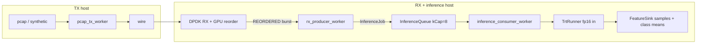

---
hide:
  - navigation
---

# DAQIRI → TensorRT ResNet Inference

This tutorial connects DAQIRI packet ingestion to a GPU inference pipeline.
Config-based GPU reorder converts wire **int8** samples into a contiguous
**fp16** NCHW batch, an SPSC ring decouples RX from TensorRT, and ResNet-50
emits one embedding vector per image — with no host bounce on the data path.
Source: `applications/resnet50_inference/`.

```
wire int8 packets (raw Ethernet, NIC-DMA into GPU-accessible buffers)
  → config-based GPU reorder + int8→fp16 (one burst = one inference batch)
  → SPSC handoff (RX producer | inference consumer)
  → ResNet-50 feature extraction (TensorRT, FP16 tensor cores)
  → FeatureSink (sample features + per-class mean-feature stats)
```

The pipeline needs **two hosts and one link**: one transmits, the other receives
and infers. The shipped configs and the `run_resnet_xhost.sh` helper default to a
pair of DGX Sparks cabled p0↔p0, but nothing in the application is
platform-specific — see [Run across two hosts](#run-across-two-hosts) for what a
different pair needs to change. A single-host software loopback needs no NIC at
all and is the fastest way to check a build.

## Summary

| | |
|---|---|
| **Dataset** | CIFAR-10, 224×224, 3-channel color images |
| **Model** | ResNet-50 feature extractor via TensorRT (FP16 input binding + tensor cores) |
| **Output** | Tensor `features`, FP32, shape `[batch, 2048]` — one **2048-length embedding vector per image** |
| **Data path** | NIC DMA → RX buffers → reorder MR → TRT zero-copy read of reorder output → FeatureSink |

### Key parameter values

| Parameter | Value |
|-----------|-------|
| Image dimensions | 3 × 224 × 224 (CIFAR-10 upscaled) |
| Wire payload per packet | 1176 B int8 |
| Packets per image | 128 |
| Images per inference batch | 32 |

Images travel as signed int8 — one byte per pixel, `pixel − 128`, which is
lossless over 0..255 and costs no extra bytes. The reorder kernel reassembles
the packets and converts to fp16 in the same pass, so the network never carries
fp16 and the CPU never touches a pixel. One delivered burst is exactly one
`[32,3,224,224]` fp16 batch.

Two constraints are worth knowing before you change any of the four values
above:

- `packets_per_image` and `images_per_batch` must both be powers of two, and
  `--images-per-batch` must stay a power-of-two divisor of
  `packets_per_batch / packets_per_image`.
- `Data_RX_GPU`'s `buf_size` **must** equal `payload_byte_offset +
  out_payload_len` (64 + 1176 = 1240). The reorder slot stride is derived from
  `buf_size - payload_byte_offset`, so any slack pads the fp16 batch and breaks
  the tensor layout.

The full parameter table — including `output_slot_stride`, `seq_bit_offset` /
`seq_bit_width`, and the derived `packets_per_batch` — is in
`applications/resnet50_inference/README.md` under **Config keys**.

## The pipeline

Two threads, two CUDA streams, and one ring between them. The NIC and the
reorder kernel fill batches on the reorder stream; TensorRT drains them on the
inference stream; the SPSC queue is the only thing the two app threads share.


```mermaid
flowchart LR
  subgraph txHost ["TX host"]
    Pcap["pcap / synthetic"]
    TxW["pcap_tx_worker"]
    Pcap --> TxW --> Wire["wire"]
  end
  subgraph rxHost ["RX + inference host"]
    Wire --> NicRx["DPDK RX + GPU reorder"]
    NicRx -->|"REORDERED burst"| Prod["rx_producer_worker"]
    Prod -->|"InferenceJob"| SPSC["InferenceQueue kCap=8"]
    SPSC --> Cons["inference_consumer_worker"]
    Cons --> TRT["TrtRunner fp16 in"]
    TRT --> Sink["FeatureSink samples + class means"]
  end
```

## How it works

The walkthrough below follows one batch from the wire to an embedding vector
(`applications/resnet50_inference/main.cpp`, `inference_pipeline.cu`,
`spsc_queue.h`, `trt_runner.cu`).

### 1. Threads and CUDA streams

The RX side has a **reorder stream**, created by `main` and handed to the
engine; the inference side has its own stream owned by the consumer thread. Two
application threads sit on either side of the SPSC queue.

| Thread | Core | Role |
|--------|-----:|------|
| DPDK EAL master | 8 | `master_core` |
| DPDK RX poller | 18 | `rx.queues[].cpu_core` |
| App RX producer | 19 | `bench_rx.cpu_core`: `get_rx_burst` → SPSC push |
| Inference consumer | 15 | `inference.cpu_core`: TRT + FeatureSink |
| reorder CUDA stream | n/a | `set_reorder_cuda_stream` (bound once after init) |
| inference CUDA stream | n/a | owned by consumer |

Core numbers are from `resnet50_rx_spark_xhost.yaml`; the TX config uses 8 / 16
/ 17 (master / app TX / TX queue). `resnet50_sw_loopback.yaml` uses a different
set entirely (master 3, RX queue 9, producer 8, inference 7), so pick cores for
your own host rather than copying these.

The consumer is launched **first**, and the producer only after it signals
`rx_ready`:

```cpp
consumer_thread = std::thread(app::inference_consumer_worker, std::cref(cfg), std::ref(sink),
                              std::ref(inf_queue), std::ref(producer_done), std::ref(rx_ready),
                              std::ref(stop));
while (!rx_ready.load() && !stop.load()) {
  std::this_thread::sleep_for(std::chrono::milliseconds(10));
}
producer_thread =
    std::thread(app::rx_producer_worker, std::cref(cfg), std::ref(inf_queue), expected_images,
                std::ref(producer_done), std::ref(stop));
```

`rx_ready` is set only after `TrtRunner::initialize()` returns, which on a cold
run *builds* the engine and can take minutes. The producer has a finite patience
budget for that:

```cpp
constexpr uint32_t kQuiesceIters = 50000;        // ~5 s after data started
constexpr uint32_t kStartupIdleIters = 1800000;  // ~3 min before any data
```

Start the producer before the engine is ready and a cold build eats straight
into that ~3-minute window. These are the same two numbers that govern how long
you have to start TX after RX — see
[Run across two hosts](#run-across-two-hosts).

### 2. Configure GPU reorder

Creating and binding one CUDA stream is the entire application side of reorder.
`main` does it immediately after `daqiri_init` and before any thread starts:

```cpp
cudaStreamCreateWithFlags(&reorder_stream, cudaStreamNonBlocking);
if (daqiri::set_reorder_cuda_stream(cfg.rx.interface_name, cfg.reorder_name, reorder_stream) !=
    daqiri::Status::SUCCESS) {
  // fatal: reorder cannot run on a stream the app can observe
}
```

Everything else is configuration. The app's `reorder:` block declares the
geometry once — the stream binding target, the packet layout, and the
sequence-number field:

```yaml
reorder:
  reorder_name: "rx_reorder_resnet_int8_fp16"
  out_payload_len: 1176
  output_slot_stride: 2352
  packets_per_image: 128
  payload_byte_offset: 64
  seq_bit_offset: 128
  seq_bit_width: 16
  images_per_batch: 32
  image_out_bytes: 301056
```

`reorder_name` is the same string passed to `set_reorder_cuda_stream` above.
The remaining knobs — reorder type, output memory region, int8→fp16 conversion,
and which flow IDs to reorder — have defaults that suit this pipeline; see
`applications/resnet50_inference/README.md` under **Config keys** for the full
table.

`seq_bit_width` must match the `--seq-bit-width` used to generate the pcap.

The application never launches a reorder kernel, never tracks a packet's slot,
and never accumulates an image — it declares the geometry and then receives
finished batches.

### 3. Receive a batch

In this example, burst size equals an inference batch, removing the need to
manage image reassembly across bursts.

DAQIRI delivers packets in bursts of DAQIRI-owned buffers, and the pointers in a
burst are valid only until the burst is freed (the
[zero-copy ownership](../concepts.md) rule):

```cpp
daqiri::BurstParams* burst = nullptr;
if (daqiri::get_rx_burst(&burst, port_id, queue_id) != daqiri::Status::SUCCESS ||
    burst == nullptr) {
  // no packets this poll — back off, count an idle poll, retry
}
```

A burst is only usable here if reorder actually ran on it. That is a flag check,
and a burst without it is freed on the spot:

```cpp
const uint32_t flags = burst->hdr.hdr.burst_flags;
if ((flags & daqiri::DAQIRI_BURST_FLAG_REORDERED) == 0U) {
  ++bursts_not_reordered;
  packets_not_reordered +=
      static_cast<uint64_t>(std::max<int64_t>(0, daqiri::get_num_packets(burst)));
  daqiri::free_all_packets_and_burst_rx(burst);
  continue;
}
```

A full batch carries `images_per_batch` images. A **timeout-flushed** batch does
not, and its true image count has to be queried — but the query can race the
reorder kernel that is still finishing:

```cpp
uint32_t n_img = cfg.images_per_batch;
if ((flags & daqiri::DAQIRI_BURST_FLAG_REORDER_TIMEOUT) != 0U) {
  daqiri::ReorderBurstInfo info{};
  // A timeout-flushed burst can still have its reorder event in flight, in
  // which case the info query reports NOT_READY: wait it out instead of
  // discarding a partially filled batch.
  constexpr uint32_t kInfoRetries = 2000;  // ~100 ms at 50 us per retry
  daqiri::Status info_status = daqiri::Status::NOT_READY;
  for (uint32_t attempt = 0; attempt < kInfoRetries; ++attempt) {
    info_status = daqiri::get_reorder_burst_info(burst, &info);
    if (info_status != daqiri::Status::NOT_READY) break;
    std::this_thread::sleep_for(std::chrono::microseconds(50));
  }
  n_img = info.source_packet_count / cfg.packets_per_image;
}
```

`NOT_READY` means the data is coming, not that it is bad, so the loop retries
rather than discards. This branch is live: the configs ship
`timeout_us: 2000`, so any batch that does not fill before a 2 ms idle gap
arrives here. A flush landing mid-image leaves stragglers that integer division
drops, counted as `remainder_dropped`.

Four things still drop a burst outright, and each has its own counter so
backpressure stays distinguishable from RX-side loss: a full SPSC queue
(`queue_full` — inference could not keep up), a partial batch holding fewer
packets than one image (`short_batch`), `get_reorder_burst_info` failing
(`info_failure`), and a null device pointer (`null_input`).

The reordered batch itself is a single pointer — the whole fp16 NCHW tensor,
contiguous, at packet 0 of the reorder output region:

```cpp
void* dev_input = daqiri::get_packet_ptr(burst, 0);
```

When the producer exits it prints every counter it kept, and these two lines are
the first thing to read after a run:

```text
rx_producer_worker: delivered_bursts=8 pushed_images=256 dropped_bursts=0 [queue_full=0 short_batch=0 info_failure=0 null_input=0]
rx_producer_worker: partial_bursts=0 partial_packets=0 early_flush_shortfall=0 remainder_dropped=0 info_failures=0 non_reordered_bursts=0 non_reordered_packets=0
```

`dropped_bursts` above zero means images were lost; the bracketed breakdown says
why. `partial_bursts` above zero means batches are closing on the idle timeout
instead of filling — usually a TX-rate symptom or misaligned queue sizes (see
[Run across two hosts](#run-across-two-hosts)). The producer also prints a
WARNING line for a full queue or dropped remainders, and a NOTE when more than
half the batches closed on timeout.

#### Where drops are counted

Loss is counted at two stages:

| Stage | Reported by | Counters |
|-------|-------------|----------|
| NIC | `daqiri::print_stats()` at shutdown | `imissed` (no RX descriptor), `ierrors`, `rx_nombuf`, plus mlx5 xstats |
| Reorder / producer | `rx_producer_worker` summary | `dropped_bursts` + its four reasons, `remainder_dropped`, `non_reordered_packets` |

One counter crosses stages. `queue_full` is reported by the producer but caused
by the consumer — it means inference could not keep up, not that the link lost
packets. Read it as backpressure; every other drop reason is genuine loss.

#### Type conversion

The reorder kernel does register-only int8→fp16 (load int8, convert, store
half). No fp32 buffer is materialized. ONNX prepends Mul/Add so
`y_c = x_fp16 * a_c + b_c` with `a_c = 1/(255*std_c)`,
`b_c = (128/255 - mean_c)/std_c` (R,G,B = channel 0,1,2). Shared constants live
in both `export_resnet_onnx.py` and `prepare_cifar10_pcap.py`. The `128/255`
term is the prep tool's pixel−128 offset being added back, so the round trip
through signed int8 is exact.

### 4. Pass the batch to the inference thread

The producer packages the batch as a descriptor and pushes it to the consumer,
so a slow TensorRT call never stalls the RX poll loop:

```cpp
struct InferenceJob {
  daqiri::BurstParams* burst = nullptr;  // reordered burst; free after TRT consumes it
  void* dev_input = nullptr;             // fp16 NCHW batch = get_packet_ptr(burst, 0)
  uint32_t batch_size = 0;               // images in this batch
  cudaEvent_t input_ready = nullptr;     // burst->event (reorder-kernel completion)
};
```

The queue is a fixed-capacity single-producer/single-consumer ring with no locks
and no allocation:

```cpp
bool try_push(const InferenceJob& job) {
  const std::size_t head = head_.load(std::memory_order_relaxed);
  const std::size_t next = (head + 1) & (kCap - 1);
  if (next == tail_.load(std::memory_order_acquire)) return false;
  slots_[head] = job;
  head_.store(next, std::memory_order_release);
  return true;
}
```

What happens when it is full is a policy split:

```cpp
if (backpressure) {                                    // example mode
  while (!(pushed = queue.try_push(job)) && !stop.load()) {
    std::this_thread::sleep_for(std::chrono::microseconds(50));
  }
} else {                                               // benchmark mode
  pushed = queue.try_push(job);
}
```

Example mode blocks: the dataset is finite and every image must be classified,
so correctness wins over rate. Benchmark mode drops the burst and moves on,
because a producer that stalls is no longer measuring the receive path. The mode
is selected purely by whether a dataset is configured (`dataset:` in YAML or
`--dataset`) — so the xhost RX config, which sets one, blocks even under
`--seconds`.

Capacity: `full()` is `depth() == kCap - 1`, so with `kCap = 8` the ring holds at
most 7 jobs; add the batch TensorRT is working on and the one the consumer holds
as `prev_burst` (step 5) and peak occupancy is 9 reorder-output buffers, against
`num_bufs: 16` in `Reorder_RX_GPU`.

### 5. Run inference and free the burst

The consumer pops a job, infers, and frees the *previous* burst:

```cpp
const bool ok =
    trt.infer(job.dev_input, job.batch_size, job.input_ready, release_evt, host_prev, n_prev);
if (ok) {
  if (host_prev != nullptr) sink.consume(host_prev, n_prev);
  if (prev_burst != nullptr) {
    daqiri::free_all_packets_and_burst_rx(prev_burst);
  }
  prev_burst = job.burst;
} else {
  daqiri::free_all_packets_and_burst_rx(job.burst);
}
```

Rotate `prev_burst` only on success; free the current burst on failure. Never
skip a free — a leaked burst drains the RX pool and produces
`NO_FREE_BURST_BUFFERS` / `NO_FREE_PACKET_BUFFERS` errors and NIC-level drops.

Deferring the free by one batch is safe because of what `infer` does before it
returns:

```cpp
if (input_ready != nullptr) {
  cudaStreamWaitEvent(stream, input_ready, 0);        // reorder kernel finished this batch
}
cudaEventRecord(start_evt_[buf], stream);
// ... (CUDA-graph fast path elided; disabled by default) ...
ctx->setInputShape(cfg_.input_name.c_str(), dims);    // dynamic batch dim
ctx->setTensorAddress(cfg_.input_name.c_str(), dev_input);
ctx->setTensorAddress(cfg_.output_name.c_str(), out_ptr);
ctx->enqueueV3(stream);

cudaMemcpyAsync(host_buf_[buf], out_ptr, out_bytes, cudaMemcpyDeviceToHost, stream);
cudaEventRecord(d2h_event_[buf], stream);
cudaEventRecord(release_evt, stream);                 // back-edge: input buffer reusable

const int prev = 1 - parity_;
if (has_pending_[prev]) {
  cudaEventSynchronize(d2h_event_[prev]);             // <-- prior batch fully read
  host_out_prev = host_buf_[prev];                    // features, one batch late
  host_out_prev_n = pending_n_[prev];
  has_pending_[prev] = false;
}
```

By the time `infer` returns successfully, that `cudaEventSynchronize` guarantees
the GPU has finished reading the previous batch's input and copying its output to
the host, so freeing that burst needs no blocking sync of our own. Features come
back **one batch late** for the same reason — double buffering by parity, so the
host never stalls the batch currently in flight.

`enable_cuda_graph` and `enable_dual_context` both default to off and are unset
in every shipped config, so the documented path runs eagerly on the consumer's
single inference stream.

### 6. Shut down

Because features arrive one batch late, the last batch is still in flight when
the loop exits. The consumer flushes it before it returns:

```cpp
float* host_final = nullptr;
uint32_t n_final = 0;
trt.drain_final(host_final, n_final);        // recover the one-batch-late tail
if (host_final != nullptr) sink.consume(host_final, n_final);
if (prev_burst != nullptr) {
  daqiri::free_all_packets_and_burst_rx(prev_burst);
}
```

Shutdown order in `main` then matters in both directions:

```cpp
producer_thread.join();          // no more pushes
producer_done.store(true);
consumer_thread.join();          // drain_final has run; every burst is freed
// ...
sink.log_final_summary(summary_seconds);
daqiri::print_stats();
daqiri::shutdown();
cudaStreamDestroy(reorder_stream);
```

`log_final_summary` comes **after** the consumer join, so the tail batch
recovered by `drain_final` is counted in the totals and the per-class stats — and
**before** `shutdown()`. The reorder stream is destroyed last, because the engine
holds it until `shutdown()` returns.

## Build

TensorRT is required, so build in the `torch` base container:

```bash
BASE_IMAGE=torch BASE_TARGET=dpdk DAQIRI_ENGINE="dpdk ibverbs" scripts/build-container.sh

cmake -S . -B build-resnet -DCMAKE_BUILD_TYPE=Release -DBUILD_SHARED_LIBS=ON \
  -DDAQIRI_BUILD_PYTHON=OFF -DDAQIRI_ENGINE="dpdk ibverbs" -DDAQIRI_BUILD_APPLICATIONS=ON
cmake --build build-resnet -j --target daqiri_resnet50_inference
```

`build-resnet` is the directory `run_resnet_xhost.sh` expects. If you build
elsewhere, pass `--build-dir <dir>` to that script.

## Prepare model + dataset

```bash
python3 applications/resnet50_inference/tools/export_resnet_onnx.py \
  --model resnet50 --output models/resnet50_features.onnx --check

python3 applications/resnet50_inference/tools/prepare_cifar10_pcap.py \
  --num-images 256 --images-per-batch 32 --out data/cifar10_resnet.pcap
```

Engine cache path: `models/resnet50_features.fp16in.engine`. Re-export after
pulling exporter changes, then delete the cached engines so TensorRT rebuilds
with FLOAT32 `features` (the ONNX front-end stays FP16 input):

```bash
rm -f models/resnet50_features.fp16in.engine models/resnet50_features.fp16in.*.engine
```

## Run without a NIC (software loopback)

No NIC and no cable. Build and prepare model/dataset as above, then:

```bash
sudo ./build-resnet/applications/resnet50_inference/daqiri_resnet50_inference \
  ./build-resnet/applications/resnet50_inference/configs/resnet50_sw_loopback.yaml \
  --replay-once --dataset data/cifar10_resnet.pcap --expected-images 256
```

Expect: TensorRT ready; `set_reorder_cuda_stream OK`; sample feature vectors and
per-class means on stderr; clean shutdown with 256 images.

## Run across two hosts

Start RX first, wait for `set_reorder_cuda_stream OK` / `TrtRunner ready`, then
start TX with `ETH_DST_ADDR` set to the RX interface's MAC. The helper script
does both over SSH:

```bash
./applications/resnet50_inference/tools/run_resnet_xhost.sh --replay-once
```

Start TX within ~3 minutes of RX: with no traffic at all the producer gives up on
a startup idle timeout (a shorter ~5 s quiescence timeout applies once frames
have arrived). Those are the `kStartupIdleIters` / `kQuiesceIters` budgets from
[step 1](#1-threads-and-cuda-streams).

Results land in `resnet-results/<run-id>.{summary,timeseries,rx.log,tx.log}`.

### Adapting to your hosts

The script and configs default to two DGX Sparks, but every platform-specific
value is overridable:

| What | Where | Default |
|------|-------|---------|
| Host names | `TX_HOST` / `RX_HOST` env | `spark-stacked-01` / `spark-stacked-02` |
| RX netdev (used to read the peer MAC) | `RX_IFACE` env | `det1` (`enp1s0f0np0` on most NICs) |
| Build directory | `--build-dir` | `build-resnet` |
| NIC PCIe address | `interfaces[].address` in both xhost configs | `0000:01:00.0` |
| CPU cores | `master_core`, `rx/tx.queues[].cpu_core`, `bench_{rx,tx}.cpu_core`, `inference.cpu_core` | see [step 1](#1-threads-and-cuda-streams) |

Network prep is Spark-specific: `scripts/setup_spark_xhost_net.sh` on both hosts
(see [system configuration](system_configuration.md)). On other platforms,
configure MTU and addressing for your NIC by hand.

### Queue sizing

Three settings must stay aligned with `packets_per_batch` (4096), or batches
straddle burst boundaries and flush partially:

- `rx.queues[].timeout_us: 2000` — finite, so a stalled batch resyncs at the
  batch boundary instead of being completed by the *next* batch's first packet.
- `rx.queues[].batch_size: 8192` — a multiple of `packets_per_batch`.
- `tx.queues[].batch_size` and `bench_tx.batch_size: 4096` — aligned to
  `packets_per_batch`, so a gap between TX bursts falls on a batch boundary.

Misalignment is quiet: the run completes but reports non-zero `partial_bursts` /
`dropped_bursts` and fewer images than sent. Rationale is in
`applications/resnet50_inference/README.md` under **Queue sizing vs. reorder
batches**.

### What a good run looks like

```text
pcap_tx_worker: sent 32768/32768 frames in 0.0510741 s (send_failures=0 fill_failures=0 no_burst_polls=0)
rx_producer_worker: delivered_bursts=8 pushed_images=256 dropped_bursts=0 [queue_full=0 short_batch=0 info_failure=0 null_input=0]
inference latency (ms): mean=8.78 p50=8.41 p99=9.36 (per batch of 32 images, n=8)
```

Also expect a `kHALF` input binding, FLOAT32 (or converted) `features`, all 256
images, and per-class means labeled with CIFAR-10 class names (`airplane` …
`truck`).

For sustained throughput rather than a fixed dataset, use `--seconds 20`; drops
are acceptable in that mode.

## Output

`FeatureSink` writes everything to **stderr**. It prints the first two feature
vectors as they arrive, then a summary at shutdown with per-class mean feature
vectors keyed by **ground-truth** labels from the `.labels` sidecar. A
predicted-class / softmax head is a follow-up.

```text
  feature[image 0, class 6 (frog)] = [0.1842, 0.0000, 0.4521, ...] (dim=2048)
  feature[image 1, class 9 (truck)] = [0.0000, 0.2310, 0.1102, ...] (dim=2048)

=== ResNet inference summary ===
images=256 batches=8 seconds=2.15 => 119.07 img/s (wall)
active_seconds=1.97 => 116.24 img/s (excludes 0.18 s before first batch)

Per-class mean-feature stats (first 8 dims + L2 norm of the mean vector):
  class  0   airplane (n=    25): mean=[0.2014, 0.0331, 0.3895, ...]  |mean|=3.8421
  class  1 automobile (n=    26): mean=[0.1577, 0.0902, 0.2233, ...]  |mean|=3.5108
  ...
  class  9      truck (n=    27): mean=[0.2588, 0.0117, 0.4410, ...]  |mean|=4.0072
```

Each printed vector is 2048 elements long — one embedding per image. Distinct
per-class means, and their differing L2 norms, indicate ResNet separates the
classes in latent space.

Quote `active_seconds`, not the `(wall)` figure: the wall clock starts when the
process does, but on a cross-host run packets only arrive once the peer has
finished its own startup.

## See also

- App README: `applications/resnet50_inference/README.md`
- Raw Ethernet reorder config: [configuration](../api-reference/configuration.md)
- Platform context for this pipeline alongside other transports:
  [DGX Spark performance](../benchmarks/performance-dgx-spark.md#end-to-end-inference-pipeline-resnet-50-cross-host)
- Raw Ethernet benches: [raw benchmarking](../benchmarks/raw_benchmarking.md)
