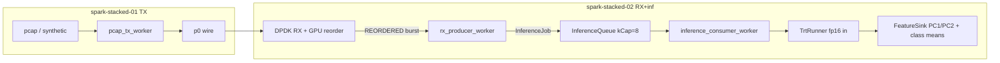

---
hide:
  - navigation
---

# DAQIRI → TensorRT ResNet Inference

This tutorial connects DAQIRI packet ingestion to a GPU inference pipeline:
config-based GPU reorder converts wire **int8** samples to a contiguous **fp16**
NCHW batch, an SPSC ring decouples RX from TensorRT, and ResNet features are
summarized per CIFAR-10 class, with no host bounce on the data path. FeatureSink
also prints headless `pc1=`/`pc2=` lines to stdout every
`inference.pca_every_n_batches` batches. Source: `applications/resnet50_inference/`.

```
wire int8 packets (raw Ethernet, NIC-DMA into GPU-accessible buffers)
  → config-based GPU reorder + int8→fp16 (one burst = one inference batch)
  → SPSC handoff (RX producer | inference consumer)
  → ResNet feature extraction (TensorRT, FP16 tensor cores)
  → FeatureSink (PC1/PC2 + per-class mean-feature stats)
```

**How to use this page**

| Goal | Path |
|------|------|
| First build / no NIC | [Smoke first (software loopback)](#smoke-first-software-loopback) |
| Understand the receive loop | [How it works](#how-it-works) |
| Published numbers (customer-like RX+inference) | [Spark↔Spark, one cable](#run-xhost) |

**Reported topology:** two DGX Sparks, **one cable** p0↔p0 (not dual-cable):

| Role | Host | Config |
|------|------|--------|
| TX | `spark-stacked-01` (ncg-spark-0177) | `resnet50_tx_spark_xhost.yaml` |
| RX+inference | `spark-stacked-02` (ncg-spark-7013) | `resnet50_rx_spark_xhost.yaml` |

Single-host p0→p1 wire loopback remains an optional NIC smoke; it is not the
reported benchmark.

## Summary

| | |
|---|---|
| **Dataset** | CIFAR-10 → 224×224, signed int8 = pixel-128 (lossless); ImageNet norm folded into ONNX |
| **Model** | ResNet-50 feature extractor via TensorRT (FP16 input binding + tensor cores); 2048-dim features |
| **Platform** | Dual DGX Spark xhost (also builds for IGX / RTX Pro) |
| **Data path** | NIC DMA → RX buffers (`host_pinned`, GPU-accessible) → reorder MR → TRT zero-copy read of reorder output → FeatureSink |

## Geometry (int8 → fp16)

Images travel as **signed int8**, one byte per pixel, and become fp16 only in GPU
memory. The reorder kernel reassembles the packets and converts in the same pass,
so the network never carries fp16 and the CPU never touches a pixel. fp16 is
required by the TensorRT engine, which is built for tensor cores; ResNet-50
itself is indifferent to the dtype.

| Field | Value |
|-------|-------|
| elems/image | 150528 (3×224×224) |
| packets_per_image | 128 |
| wire payload | 1176 B int8 |
| output_slot_stride | 2352 B fp16 |
| packets_per_batch | 4096 (= 128×32) |
| seq | header bit_offset 128, width 12 |
| aggregate output | 9,633,792 B = `[32,3,224,224]` fp16 |

The two ends of that table are the same image counted twice. On the wire,
128 packets × 1176 B int8 = 150,528 B = 3×224×224 — one byte per pixel, no
padding. On the reorder output, `packets_per_batch (4096) × output_slot_stride
(2352) = 9,633,792` B, which is exactly `[32,3,224,224]` in fp16. Each packet's
1176 payload bytes widen to a 2352-byte fp16 slot, and 32 images of those slots
tile the batch tensor with nothing left over.

That exactness is a constraint, not a coincidence. `Data_RX_GPU`'s
`buf_size` **must** be `payload_byte_offset + out_payload_len` (64 + 1176 = 1240):
the reorder slot stride is derived from `source buf_size - payload_byte_offset`,
so any slack pads the fp16 batch and breaks the tensor layout.

Signed rather than `uint8` because the convert path is int8→fp16, so the prep
tool subtracts 128 from every pixel. That is lossless over 0..255, costs no extra
bytes, and the ONNX front-end adds the offset back as part of normalization.

`packets_per_image` and `images_per_batch` must both be powers of two.
`--images-per-batch` must stay a power-of-two divisor of `packets_per_batch / packets_per_image`.

`seq_bit_width: 12` gives a 4096-value sequence space — exactly one
`packets_per_batch`, so the sequence number wraps on the batch boundary. DAQIRI
requires `2^seq_bit_width` to be divisible by `packets_per_batch`, and the seq
field must end at or before `payload_byte_offset` (128 + 12 ≤ 64×8).

### Queue sizing

The DPDK reorder path groups **the first `packets_per_batch` packets that
arrive** into one batch (each packet lands at `seq % packets_per_batch`), and a
separate timeout poll flushes a part-filled batch once
`now - first_packet_cycles >= timeout_us`. A partial flush is truncated to whole
images, so the image straddling the boundary is dropped.

| Setting | xhost value | Requirement |
|---------|------------:|-------------|
| `rx.queues[].timeout_us` | 0 | Disables partial flushes |
| `rx.queues[].batch_size` | 8192 | Multiple of `packets_per_batch` |
| `tx.queues[].batch_size`, `bench_tx.batch_size` | 4096 | Aligned to `packets_per_batch` |

`timeout_us: 0` is deliberate. The dataset is padded to whole batches, so a
partial flush can only ever lose data, and **any** finite timeout loses the race
whenever the RX poller stalls mid-batch because of inference backpressure, a cold
first run, or CPU contention. Measured on the xhost pair (256 images):

| `timeout_us` | Result |
|---|---|
| 0 | 256/256, three runs, `partial=0`. Also `partial=0` across 14,190 reorder batches in prior 30 s sustained runs |
| 20000 | 256/256 twice on an idle host; 255/256 twice while `app-detector` competed for CPU on the TX host |
| 200000 | 255/256 on a cold first run, idle host |

The 255/256 cells are the point: a finite timeout only helps if the flush boundary
never lands mid-batch, and CPU contention is enough to make it land there.

The trade-off: with flushing off, a batch missing even one packet is never
delivered, costing all 32 of its images instead of 31. A streaming deployment
that tolerates loss wants a finite timeout; a fixed dataset replay does not.

Misalignment is silent: the run completes but reports partial bursts and fewer
images than sent (`pushed 255 images (... partial=2 dropped=1)`).

## The pipeline

Two threads, two CUDA streams, and one ring between them. The NIC and the reorder
kernel fill batches on the reorder stream; TensorRT drains them on the inference
stream; the SPSC queue is the only thing the two app threads share. There is no
blocking synchronization in the steady-state loop — the one place the consumer
waits is on the *previous* batch's device-to-host copy, which is also what makes
freeing the previous burst safe.


```mermaid
flowchart LR
  subgraph txHost ["spark-stacked-01 TX"]
    Pcap["pcap / synthetic"]
    TxW["pcap_tx_worker"]
    Pcap --> TxW --> Wire["p0 wire"]
  end
  subgraph rxHost ["spark-stacked-02 RX+inf"]
    Wire --> NicRx["DPDK RX + GPU reorder"]
    NicRx -->|"REORDERED burst"| Prod["rx_producer_worker"]
    Prod -->|"InferenceJob"| SPSC["InferenceQueue kCap=8"]
    SPSC --> Cons["inference_consumer_worker"]
    Cons --> TRT["TrtRunner fp16 in"]
    TRT --> Sink["FeatureSink PC1/PC2 + class means"]
  end
```

## How it works

The receive path is two threads passing burst descriptors across a ring. The
walkthrough below follows one batch from the wire to a feature vector
(`applications/resnet50_inference/main.cpp`, `inference_pipeline.cu`,
`spsc_queue.h`, `trt_runner.cu`).

### 1 — Two threads, two streams, one queue

Nothing in this pipeline runs on a single stream. The RX side has a **reorder
stream**, created by `main` and handed to the engine, and the inference side has
its own stream owned by the consumer thread. Two application threads sit on
either side of the SPSC queue.

| Thread | Core | Role |
|--------|-----:|------|
| DPDK EAL master | 8 | `master_core` |
| DPDK RX poller | 18 | `rx.queues[].cpu_core` |
| App RX producer | 19 | `bench_rx.cpu_core`: `get_rx_burst` → SPSC push |
| Inference consumer | 15 | `inference.cpu_core`: TRT + FeatureSink |
| reorder CUDA stream | n/a | `set_reorder_cuda_stream` (bound once after init) |
| inference CUDA stream | n/a | owned by consumer |

TX host uses cores 8 / 16 / 17 (master / app TX / TX queue).

The startup order matters, and it is not arbitrary — the consumer is launched
**first**, and the producer only after it signals `rx_ready`:

```cpp
consumer_thread = std::thread(app::inference_consumer_worker, std::cref(cfg), std::ref(sink),
                              std::ref(inf_queue), std::ref(producer_done), std::ref(rx_ready),
                              std::ref(stop));
while (!rx_ready.load() && !stop.load()) {
  std::this_thread::sleep_for(std::chrono::milliseconds(10));
}
producer_thread =
    std::thread(app::rx_producer_worker, std::cref(cfg), std::ref(inf_queue), expected_images,
                std::ref(producer_done), std::ref(stop));
```

`rx_ready` is set only after `TrtRunner::initialize()` returns, which on a cold
run *builds* the engine and can take minutes. The producer has a finite patience
budget for that:

```cpp
constexpr uint32_t kQuiesceIters = 50000;        // ~5 s after data started
constexpr uint32_t kStartupIdleIters = 1800000;  // ~3 min before any data
```

Start the producer before the engine is ready and a cold build eats straight into
that ~3-minute window. These are the same two numbers that govern how long you
have to start TX after RX — see [Run (xhost)](#run-xhost).

### 2 — Bind the reorder stream once

This is the entire application side of reorder. `main` creates one stream and
hands it to the engine, immediately after `daqiri_init` and before any thread
starts:

```cpp
cudaStreamCreateWithFlags(&reorder_stream, cudaStreamNonBlocking);
if (daqiri::set_reorder_cuda_stream(cfg.rx.interface_name, cfg.reorder_name, reorder_stream) !=
    daqiri::Status::SUCCESS) {
  // fatal: reorder cannot run on a stream the app can observe
}
```

Everything else is configuration. The `reorder_configs:` block names the stream
binding target, the memory region the reordered batch lands in, the dtype
conversion, and the sequence-number field:

```yaml
reorder_configs:
- name: "rx_reorder_resnet_int8_fp16"
  reorder_type: "gpu"
  memory_region: "Reorder_RX_GPU"
  payload_byte_offset: 64
  flow_ids: [201]
  data_types:
    input_type: "int8"
    output_type: "fp16"
    endianness: "host"
  method:
    seq_packets_per_batch:
      sequence_number:
        bit_offset: 128
        bit_width: 12
      packets_per_batch: 4096
```

The application never launches a reorder kernel, never tracks a packet's slot,
and never accumulates an image. It declares the geometry once and then receives
finished batches.

### 3 — Receive a burst, which becomes an inference batch

Because `packets_per_batch` is `images_per_batch × packets_per_image`, **one
delivered burst is exactly one inference batch**. There is no cross-burst image
reassembly to manage.

DAQIRI delivers packets in bursts of DAQIRI-owned buffers, and the pointers in a
burst are valid only until the burst is freed (the
[zero-copy ownership](../concepts.md) rule):

```cpp
daqiri::BurstParams* burst = nullptr;
if (daqiri::get_rx_burst(&burst, port_id, queue_id) != daqiri::Status::SUCCESS ||
    burst == nullptr) {
  // no packets this poll — back off, count an idle poll, retry
}
```

A burst is only usable here if reorder actually ran on it. That is a flag check,
and a burst without it is freed on the spot:

```cpp
const uint32_t flags = burst->hdr.hdr.burst_flags;
if ((flags & daqiri::DAQIRI_BURST_FLAG_REORDERED) == 0U) {
  ++bursts_not_reordered;
  packets_not_reordered +=
      static_cast<uint64_t>(std::max<int64_t>(0, daqiri::get_num_packets(burst)));
  daqiri::free_all_packets_and_burst_rx(burst);
  continue;
}
```

A full batch carries `images_per_batch` images. A **timeout-flushed** batch does
not, and its true image count has to be queried — but the query can race the
reorder kernel that is still finishing:

```cpp
uint32_t n_img = cfg.images_per_batch;
if ((flags & daqiri::DAQIRI_BURST_FLAG_REORDER_TIMEOUT) != 0U) {
  daqiri::ReorderBurstInfo info{};
  // A timeout-flushed burst can still have its reorder event in flight, in
  // which case the info query reports NOT_READY: wait it out instead of
  // discarding a partially filled batch.
  constexpr uint32_t kInfoRetries = 2000;  // ~100 ms at 50 us per retry
  daqiri::Status info_status = daqiri::Status::NOT_READY;
  for (uint32_t attempt = 0; attempt < kInfoRetries; ++attempt) {
    info_status = daqiri::get_reorder_burst_info(burst, &info);
    if (info_status != daqiri::Status::NOT_READY) break;
    std::this_thread::sleep_for(std::chrono::microseconds(50));
  }
  n_img = info.source_packet_count / cfg.packets_per_image;
}
```

Retrying rather than discarding is the point: `NOT_READY` means the data is
coming, not that it is bad. On the reported path this whole branch is dead code —
`timeout_us: 0` means batches are only ever delivered complete (see
[Queue sizing](#queue-sizing)).

Three things still drop a burst, and each has its own counter:
`get_reorder_burst_info` failing outright (`info_failures`), a partial batch
holding fewer packets than one image so `n_img == 0`, and a null device pointer.
All three increment `bursts_dropped`.

The reordered batch itself is a single pointer — the whole fp16 NCHW tensor,
contiguous, at packet 0 of the reorder output region:

```cpp
void* dev_input = daqiri::get_packet_ptr(burst, 0);
```

When the producer exits it prints every counter it kept, and this line is the
first thing to read after a run:

```text
rx_producer_worker: pushed 256 images (reordered_bursts=8 partial=0 dropped=0
  partial_packets=0 info_failures=0 non_reordered_bursts=0 non_reordered_packets=0)
```

`partial` or `dropped` above zero means the queue sizing is misaligned, which is
the concrete form of the silent-misalignment failure described in
[Queue sizing](#queue-sizing).

#### Type conversion

The reorder kernel does register-only int8→fp16 (load int8, convert, store half).
No fp32 buffer is materialized. ONNX prepends Mul/Add so
`y_c = x_fp16 * a_c + b_c` with `a_c = 1/(255*std_c)`,
`b_c = (128/255 - mean_c)/std_c` (R,G,B = channel 0,1,2). Shared constants live
in both `export_resnet_onnx.py` and `prepare_cifar10_pcap.py`. The `128/255` term
is the prep tool's pixel−128 offset being added back, so the round trip through
signed int8 is exact.

### 4 — Hand off across the SPSC ring

The producer does not infer. It packages the batch as a descriptor and pushes it
to the consumer, so a slow TensorRT call never stalls the RX poll loop:

```cpp
struct InferenceJob {
  daqiri::BurstParams* burst = nullptr;  // reordered burst; free after TRT consumes it
  void* dev_input = nullptr;             // fp16 NCHW batch = get_packet_ptr(burst, 0)
  uint32_t batch_size = 0;               // images in this batch
  cudaEvent_t input_ready = nullptr;     // burst->event (reorder-kernel completion)
};
```

The queue is a fixed-capacity single-producer/single-consumer ring with no locks
and no allocation:

```cpp
bool try_push(const InferenceJob& job) {
  const std::size_t head = head_.load(std::memory_order_relaxed);
  const std::size_t next = (head + 1) & (kCap - 1);
  if (next == tail_.load(std::memory_order_acquire)) return false;
  slots_[head] = job;
  head_.store(next, std::memory_order_release);
  return true;
}
```

What happens when it is full is a **policy split**, and it is the one place the
two run modes genuinely differ:

```cpp
if (backpressure) {                                    // example mode
  while (!(pushed = queue.try_push(job)) && !stop.load()) {
    std::this_thread::sleep_for(std::chrono::microseconds(50));
  }
} else {                                               // benchmark mode
  pushed = queue.try_push(job);
}
```

Example mode blocks: the dataset is finite and every image must be classified, so
correctness wins over rate. Benchmark mode drops the burst and moves on, because
a producer that stalls is no longer measuring the receive path.

Capacity is smaller than it looks. `full()` is `depth() == kCap - 1`, so with
`kCap = 8` the ring holds **at most 7** jobs. Add the batch TensorRT is working
on and the one the consumer is still holding as `prev_burst` (step 5), and peak
occupancy is **9** reorder-output buffers — against `num_bufs: 16` in
`Reorder_RX_GPU`. The ring cannot outrun the pool that backs it, with room to
spare.

### 5 — Run inference on the batch, then free the burst

The consumer pops a job, infers, and frees the *previous* burst:

```cpp
const bool ok =
    trt.infer(job.dev_input, job.batch_size, job.input_ready, release_evt, host_prev, n_prev);
if (ok) {
  if (host_prev != nullptr) sink.consume(host_prev, n_prev);
  if (prev_burst != nullptr) {
    daqiri::free_all_packets_and_burst_rx(prev_burst);
  }
  prev_burst = job.burst;
} else {
  daqiri::free_all_packets_and_burst_rx(job.burst);
}
```

Rotate `prev_burst` only on success; free the current burst on failure. Never
skip a free — a leaked burst drains the RX pool and produces
`NO_FREE_BURST_BUFFERS` / `NO_FREE_PACKET_BUFFERS` errors and NIC-level drops.

Why deferring the free by one batch is safe comes out of `infer` itself. It waits
on the reorder event, enqueues, copies results back, and then — before returning —
synchronizes on the *previous* batch's device-to-host event:

```cpp
if (input_ready != nullptr) {
  cudaStreamWaitEvent(stream, input_ready, 0);        // reorder kernel finished this batch
}
cudaEventRecord(start_evt_[buf], stream);
// ... (CUDA-graph fast path elided; disabled in the xhost config) ...
ctx->setInputShape(cfg_.input_name.c_str(), dims);    // dynamic batch dim
ctx->setTensorAddress(cfg_.input_name.c_str(), dev_input);
ctx->setTensorAddress(cfg_.output_name.c_str(), out_ptr);
ctx->enqueueV3(stream);

cudaMemcpyAsync(host_buf_[buf], out_ptr, out_bytes, cudaMemcpyDeviceToHost, stream);
cudaEventRecord(d2h_event_[buf], stream);
cudaEventRecord(release_evt, stream);                 // back-edge: input buffer reusable

const int prev = 1 - parity_;
if (has_pending_[prev]) {
  cudaEventSynchronize(d2h_event_[prev]);             // <-- prior batch fully read
  host_out_prev = host_buf_[prev];                    // features, one batch late
  host_out_prev_n = pending_n_[prev];
  has_pending_[prev] = false;
}
```

That `cudaEventSynchronize(d2h_event_[prev])` is the whole argument: by the time
`infer` returns successfully, the GPU has finished reading the previous batch's
input and copying its output to the host. So the previous burst's memory is no
longer referenced, and freeing it is safe without any blocking sync of our own.
Features come back **one batch late** for the same reason — double buffering by
parity, so the host never stalls the batch currently in flight.

Two TensorRT options in the runner, `enable_cuda_graph` and
`enable_dual_context`, are **off** in the xhost config, so the reported path runs
eagerly on the consumer's single inference stream.

### 6 — Drain and tear down in order

Because features arrive one batch late, the last batch is still in flight when
the loop exits. The consumer flushes it before it returns:

```cpp
float* host_final = nullptr;
uint32_t n_final = 0;
trt.drain_final(host_final, n_final);        // recover the one-batch-late tail
if (host_final != nullptr) sink.consume(host_final, n_final);
if (prev_burst != nullptr) {
  daqiri::free_all_packets_and_burst_rx(prev_burst);
}
```

Shutdown order in `main` is then load-bearing in both directions:

```cpp
producer_thread.join();          // no more pushes
producer_done.store(true);
consumer_thread.join();          // drain_final has run; every burst is freed
// ...
sink.log_final_summary(summary_seconds);
daqiri::print_stats();
daqiri::shutdown();
cudaStreamDestroy(reorder_stream);
```

`log_final_summary` comes **after** the consumer join, so the tail batch recovered
by `drain_final` is counted in the totals and the per-class stats — and **before**
`shutdown()`. The reorder stream is destroyed last, because the engine holds it
until `shutdown()` returns.

## Build

```bash
BASE_IMAGE=torch BASE_TARGET=dpdk DAQIRI_ENGINE="dpdk ibverbs" scripts/build-container.sh

cmake -S . -B build -DCMAKE_BUILD_TYPE=Release -DBUILD_SHARED_LIBS=ON \
  -DDAQIRI_BUILD_PYTHON=OFF -DDAQIRI_ENGINE="dpdk ibverbs" -DDAQIRI_BUILD_APPLICATIONS=ON
cmake --build build -j --target daqiri_resnet50_inference
```

## Prepare model + dataset

```bash
python3 applications/resnet50_inference/tools/export_resnet_onnx.py \
  --model resnet50 --output models/resnet50_features.onnx --check
rm -f models/resnet50_features.fp16in.engine models/resnet50_features.fp16in.*.engine

python3 applications/resnet50_inference/tools/prepare_cifar10_pcap.py \
  --num-images 256 --images-per-batch 32 --out data/cifar10_resnet.pcap
```

Engine cache path: `models/resnet50_features.fp16in.engine`.
Re-export after pulling exporter changes, then delete that engine so TensorRT
rebuilds with FLOAT32 `features` (the ONNX front-end stays FP16 input).

## Smoke first (software loopback)

No NIC and no cable. Build and prepare model/dataset as above, then:

```bash
sudo ./build/applications/resnet50_inference/daqiri_resnet50_inference \
  ./build/applications/resnet50_inference/configs/resnet50_sw_loopback.yaml \
  --replay-once --dataset data/cifar10_resnet.pcap --expected-images 256
```

Expect: TensorRT ready; `set_reorder_cuda_stream OK`; `pc1=`/`pc2=` lines on
**stdout**; per-class mean features on stderr; clean shutdown with 256 images.
App README: `applications/resnet50_inference/README.md`.

## Run (xhost)

Net prep (both hosts): see [system configuration](system_configuration.md):
`scripts/setup_spark_xhost_net.sh`. Use **one** cable between the Sparks on
p0↔p0.

```bash
./applications/resnet50_inference/tools/run_resnet_xhost.sh --replay-once
```

Or manually: start RX on stacked-02 first (`--mode rx`), wait for
`set_reorder_cuda_stream OK` / `TrtRunner ready`, then TX on stacked-01 with
`ETH_DST_ADDR` set to the RX p0 MAC (`--mode tx --replay-once`).

Start TX within ~3 minutes of RX: with no traffic at all the producer gives up
on a startup idle timeout (a shorter ~5 s quiescence timeout applies once frames
have arrived). Those are the `kStartupIdleIters` / `kQuiesceIters` budgets from
[step 1](#1-two-threads-two-streams-one-queue).

Expect: kHALF input binding; FLOAT32 (or converted) `features`; all 256 images;
`pc1=`/`pc2=` on stdout; per-class mean features labeled with CIFAR-10 class
names (`airplane` … `truck`); clean shutdown. Measured on stacked-01 →
stacked-02 (256 images, `--replay-once`):

```text
pcap_tx_worker: sent 32768/32768 frames in 0.0510741 s (send_failures=0 fill_failures=0 no_burst_polls=0)
rx_producer_worker: pushed 256 images (reordered_bursts=8 partial=0 dropped=0 ...)
inference latency (ms): mean=8.78 p50=8.41 p99=9.36 (per batch of 32 images, n=8)
```

`partial` / `dropped` counters above zero mean the queue sizing is misaligned;
see [Queue sizing](#queue-sizing).

Bench: `--seconds 20` for sustained throughput (drops OK; stats off).

## Performance

Measured on the xhost pair (stacked-01 TX to stacked-02 RX), batch of 32 images.
Payload Gb/s counts CIFAR-10's native uint8 image bytes on the wire. The fp16
TensorRT input exists only after GPU reorder.

| Result | img/s | Payload Gb/s | latency_ms | Note |
|---|---:|---:|---:|---|
| **ResNet-50 FP16 baseline** | **3431** | **4.13** | **8.66** | int8 wire, GPU int8 to fp16 reorder, FP16 TensorRT |
| ResNet-18 FP16 comparison | 4626 | 5.57 | 2.59 | +34.8% versus ResNet-50 baseline |

Clock locking and INT8 TensorRT did not improve the ResNet-50 result in this
setup: locked FP16 was 3411 img/s (-0.6%), and locked INT8 was 3390 img/s
(-1.2%).

**Bottleneck:** ResNet-50 uses 4.13 Gb/s of image payload, about 4.36 Gb/s on the
wire with headers. That is far below the roughly 100 Gb/s ingest-only result for
the same Spark pair. The smaller ResNet-18 model raises throughput, so the limit
for this PR's ResNet example is TensorRT model execution, not RX polling, GPU
reorder, or link bandwidth.

### Batch size

`images_per_batch` sets both the reorder window and the TensorRT batch. Keep it a
power-of-two divisor of `packets_per_batch / packets_per_image`. Treat batch size
as a latency and queueing setting until the next one-cable, uint8-accounted sweep
is complete.

For this pipeline in the context of the platform's other transport numbers, see
[DGX Spark performance](../benchmarks/performance-dgx-spark.md#end-to-end-inference-pipeline-resnet-50-cross-host).

## Output (v1)

`FeatureSink` prints per-class mean feature vectors using **ground-truth** labels
from the `.labels` sidecar, with CIFAR-10 class names. A predicted-class /
softmax head is a follow-up.

A successful example-mode run prints two sample feature vectors as they arrive,
then the summary at shutdown (stderr; the `pc1=`/`pc2=` projection lines go to
stdout):

```text
  feature[image 0, class 6 (frog)] = [0.1842, 0.0000, 0.4521, ...] (dim=2048)
  feature[image 1, class 9 (truck)] = [0.0000, 0.2310, 0.1102, ...] (dim=2048)

=== ResNet inference summary ===
images=256 batches=8 seconds=2.15 => 119.07 img/s

Per-class mean-feature stats (first 8 dims + L2 norm of the mean vector):
  class  0   airplane (n=    25): mean=[0.2014, 0.0331, 0.3895, ...]  |mean|=3.8421
  class  1 automobile (n=    26): mean=[0.1577, 0.0902, 0.2233, ...]  |mean|=3.5108
  ...
  class  9      truck (n=    27): mean=[0.2588, 0.0117, 0.4410, ...]  |mean|=4.0072
(Distinct per-class mean vectors indicate ResNet separates the classes in latent space. ...)
```

Distinct per-class mean vectors, and their differing L2 norms, are a cheap
dependency-free readout: a quick post-run check that the latent space separates
by class without pulling in a clustering or plotting dependency. Note that the
`img/s` in that summary covers the whole process lifetime including startup — it
is not the throughput figure reported under [Performance](#performance).

## See also

- App README: `applications/resnet50_inference/README.md`
- Raw Ethernet reorder config: [configuration](../api-reference/configuration.md)
- Spark xhost benches: [raw benchmarking](../benchmarks/raw_benchmarking.md)
