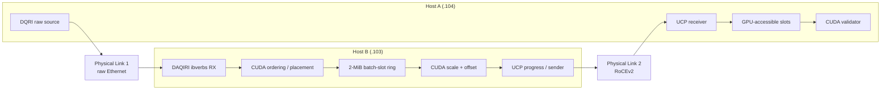

---
hide:
  - navigation
---

# DAQIRI + UCX GPU Egress

This tutorial builds a deliberately narrow two-host example:

```text
raw Ethernet → DAQIRI RX → CUDA ordering/placement → batched CUDA transform
             → UCP Active Message over RoCEv2 → GPU-accessible receive slot
```

Source: `applications/ucx_gpu_egress/`.

The point is to show how an application can combine DAQIRI and UCX in one process
without turning UCX into a DAQIRI engine. The example has one producer, one
receiver, one logical stream, a fixed image schema, bounded memory, and explicit
completion semantics.

## Summary

| | |
|---|---|
| **Input** | 256×256 row-major `uint16` images, sixteen 8,192-byte raw fragments per image |
| **CUDA batch** | Sixteen images / 256 packets / 2 MiB |
| **Processing** | In-place `fmaf(scale, pixel, offset)`, clamp to `uint16` range, round to nearest-even |
| **Data transport** | Two-sided UCP Active Message rendezvous, one 128-KiB DATA message per image |
| **Spark memory mode** | Mapped host-pinned producer and receiver pools |
| **Overload** | Drop newest before UCP submission when no receiver credit is available |
| **Delivery** | Successful UCP receive completion; downstream GPU work may start afterward |

## Two-link topology

Host A generates raw input and receives the result. Host B runs one process with
DAQIRI RX, CUDA processing, and UCX egress.



The current lab mapping is:

| Purpose | Host A | Host B |
|---|---|---|
| Link 1 raw | `det1`, `rocep1s0f0:1`, BDF `0000:01:00.0` | `det1`, `mlx5_0:1`, BDF `0000:01:00.0` |
| Link 2 UCX | `det4`, `roceP2p1s0f1:1`, BDF `0002:01:00.1`, `10.55.1.1/24`, GID 3 | `det4`, `mlx5_3:1`, BDF `0002:01:00.1`, `10.55.1.2/24`, GID 11 |
| GPU | GPU 0, BDF `000f:01:00.0` | GPU 0, BDF `000f:01:00.0` |

Both links are direct 100-Gbit/s ConnectX-7 connections with 9,000-byte MTU. The
`det1`/`det4` pair has separate PCIe prefixes and previously sustained about
200 Gbit/s aggregate raw traffic. `det1`/`det3` shares a PCIe path and is not the
preferred two-link pairing. Rediscover all names, BDFs, GIDs, addresses, link
state, and MTU after any cabling or firmware change.

## Why assembly is local to the example

DAQIRI's ibverbs raw engine is the right ingress engine here: it uses the mlx5
device directly, requires no DPDK EAL, and supports the mapped host-pinned buffers
used on DGX Spark. DAQIRI's current raw reorder window, however, flushes by arrival
count rather than source batch identity. A missing fragment can shift later image
windows. DPDK's idle timeout does not solve that under continuous traffic because a
new count-based window fills before an idle timeout.

The example therefore receives ordinary DAQIRI bursts and carries a small DQRI v1
header in every packet. It is an application agreement, not a new public DAQIRI API.

| Frame byte | Size | DQRI field |
|---:|---:|---|
| 42 | 4 | magic `DQRI` |
| 46 | 1 + 1 | version 1, flags 0 |
| 48 | 2 + 2 | header length 38, fragment slot 0–255 |
| 52 | 4 | source batch ID |
| 56 | 8 | nonzero source epoch |
| 64 | 4 | packet sequence |
| 68 | 2 + 2 | payload length 8192, fragments per batch 256 |
| 72 | 4 + 4 | header CRC32C, reserved zero |

Integers use network byte order. The assembler validates the CRC and requires
`packet_sequence == batch_id*256 + fragment_slot` modulo 2^32. A 256-bit bitmap
places every fragment exactly once. Missing, duplicate, malformed, timed-out, and
cross-batch input rejects the complete sixteen-image batch. Sequence numbers are
still consumed, so rejection becomes a visible sixteen-image gap at the receiver.

The RX memory region uses `buf_size: 8272` for the 42-byte network header,
38-byte DQRI header, and 8,192-byte payload. The ibverbs MPRQ stride rounds this to
16 KiB; 16,384 buffers therefore reserve approximately 256 MiB of pinned memory.

## Threads and slot ownership

On Host B, DAQIRI and UCX have independent progress owners. The tested core layout
is:

| Core | Owner |
|---:|---|
| 18 | DAQIRI internal Link 1 CQ poller |
| 19 | RX, DQRI assembly, CUDA placement, DAQIRI burst release |
| 17 | CUDA processing |
| 16 | UCP listener, progress, sends, credits, and retirements on Link 2 |

Host A uses core 17 for DAQIRI TX, core 16 for raw generation, and core 18 for the
UCP receiver. Startup verifies that assigned Host B cores do not overlap.

Each Host B batch slot has one generation-checked owner:

```text
FREE → RX/PLACING → PROCESS_QUEUED → PROCESSING → UCX_QUEUED
     ←---------------- retirement after all sends complete ---------
```

The RX thread launches the ordering/placement kernel on its stream. Every DAQIRI
burst remains RX-owned until a per-burst CUDA event proves that all packet reads are
finished; only then does RX call `free_all_packets_and_burst_rx()`. The processing
thread polls the slot's `placement_done` event and transforms sixteen images in
place on its own stream.

The UCP producer hands out a move-only `BatchLease`. Processing consumes that lease
with `submit_after()`, `cancel()`, or `release_unused()`. `submit_after()` records a
producer-owned reusable event on the processing stream. The UCP thread polls that
event, submits admitted images, and retires the batch slot after every send
completion. Publishing retirement happens only after the slot is marked free; the
RX owner must observe that retirement before it can reacquire the generation.

This is what “saturating transform” means in the example:

```text
float y = fmaf(scale, float(pixel), offset)
y = clamp(y, 0, 65535)
output = round_to_nearest_even_uint16(y)
```

It describes numeric clamping, not GPU occupancy. The steady-state path never calls
`cudaDeviceSynchronize()`; device-wide synchronization is reserved for final
failure-safe teardown.

## UCP data and control

Both endpoints initialize UCP with `UCP_FEATURE_AM` and create a
`UCS_THREAD_MODE_SINGLE` worker owned only by its pinned progress thread. Host B
constructs the listener at `10.55.1.2:13341`; Host A binds `10.55.1.1` and creates
the client endpoint with peer-error handling enabled.

Small Active Messages carry `HELLO`, `ACCEPT`, `REJECT`, cumulative `CREDIT`, `EOS`,
and `EOS_ACK`. DATA uses Active Message rendezvous with a 72-byte serialized header.
The receiver's short callback validates the header and capacity first, selects a
free slot, and calls `ucp_am_recv_data_nbx()` with the registered destination. It
returns `UCS_INPROGRESS` only after consuming the rendezvous descriptor; rejected
descriptors return `UCS_OK` and fail the fixed run.

Completion meanings are intentionally distinct:

| Boundary | Meaning |
|---|---|
| Producer CUDA event | Processing writes are complete; UCP/RNIC may read the slot |
| UCP send submission | Message is admitted; it will not be deliberately dropped |
| UCP send completion | Producer buffer is reusable; remote delivery is not implied |
| UCP receive completion | Complete payload is available in the receiver slot; message is delivered |
| `release_after(stream)` event | Downstream GPU work is finished; slot and credit may be reused |
| `EOS_ACK` | All admitted DATA reached receive completion; not all downstream GPU work is necessarily done |

The receiver allocates N fixed-size slots and grants N message credits in `HELLO`.
The producer consumes one credit per admitted image. With no credit, the composed
pipeline drops new images before UCP submission. Returned credits are cumulative;
the receiver keeps at most one CREDIT send in flight and folds newer releases into
the next update. Stopping credit returns stalls or drops new admission without
unbounded allocation.

## Build a UCX-capable image

The host UCX 1.16 packages on both lab systems lack CUDA support. Build UCX 1.20 in
the project container instead:

```bash
BASE_TARGET=ucx DAQIRI_ENGINE=ibverbs DAQIRI_BUILD_APPLICATIONS=ON \
  DAQIRI_BUILD_RESNET50_INFERENCE=OFF DAQIRI_BUILD_UCX_GPU_EGRESS=ON \
  DAQIRI_BUILD_EXAMPLES=OFF IMAGE_TAG=daqiri:ucx-gpu-egress \
  scripts/build-container.sh
```

The image configures UCX with verbs, RDMA-CM, mlx5, and CUDA support in `/opt/ucx`.
CMake requires `ucx >= 1.20.0` through `ucx.pc`; configure failure is the first
capability gate. The runtime container must use `--privileged --gpus all
--network host --ulimit memlock=-1:-1` and mount the host hugepage directory.

Before traffic, run `ucx_info -v` and `ucx_info -d` in the container. Confirm the
intended mlx5 port and CUDA memory components are present. Pin both device and GID:

```bash
# Host B
export UCX_NET_DEVICES=mlx5_3:1
export UCX_IB_GID_INDEX=11

# Host A
export UCX_NET_DEVICES=roceP2p1s0f1:1
export UCX_IB_GID_INDEX=3
```

The executables reject a missing, multi-device, or nonnumeric binding. They log the
requested binding and UCP worker capabilities. For the first representative sizes,
also set `UCX_LOG_LEVEL=info` and `UCX_PROTO_INFO=y` and inspect UCX's selected
transport/protocol. Do not set `UCX_TLS` unless diagnosing a fallback; if it is
restricted, retain everything UCX needs for RDMA bootstrap and CUDA-memory handling.

## Run in stages

Start with the independent transports; then compose them.

1. Run the existing `daqiri_bench_raw_gpudirect` cross-host RX-only check on Link 1.
2. Run `daqiri_ucx_gpu_transport_bench` in producer mode on Host B and receiver mode
   on Host A. The producer now uses the same batch-lease path as the full pipeline.
3. Run `daqiri_ucx_raw_pipeline --stage assemble` and validate the CUDA ordering
   kernel without processing or UCX.
4. Run `--stage process` to add the sixteen-image scale/offset kernel.
5. Run `--stage egress`, starting Host B, then the Host A receiver, then raw TX only
   after Host B reports `receiver_ready` and `ingress_ready`.

The installed config templates are under `/opt/daqiri/bin/ucx_gpu_egress/`:

- `raw_source.yaml`: Host A Link 1 BDF, Host B Link 1 MAC, source epoch, TX core,
  burst size, and optional hardware pacing.
- `raw_processor.yaml`: Host B Link 1 BDF, Link 2 listener, source epoch, CUDA scale
  and offset, ring depths, receiver maximum, and four Host B cores.

For a 100,000-batch composed run, the receiver expects 1,600,000 images:

```bash
# Host B
daqiri_ucx_raw_pipeline /configs/raw_processor.yaml --stage egress --batches 100000

# Host A, after listener_ready
daqiri_ucx_gpu_transport_bench --mode receiver \
  --connect 10.55.1.2:13341 --local 10.55.1.1:0 \
  --images 1600000 --queue-depth 256 --gpu-id 0 --cpu-core 18 \
  --memory-kind host_pinned_mapped --timeout-seconds 180 \
  --validation raw-transform --scale 1.25 --offset -32

# Host A, after ingress_ready
daqiri_ucx_raw_source /configs/raw_source.yaml --batches 100000
```

The separate raw-source process runs to its fixed bound. Version 1 has no remote
stop message; a launch wrapper should stop the source if either pipeline endpoint
exits nonzero.

## Validate results

The GPU validator checks every delivered image and copies only its small result
record to CPU memory. Most test-pattern pixels repeat every sixteen image sequences;
the CPU DQRI batch/fragment validation protects cross-batch identity, while the GPU
kernel proves placement offsets, the sequence tag, and transform output.

The staged lab checks established:

- Raw RX + application assembly sustained Link 1 rate with zero batch rejects.
- Adding the sixteen-image transform preserved that rate and produced zero GPU
  validation errors.
- At `pacing_mbps: 95000` and receive depth 256, 1.6 million images were assembled,
  transformed, admitted, delivered, released, and validated with zero drops or
  sequence gaps. DATA payload throughput was 94.94 Gbit/s.
- At unrestricted Link 1 rate, the bounded policy dropped 54,540 of 1.6 million
  images before UCP admission; the receiver reported the corresponding gaps.

Unrestricted input is not a lossless acceptance target. Link 1 framing would require
about 98.7 Gbit/s of image payload on Link 2 before RoCE/UCP overhead. The verified
lossless Spark point is the paced 95,000-Mbit/s source with depth 256.

For throughput, run `mlnx_perf -i <netdev> -t 1` on both links for at least ten
seconds. Exclude startup and shutdown and report stable one-second samples. Keep PHY
rates separate from application payload throughput, which uses the interval from
first to last DATA completion. Short smokes are correctness checks, not directly
comparable sustained measurements.

## Memory modes and GPUDirect claims

`host_pinned_mapped` gives CPU/UCX and CUDA aliases for the same pinned allocation
and is the working DGX Spark path. `cuda_device` allocates the producer and receiver
pools with `cudaMalloc` and passes CUDA pointers plus registered memory handles to
UCP. It remains supported for later discrete-GPU testing.

On the current Spark, a CUDA-device UCP probe selected `cuda_copy` and reached only
about 10.77 Gbit/s, so it is not a GPUDirect RDMA result. Mapped host-pinned transfer
reached near line rate. A future `cuda_device` result counts as GDR only when UCX
protocol output selects the intended RDMA path and NIC/PCIe counters demonstrate
RNIC DMA without host staging.

## Failure and security boundaries

An endpoint or protocol error fails the fixed run. Every connection gets a random
epoch; stale control messages are rejected. Outstanding send completion after an
error is reported as delivery unknown unless `EOS_ACK` already established that all
admitted DATA reached remote receive completion. Endpoint-close timeouts and local
CUDA borrowers quarantine registrations instead of freeing storage unsafely.

There is no persistence, replay, exactly-once processing, automatic reconnect,
processing-level acknowledgement, encryption, or authentication. The two direct
links and both hosts are assumed trusted.

## Next checks

Before treating the example as a reusable starting point, run deliberate receiver
slowdown, depths 1/4/16/64/256, malformed headers, endpoint kill with operations in
flight, and a multi-hour soak. Run `cuda_device` on the separate capable system, but
keep it optional so the mapped-host Spark example remains functional.

See also:

- [Raw Ethernet Benchmarking](../benchmarks/raw_benchmarking.md)
- [Socket and RDMA Benchmarking](../benchmarks/socket_benchmarking.md)
- [DAQIRI Concepts](../concepts.md)
- App README: `applications/ucx_gpu_egress/README.md`
