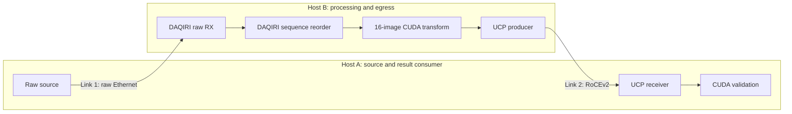
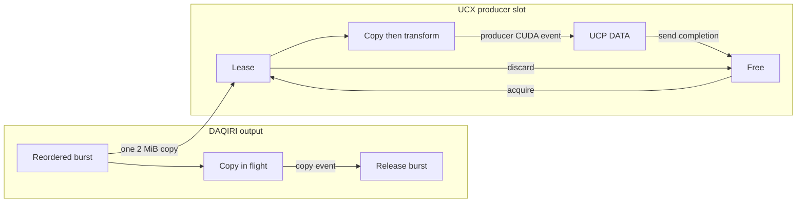
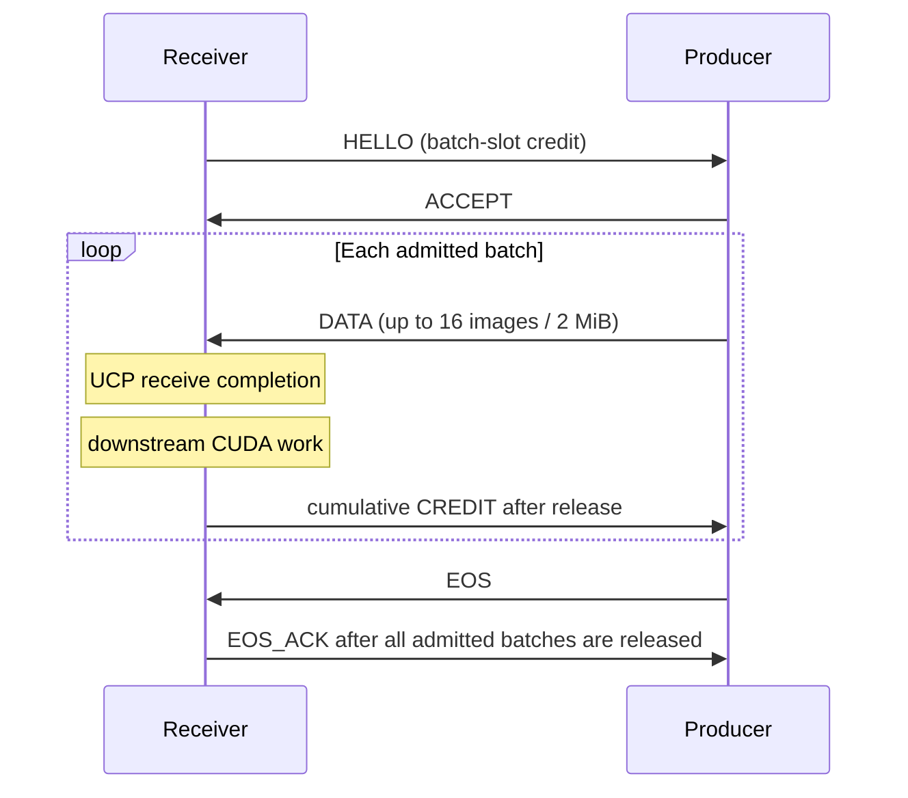

---
hide:
  - navigation
---

# DAQIRI + UCX GPU Egress

This example joins two independent data paths in one application:

```text
raw Ethernet → DAQIRI RX and reorder → 16-image CUDA batch → CUDA transform
             → one UCP rendezvous message → remote GPU-accessible batch slot
```

DAQIRI owns raw ingress. UCX owns egress. The application connects them with a
bounded pool of 2 MiB batches and explicit CUDA and UCP completion boundaries.
UCX is not a DAQIRI engine.

The example includes three executables:

| Executable | Role |
|---|---|
| `daqiri_ucx_raw_source` | Generate the sequenced raw packets used by the tutorial. |
| `daqiri_ucx_raw_pipeline` | Receive and reorder raw packets, transform each batch, and optionally send it through UCX. |
| `daqiri_ucx_gpu_transport_bench` | Exercise the same batch-level UCX transport without DAQIRI ingress. |

## Topology

Host A generates raw input and receives processed batches. Host B receives the
raw packets, runs CUDA, and sends the results through UCX. Use separate physical
links for ingress and egress.



The validated DGX Spark setup used the following mapping. Treat it as a worked
example, not a portable hardware configuration.

| Purpose | Host A | Host B |
|---|---|---|
| Link 1 raw | `det1`, BDF `0000:01:00.0` | `det1`, BDF `0000:01:00.0` |
| Link 2 UCX | `det4`, `roceP2p1s0f1:1`, `10.55.1.1/24`, GID 3 | `det4`, `mlx5_3:1`, `10.55.1.2/24`, GID 11 |
| CUDA device | GPU 0 | GPU 0 |

Both links used 9,000-byte MTUs. Recheck interface names, BDFs, MAC addresses,
IP addresses, GIDs, link state, MTU, and CPU topology after any host, firmware,
or cabling change.

## Build and start the containers

Run these preparation steps from the DAQIRI checkout on both hosts. First copy
the configuration templates to a writable directory:

```bash
mkdir -p run/ucx-gpu-egress
cp applications/ucx_gpu_egress/configs/*.yaml run/ucx-gpu-egress/
```

Replace every `<PLACEHOLDER>` in both copied files. Build the same image on both
hosts:

```bash
BASE_TARGET=ucx DAQIRI_ENGINE=ibverbs DAQIRI_BUILD_APPLICATIONS=ON \
  DAQIRI_BUILD_RESNET50_INFERENCE=OFF DAQIRI_BUILD_UCX_GPU_EGRESS=ON \
  DAQIRI_BUILD_EXAMPLES=OFF IMAGE_TAG=daqiri:ucx-gpu-egress \
  scripts/build-container.sh
```

The `ucx` target builds UCX 1.20 with verbs, mlx5, RDMA-CM, NUMA, and CUDA
support. It derives from the DAQIRI base-dependency stage and does not build or
install DPDK.

Start one persistent container on each host:

```bash
docker run --rm --detach --name daqiri-ucx \
  --user 0:0 --privileged --gpus all --network host \
  --ulimit memlock=-1:-1 \
  --volume /dev/hugepages:/dev/hugepages \
  --volume "$(pwd)/run/ucx-gpu-egress:/configs:ro" \
  daqiri:ucx-gpu-egress sleep infinity
```

The commands below use `docker exec daqiri-ucx`. Stop the container after the
run with:

```bash
docker stop daqiri-ucx
```

## Check UCX binding

Run these checks before starting traffic:

```bash
docker exec daqiri-ucx ucx_info -v
docker exec daqiri-ucx ucx_info -d
```

Identify the Link 2 mlx5 device and its RoCEv2 GID on each host. Pass both to
every UCX process. A device name alone is not enough when the port has multiple
GIDs.

The commands in this tutorial use:

| Host | `UCX_NET_DEVICES` | `UCX_IB_GID_INDEX` |
|---|---|---:|
| A | `roceP2p1s0f1:1` | 3 |
| B | `mlx5_3:1` | 11 |

For the first run, also pass `UCX_LOG_LEVEL=info` and `UCX_PROTO_INFO=y`. Confirm
the selected device, GID, and rendezvous protocol in the logs. Do not describe a
`cuda_device` result as GPUDirect RDMA unless the protocol output and NIC/PCIe
counters prove that path.

## Keep coupled values consistent

Check these cross-process invariants after editing the templates or commands.

| Value | Must agree between | Rule |
|---|---|---|
| Fixed egress run bound | raw source, raw pipeline, UCX receiver | `images = batches × 16`; a final partial batch is allowed only by the standalone UCX benchmark. |
| Image and batch geometry | all processes | One image is 256×256 `uint16` (128 KiB); one full batch is 16 images (2 MiB). Source `burst_packets` must be a multiple of 256. |
| Raw UDP ports | `raw_source.yaml`, `raw_processor.yaml` | Source and destination ports must match the Host B RX flow. |
| Packet sequence | raw source, DAQIRI reorder | The tutorial source starts at zero and advances once per fragment. |
| Transform | raw pipeline, receiver validation | Use the same `scale` and `offset`. The operation is `fmaf`, clamp to the `uint16` range, then round to nearest even. |
| UCP endpoint | Host B producer, Host A receiver | The receiver connects to the Host B Link 2 listener address and port. |
| Queue depth | UCX receiver, Host B `slot_count` | Depth counts 2 MiB batch slots, not images. The receiver depth must not exceed the producer maximum; the worked configuration uses 16 on both hosts. |
| Memory kind | each endpoint locally | `host_pinned_mapped` is the DGX Spark mode. The endpoints may use different local memory kinds. |
| CUDA device | pipeline, receiver | Select an available device independently on each host. |
| CPU cores | each host | Do not overlap the DAQIRI poller, pipeline work, UCX progress, or source cores on the same host. |

## Validate in stages

Do not begin with the composed run. Each stage adds one boundary and has a
specific pass condition.

| Stage | Processes | Pass condition |
|---|---|---|
| 1. UCX transport | Host B transport producer; Host A transport receiver | All generated images are admitted, delivered, released, and validated; zero drops, gaps, validation failures, and images with unknown delivery. |
| 2. DAQIRI reorder | Host B pipeline `receive`; Host A raw source | Source, reordered, completed, and released batch counts match; every reordered image passes identity validation. |
| 3. CUDA processing | Host B pipeline `process`; Host A raw source | Stage 2 remains clean; processed and completed batch counts match and every transformed image passes validation. |
| 4. Composed egress | Host B pipeline `egress`; Host A UCX receiver and raw source | All expected batches reach receiver release; zero pre-submit drops, gaps, validation errors, DAQIRI queue errors, or NIC drops. |

### Stage 1: UCX transport only

Start the producer on Host B. It creates the listener and waits for the receiver:

```bash
docker exec \
  --env UCX_NET_DEVICES=mlx5_3:1 \
  --env UCX_IB_GID_INDEX=11 \
  --env UCX_LOG_LEVEL=info \
  --env UCX_PROTO_INFO=y \
  daqiri-ucx daqiri_ucx_gpu_transport_bench \
  --mode producer --listen 10.55.1.2:13341 \
  --images 1600000 --queue-depth 16 --batch-slots 16 \
  --gpu-id 0 --cpu-core 16 --memory-kind host_pinned_mapped \
  --credit-mode wait --timeout-seconds 180
```

Then start the receiver on Host A:

```bash
docker exec \
  --env UCX_NET_DEVICES=roceP2p1s0f1:1 \
  --env UCX_IB_GID_INDEX=3 \
  --env UCX_LOG_LEVEL=info \
  --env UCX_PROTO_INFO=y \
  daqiri-ucx daqiri_ucx_gpu_transport_bench \
  --mode receiver --connect 10.55.1.2:13341 --local 10.55.1.1:0 \
  --images 1600000 --queue-depth 16 --gpu-id 0 --cpu-core 18 \
  --memory-kind host_pinned_mapped --timeout-seconds 180
```

For this bound, the producer must report `generated=1600000`,
`admitted=1600000`, `batches_sent=100000`, `dropped_no_credit=0`, and
`delivery_unknown=0`. The receiver must report `batches_delivered=100000`,
`batches_released=100000`, `sequence_gaps=0`, and `validation_failures=0`.

### Stages 2 and 3: raw ingress and CUDA processing

Run each stage separately. On Host B, start the pipeline first:

```bash
# Use --stage receive first, then repeat with --stage process.
docker exec daqiri-ucx daqiri_ucx_raw_pipeline \
  /configs/raw_processor.yaml --stage receive --batches 100000
```

After Host B prints `ingress_ready`, start the bounded source on Host A:

```bash
docker exec daqiri-ucx daqiri_ucx_raw_source \
  /configs/raw_source.yaml --batches 100000
```

For `receive`, the source must report `packets=25600000` and `batches=100000`.
The pipeline must report `reordered_batches=100000`,
`source_packets=25600000`, `completed_batches=100000`,
`released_bursts=100000`, and `validation_errors=0`. For `process`, require the
same values plus `processed_batches=100000`. In both runs,
`missing_batches`, `incomplete_batches`, and `stale_batches` must be zero. A
fixed run exits unsuccessfully if those counts do not reconcile.

### Stage 4: composed egress

There are three processes. Start them in this order.

1. On Host B, start the pipeline. It creates the UCX listener before waiting for
   the receiver:

    ```bash
    docker exec \
      --env UCX_NET_DEVICES=mlx5_3:1 \
      --env UCX_IB_GID_INDEX=11 \
      daqiri-ucx daqiri_ucx_raw_pipeline \
      /configs/raw_processor.yaml --stage egress --batches 100000
    ```

2. After Host B prints `listener_ready`, start the receiver on Host A:

    ```bash
    docker exec \
      --env UCX_NET_DEVICES=roceP2p1s0f1:1 \
      --env UCX_IB_GID_INDEX=3 \
      daqiri-ucx daqiri_ucx_gpu_transport_bench \
      --mode receiver --connect 10.55.1.2:13341 --local 10.55.1.1:0 \
      --images 1600000 --queue-depth 16 --gpu-id 0 --cpu-core 18 \
      --memory-kind host_pinned_mapped --timeout-seconds 180 \
      --validation raw-transform --scale 1.25 --offset -32
    ```

3. After Host B prints `receiver_ready` and then `ingress_ready`, start the raw
   source on Host A:

    ```bash
    docker exec daqiri-ucx daqiri_ucx_raw_source \
      /configs/raw_source.yaml --batches 100000
    ```

The source has no remote stop message. It normally exits at `--batches`. If
either endpoint fails, interrupt the source explicitly before restarting the
complete three-process run.

Check each process separately:

- Raw source: `packets=25600000` and `batches=100000`.
- Pipeline RX: `reordered_batches=100000`, `source_packets=25600000`,
  `processed_batches=100000`, `completed_batches=100000`, and zero
  `missing_batches`, `incomplete_batches`, and `stale_batches`.
- Pipeline egress: `submitted_batches=100000`, `retired_batches=100000`,
  `batches_sent=100000`, `batches_delivered=100000`, and zero
  `dropped_before_submit`, `dropped_no_credit`, and `delivery_unknown`.
- Receiver: `admitted=1600000`, `batches_delivered=100000`,
  `batches_released=100000`, and zero `sequence_gaps` and
  `validation_failures`.

Also require clean DAQIRI queue statistics and unchanged NIC discard/error
counters. Any mismatch fails the acceptance run.

## Implementation guide

### Raw input and DAQIRI reorder

The source emits 8,272-byte Ethernet/IPv4/UDP frames. A network-order 32-bit
packet sequence starts at frame byte 42. Image data starts at byte 80 and occupies
8,192 bytes. Sixteen fragments form one image; 256 packets form one 16-image
batch.

`raw_processor.yaml` describes that layout with DAQIRI's
`seq_packets_per_batch` reorder method. The ibverbs engine derives the source
batch from the sequence number, rejects duplicate or stale packets, and closes an
incomplete batch when a newer batch arrives. The application consumes DAQIRI's
reordered output; it does not implement a second packet format or assembler.

### Batch ownership

DAQIRI and UCX use separate pools. DAQIRI reorders into a 2 MiB `Reorder_RX`
buffer. The application acquires a UCX `BatchLease`, copies the complete batch
with one `cudaMemcpyAsync`, and records an event immediately after the copy. It
frees the DAQIRI burst only when that event completes. The transform is queued
after the copy on the same CUDA stream.



`BatchLease` is move-only. `submit_after(stream)` records a reusable CUDA event,
so UCX cannot read the slot before processing finishes. `discard()` returns an
unsubmitted slot. The producer recycles a slot only after UCP has stopped
reading the batch; generation checks prevent stale returns. This example uses one
bounded device copy at the DAQIRI-to-UCX boundary because its independently owned
pools do not coordinate slot lifetimes. DAQIRI's external memory-region API can
bind caller-owned reorder storage, but using the UCX pool that way would require a
shared ownership protocol beyond this example.

The receiver exposes a move-only `ReceivedBatch`. UCP receive completion makes
the batch available to the caller. `release_after(stream)` delays slot and credit
reuse until downstream CUDA work completes. The caller that invokes `receive()`,
`release()`, or `release_after()` also progresses the receiver's UCP worker; the
receiver does not own a background thread.

### UCP exchange

Control messages are small Active Messages. DATA is one rendezvous Active
Message per batch, not one message per image.



The bounded policy drops a new output batch before UCP submission when no credit
is available. Once admitted, DATA is not deliberately dropped. `EOS_ACK` proves
remote UCP receive completion and release for every admitted batch. When the
receiver uses `release_after(stream)`, it also proves completion of the CUDA work
queued before that release; it does not acknowledge work outside this ownership
boundary.

### Completion and failure boundaries

| Boundary | What it proves |
|---|---|
| DAQIRI reorder completion | All fragments selected for the batch were placed in sequence order. |
| Application copy event | The UCX lease contains the reordered batch and the DAQIRI burst may be freed. |
| Producer CUDA event | The transform has finished writing the batch. |
| UCP send completion | The producer may reuse its batch buffer. It is not a remote-delivery acknowledgement. |
| UCP receive completion | The complete batch is available in the receiver slot. |
| `release_after(stream)` event | Downstream CUDA work has finished reading the received batch. |
| `EOS_ACK` | Every admitted batch reached receive completion and its receiver slot was released. |

The transport is fail-stop: restart both endpoints after a connection or protocol
error. It does not provide reconnect, replay, persistence, encryption,
authentication, or processing-level acknowledgement. On uncertain shutdown it
quarantines registered storage rather than freeing memory still borrowed by CUDA
or UCX.

HELLO validation failures are logged by the producer before `ACCEPT`. The
receiver may report only an endpoint failure, so retain both endpoint logs.

`host_pinned_mapped` is the validated DGX Spark mode. It gives UCX a CPU pointer
and CUDA an alias to the same pinned allocation. `cuda_device` remains available
for later discrete-GPU testing, but it is not validated on DGX Spark and no Spark
device-memory result is published here.

## Performance results

The batch-message implementation was measured on 2026-09-05 with two DGX Spark
systems and the configuration in this tutorial. Both systems used an NVIDIA GB10
GPU, driver 580.142, 100-Gbit/s ConnectX ports with firmware 28.45.4028, 9,000-byte
MTUs, and `host_pinned_mapped` UCX pools. Host A (`spark-e069`) generated raw
traffic on `det1` and received UCX on `det4`; Host B (`dleshchev-spark`) received
and reordered raw traffic on `det1`, ran the CUDA transform, and sent UCX on
`det4`. The runtime used the DPDK-free `ucx` container stage,
`DAQIRI_ENGINE=ibverbs`, and UCX 1.20.0.

The standalone stages establish the capacity of each boundary:

| Stage | Application payload | Exact result | One-second `mlnx_perf` counter estimates |
|---|---:|---|---|
| DAQIRI receive and reorder | 94.965 Gbit/s | 25,600,000 packets, 100,000 batches, no missing, incomplete, stale, or invalid batches | Link 1 RX: 96.75–97.50 Gbit/s |
| DAQIRI receive, reorder, and CUDA transform | 94.963 Gbit/s | 100,000 processed batches, 1,600,000 valid images | Link 1 RX: 96.77–97.47 Gbit/s |
| UCX batch transport | 98.029 Gbit/s | 1,600,000 images; 100,000 batches sent, delivered, and released | Link 2 TX: 100.30–101.06 Gbit/s; RX: 100.34–100.91 Gbit/s |

The composed run exercised both links at once. DAQIRI reordered
`25,600,000` packets into `100,000` batches at 94.942 Gbit/s of image payload.
The pipeline submitted, retired, sent, delivered, and released all `100,000`
UCX batches. The receiver measured 94.942 Gbit/s of delivered payload and
validated all `1,600,000` transformed images. Pre-submit drops, credit drops,
unknown deliveries, sequence gaps,
missing/incomplete/stale batches, CQ errors, application-ring drops, and
validation errors were all zero.

After discarding startup and shutdown samples, Link 1 averaged 97.04 Gbit/s at
Host B RX and 97.21 Gbit/s at Host A TX. Link 2 averaged 97.51 Gbit/s at Host B
TX and 97.69 Gbit/s at Host A RX. Before/after NIC counter deltas for the same
run were:

| Data direction | Packets | Bytes | `rx_out_of_buffer` | `rx_discards_phy` | `tx_discards_phy` |
|---|---:|---:|---:|---:|---:|
| Link 1, Host A TX → Host B RX | 25,600,004 | 211,865,600,964 | 0 | 0 | 0 |
| Link 2, Host B TX → Host A RX | 51,300,042 | 212,907,006,660 | 0 | 0 | 0 |

The NIC deltas include low-rate control/background frames, so use application
counters for exact packet and batch accounting. Link 1 added no unmatched-steering
packets; Link 2 added 23 on each host while the accepted UCX image counts remained
exact. One-second `mlnx_perf` estimates include counter semantics, wire overhead,
and sampling jitter, so a sample can slightly exceed the nominal port rate. The
application payload rates above count only the 128-KiB image payloads.

A publishable run uses 100,000 batches (1.6 million images), 16 receiver batch
slots, 9,000-byte MTUs, `host_pinned_mapped` pools, and 95,000-Mbit/s raw-source
pacing. Run for at least ten seconds. On each host, run
`mlnx_perf -i <netdev> -t 1` on the host, outside the UCX container, and discard
startup and shutdown samples.

Publish all of the following together:

- DAQIRI reordered payload Gbit/s and the exact RX/reorder counters;
- UCX producer DATA payload Gbit/s and exact admitted/delivered batch counts;
- stable Link 1 and Link 2 PHY samples plus before/after discard counters;
- receiver release, sequence-gap, and validation counts.

Do not add TX and RX rates for returned traffic or substitute PHY transit for
successful application delivery.
